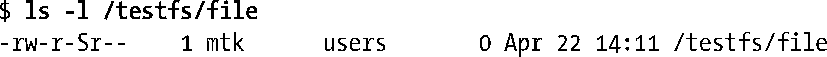
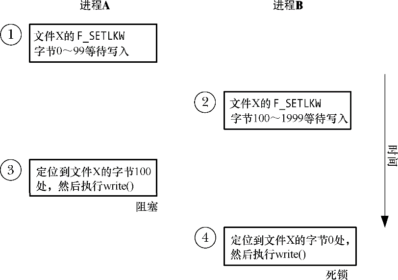

### 55.4　强制加锁

到目前为止介绍的锁都是劝告式锁。这意味着一个进程可以自由地忽略fcntl()（或flock()）的使用或简单地在文件上执行I/O。内核不会阻止进程的这种行为。在使用劝告式锁时，应用程序的设计者需要：

+ 为文件设置合适的所有权（或组所有权）以及权限以防止非协作进程执行文件I/O；
+ 通过在执行I/O之前获取恰当的锁来确保构成应用程序的进程相互协作。

与其他很多UNIX实现一样，Linux也允许fcntl()记录锁是强制式的。这表示需对每个文件I/O操作进行检查以判断其他进程在执行I/O所在的文件区域上是否持有任何不兼容的锁。

> 劝告式模式加锁有时候被称为自由加锁（discretionary locking），而强制式加锁有时候则被称为强制模式加锁（enforcement-mode locking）。SUSv3并没有规定强制式加锁，但在大多数现代UNIX实现上都存在这种加锁模式（细节方面可能存在一些差异）。

为了在Linux上使用强制式加锁就必须要在包含待加锁的文件的文件系统以及每个待加锁的文件上启用这一项功能。通过在挂载文件系统时使用（Linux特有的）–o mand选项能够在该文件系统上启用强制式加锁。

在程序中可以通过在调用mount(2)（14.8.1节）时指定MS_MANDLOCK标记来取得同样的结果。

通过查看不带任何选项的mount(8)命令的输出就能够看出一个挂载文件系统是否启用了强制式加锁。

文件上强制式加锁的启用是通过开启set-group-ID权限位和关闭group-execute权限来完成的。这种权限位组合在其他场景中是毫无意义的，并且在之前的UNIX实现中并没有用到这种权限位组合。正因为如此，后面的UNIX系统在新增强制式加锁时就无需修改既有程序或添加新的系统调用了。在shell中可以按照下面的方法在一个文件上启用强制式加锁。

在一个程序中可以通过使用chmod()或fchmod()（15.4.7节）恰当地设置文件上的权限来启用该文件上的强制式加锁。

当显示一个启用了强制式加锁权限位的文件的权限时，ls(1)会在group-execute权限列中显示一个S。

所有原生Linux和UNIX文件系统都支持强制式加锁，但一些网络文件系统和非UNIX文件系统可能就不支持强制式加锁了。例如，微软的VFAT文件系统没有set-group-ID权限位，因此在VFAT文件系统上就无法启用强制式加锁了。

#### 强制式加锁对文件I/O操作的影响

如果在一个文件上启用强制式加锁时，那么执行数据传输的系统调用（如read()或write()）在碰到锁冲突（即在当前被读或写操作锁住的区域上执行一个写入操作或在当前被写锁住的区域上执行一个读操作）时会发生什么呢？这个问题的答案取决于是以阻塞模式还是非阻塞模式打开了文件。如果以阻塞模式打开了文件，那么系统调用就会阻塞。如果在打开文件时使用了O_NONBLOCK标记，那么系统调用就会立即失败并返回EAGAIN错误。类似的规则同样适用于truncate()和ftruncate()，前提是它们尝试从中增加或删除字节的文件当前被另一个进程锁住（为了读或者写）了。

如果以阻塞模式打开了一个文件（即在open()调用中没有指定O_NONBLOCK），那么I/O系统调用可能会导致死锁情形的出现。考虑图55-7中给出的例子，其中两个进程都打开了同一个文件以执行阻塞式I/O，它们先获取了文件中不同部分上的写锁，然后分别尝试写入被对方锁住的区域。内核在解决这个问题时采用的方式与解决由两个fcntl()调用引起的死锁问题时所用的方式是一样的（55.3.1节）：它选择死锁所涉及到的其中一个进程并使其write()系统调用失败并返回EDEADLK错误。

<b class="my_markdown">图55-7：启用强制式加锁时发生的死锁</b>

使用O_TRUNC标记open()一个文件在存在其他进程持有该文件任意部分上的一个读锁或写锁时会立即失败（返回EAGAIN错误）。

如果存在进程持有了一个文件任意部分上的强制式读锁或写锁，那么就无法在该文件上创建一个共享内存映射（即在调用mmap()时指定了MAP_SHARED标记）。同样，如果一个文件参与了一个共享内存映射，那么就无法在该文件的任意部分上放置一把强制式锁。在这两种情况中，相关的系统调用会立即失败并返回EAGAIN错误。之所以存在这些限制的原因在考虑内存映射的实现之后就变得清晰起来了。在49.4.2节中曾经介绍过一个既从文件中读取又向文件写入的共享文件映射（特别是后一个操作会与文件上任意类型的锁产生冲突）。此外，这种文件I/O是通过内存管理子系统完成的，而这个子系统是不清楚系统中任意一个文件锁所处的位置的。因此为防止一个映射更新一个被放置了强制式锁的文件，内核需要执行一个简单的检查——在执行mmap()调用时检查待映射的文件中所有位置上是否存在锁（对于fcntl()调用也是如此）。

#### 强制式加锁警告

强制式锁所起的作用其实没有其一开始看起来那么大，它存在一些潜在的缺陷和问题。

+ 在一个文件上持有一把强制式锁并不能阻止其他进程删除这个文件，因为只要在父目录上拥有合适的权限就能够与一个文件断开链接。
+ 在一个可公开访问的文件上启用强制式锁之前需要经过深思熟虑，因为即使是特权进程也无法覆盖一个强制式锁。恶意用户可能会持续地持有该文件上的锁以制造拒绝服务的攻击。（在大多数情况下可以通过关闭set-group-ID位来使得该文件再次可访问，但当强制式文件锁造成系统挂起时就无法这样做了。）
+ 使用强制式加锁存在性能开销。在启用了强制式加锁的文件上执行的每个I/O系统调用中，内核都必须要检查在文件上是否存在冲突的锁。如果文件上存在大量的锁，那么这种检查工作会极大地降低I/O系统调用的效率。
+ 强制式加锁还会在应用程序设计阶段造成额外的开销，因为需要处理每个I/O系统调用返回EAGAIN（非阻塞I/O）或EDEADLK（阻塞I/O）错误的情况。
+ 因为在当前的Linux实现中存在一些内核竞争条件，因此在有些情况下执行I/O操作的系统调用在文件上存在本应该拒绝这些操作的强制式锁时也能成功。

总的来说，应该尽可能避免使用强制式锁。

