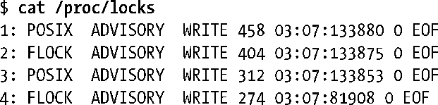
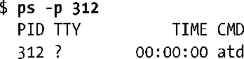
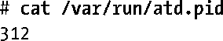
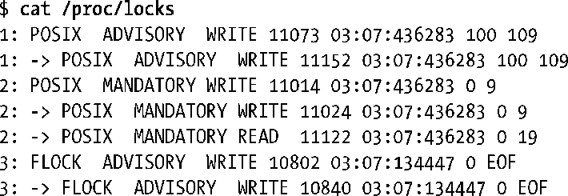

### 55.5　/proc/locks文件

通过检查Linux特有的/proc/locks文件中的内容能够查看系统中当前存在的锁。下面给出了一个示例文件所包含的信息（在本例中是四个锁）。

/proc/locks文件显示了使用flock()和fcntl()创建的锁的相关信息。每把锁的8个字段的含义如下（从左至右）。

1．锁在该文件上所有锁中的序号（参见55.3.4节）。

2．锁的类型。其中FLOCK表示flock()创建的锁，POSIX表示fcntl()创建的锁。

3．锁的模式，其值是ADVISORY或MANDATORY。

4．锁的类型，其值是READ或WRITE（对应于fcntl()的共享锁和互斥锁）。

5．持有锁的进程的进程ID。

6．三个用冒号分隔的数字，它们标识出了锁所属的文件。这些数字是文件所处的文件系统的主要和次要设备号，后面跟着文件的i-node号。

7．锁的起始字节。对于flock()锁来讲，其值永远是0。

8．锁的结尾字节。其中EOF表示锁延伸到文件的结尾（即对于fcntl()创建的锁来讲是将l_len指定为0）。对于flock()锁来讲，这一列的值永远是EOF。

在Linux 2.4以及之前的版本上，/proc/locks文件中的每一行都还包含五个额外的十六进制值。它们是内核用来记录在各个列表中的锁的指针地址，这些值对于应用程序来讲是毫无用处的。

使用/proc/locks中的信息能够找出哪个进程持有了哪个文件上的锁。下面的shell会话显示了如何找出上面列表中序号为3的锁的此类信息。这个锁由进程ID为312的进程持有，其所属的文件在主要ID为3、次要ID为7的设备上的第133853个i-node上。下面首先使用ps(1)列出进程ID为312的进程的相关信息。

从上面的输出可以看出持有锁的程序是atd，即执行批处理作业的daemon。

为找出被锁住的文件，下面首先在/dev目录中搜索文件并确定ID为3:7的设备是/dev/sda7。

接着确定设备/dev/sda7的挂载点并在该部分文件系统中搜索i-node号为133853的文件。

find –mount选项防止find进入/下的子目录（表示其他文件系统的挂载点）进行搜索。

最后显示被锁住的文件的内容。

这样就能看出atd daemon持有了/var/run/atd.pid文件上的一把锁，而这个文件中的内容就是运行atd的进程的进程ID。这个daemon采用了一项技术来确保在一个时刻只有一个daemon实例在运行，在55.6节中将会对这项技术进行描述。

通过/proc/locks还能够获取被阻塞的锁请求的相关信息，如下面的输出所示。

其中锁号后面随即跟着->字符的行表示被相应锁号阻塞的锁请求。因此从上面的输出可以看出一个请求被阻塞在锁1上，两个请求被阻塞在锁2上（使用fcntl()创建的一把锁），一个请求被阻塞在锁3上（使用flock()创建的一把锁）。

> /proc/locks文件还显示了系统中进程持有的文件租用的相关信息。文件租用是Linux特有的的机制，它自Linux 2.4起可用。如果一个进程租用了一个文件，那么该进程在其他进程尝试open()或truncate()该文件时会收到通知（通过发送信号）。（包括truncate()是有必要的，因为它是唯一一个在无需打开文件的情况下就能够改变文件的内容的系统调用。）之所以提供文件租用功能是为了使得Samba能够支持Microsoft SMB的机会锁（oplocks）功能以及允许第4版的NFS支持委托（delegations，它与SMB oplocks类似）。更多有关文件租用的细节可以在fcntl(2)手册中关于F_SETLEASE操作的描述中找到。

