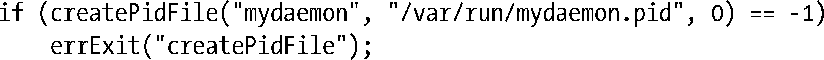
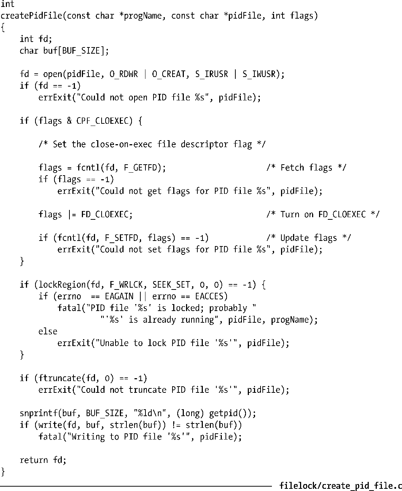

### 55.6　仅运行一个程序的单个实例

一些程序——特别是很多daemon——需要确保同一时刻只有一个程序实例在系统中运行。完成这项任务的一个常见方法是让daemon在一个标准目录中创建一个文件并在该文件上放置一把写锁。daemon在其执行期间一直持有这个文件锁并在即将终止之前删除这个文件。如果启动了daemon的另一个实例，那么它在获取该文件上的写锁时就会失败，其结果是它会意识到daemon的另一个实例肯定正在运行，然后终止。

> 很多网络服务器采用了另一种常规做法，即当服务器绑定的众所周知的socket端口号已经被使用时就认为该服务器实例已经处于运行状态了（61.10节）。

/var/run目录通常是存放此类锁文件的位置。或者也可以在daemon的配置文件中加一行来指定文件的位置。

通常，daemon会将其进程ID写入锁文件，因此这个文件在命名时通常将.pid作为扩展名（如syslogd会创建文件/var/run/syslogd.pid）。这对于那些需要找出daemon的进程ID的应用程序来讲是比较有用的。它还允许执行额外的健全检查——可以像20.5节中描述的那样使用kill(pid, 0)来检查进程ID是否存在。（在较早的不提供文件加锁的UNIX实现上，这是一种不完美但很实用的方法，用于检查一个daemon实例是否在运行或前一个实例在终止之前是否没有成功删除这个文件。）

用来创建和锁住一个进程ID锁文件的代码存在很多微小的差异。程序清单55-4根据[Stevens, 1999]提供的想法提供了一个函数createPidFile()，它封装了上面描述的步骤。调用这个函数通常会使用下面这样的代码。

createPidFile()函数中的一个精妙之处是使用ftruncate()来清除锁文件中之前存在的所有字符串。之所以要这样做是因为daemon的上一个实例在删除文件时可能因系统崩溃而失败。在这种情况下，如果新daemon实例的进程ID较小，那么可能就无法完全覆盖之前文件中的内容。例如，如果进程ID是789，那么就只会向文件写入789\n，但之前的daemon实例可能已经向文件写入了12345\n，这时如果不截断文件的话得到的内容就会是789\n5\n。从严格意义上来讲，清除所有既有字符串并不是必需的，但这样做显得更加简洁并且能排除产生混淆的可能。

在flags参数中可以指定常量CPF_CLOEXEC将会导致createPidFile()为文件描述符设置close-on-exec标记（27.4节）。这对于通过调用exec()重启自己的服务器来讲是比较有用的。如果在exec()时文件描述符没有被关闭，那么重新启动的服务器会认为服务器的另一个实例正处于运行状态。

程序清单55-4：创建一个PID锁文件以确保只有一个程序实例被启动了

