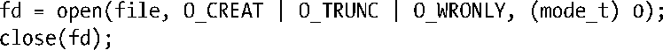

### 55.7　老式加锁技术

在较早的不支持文件加锁的UNIX实现上可以使用一些特别的加锁技术。尽管所有这些技术都已经被fcntl()记录加锁所取代，但这里仍然要介绍它们，因为在一些较早的应用程序中仍然存在它们的身影。所有这些技术在性质上都是劝告式的。

#### open(file, 0_CREAT | 0_EXCL,...)加上unlink(file)

SUSv3要求使用了O_CREAT和O_EXCL标记的open()调用有原子地执行检查文件的存在性以及创建文件两个步骤（5.1节）。这意味着如果两个进程尝试在创建一个文件时指定这些标记，那么就保证只有其中一个进程能够成功。（另一个进程会从open()中收到EEXIST错误。）这种调用与unlink()系统调用组合起来就构成了一种加锁机制的基础。获取锁可通过成功地使用O_CREAT和O_EXCL标记打开文件后，立即跟着一个close()来完成。释放锁则可以通过使用unlink()来完成。尽管这项技术能够正常工作，但它存在一些局限。

+ 如果open()失败了，即表示其他进程拥有了锁，那么就必须要在某种循环中重试open()操作，这种循环既可以是持续不停地（这将会浪费CPU时间），也可以在相邻两次尝试之间加上一定的延迟（意味着在锁可用的时刻和实际获取锁的时刻之间可能存在一定的延迟）。有了fcntl()之后则可以使用F_SETLKW来阻塞直到锁可用为止。
+ 使用open()和unlink()获取和释放锁涉及到文件系统的操作，这比记录锁要慢很多。（在笔者的一台运行Linux 2.6.31的x86-32系统上，使用这里描述的技术获取和释放一个ext3文件上的1百万个锁需要花费44秒。获取和释放该文件中同样字节上的1百万个记录锁仅需要2.5秒。）
+ 如果一个进程意外终止并且没有删除锁文件，那么锁就不会被释放。处理这个问题存在特别的技术，包括检查文件的上次修改时间和让锁的持有者将其进程ID写入文件，这样就能够检查进程是否存在，但这些技术中没有一项技术是安全可靠的。与之相反的是，在一个进程终止时记录锁的释放操作是原子的。
+ 如果放置多把锁（即使用多个锁文件），那么就无法检测出死锁。如果发生了死锁，那么造成死锁的进程就会永远保持阻塞。（每个进程都会定在那里检查是否能够获取请求的锁。）与之形成对比的是，内核会对fcntl()记录锁进程死锁检测。
+ 第二版的NFS不支持O_EXCL语义。Linux 2.4 NFS客户端也没有正确地实现O_EXCL，即使是第三版的NFS以及之后的版本也没能完成这个任务。

#### link(file, lockfile)加上unlink(lockfile)

link()系统调用在新链接已经存在时会失败的事实可用作一种加锁机制，而解锁功能则还是使用unlink()来完成。常规的做法是让需要获取锁的进程创建一个唯一的临时文件名，一般来讲需要包含进程ID（如果锁文件被创建于一个网络文件系统上，那么可能的话再加上主机名）。要获取锁则需要将这个临时文件链接到某个约定的标准路径名上。（硬链接在语义上需要两个路径名位于同一个文件系统上。）如果link()调用成功，那么就是获取了锁。如果失败（EEXIST），那么就是另一个进程持有了锁，因此必须要在稍后某个时刻重新尝试获取锁。这项技术与上面介绍的open(file, O_CREAT | O_EXCL,...)技术存在相同的局限。

当指定O_TRUNC并且写权限被拒绝时在一个既有文件上调用open()会失败的事实可作为一项加锁技术的基础。要获取一把锁可以使用下面的代码（省略了错误检查）来创建一个新文件。

> 至于为何在上面的open()调用中使用(mode_t)转换可参见附录C。

如果open()调用成功（即文件之前不存在），那么就是获取了锁。如果因EACCES而失败（即文件存在但没有人拥有权限），那么其他进程持有了锁，还需要在后面某个时刻尝试重新获取锁。这项技术与前面介绍的技术存在相同的局限，还需要注意的是不能在具备超级用户特权的程序中使用这项技术，因为open()总是会成功，不管文件上设置的权限是什么。

