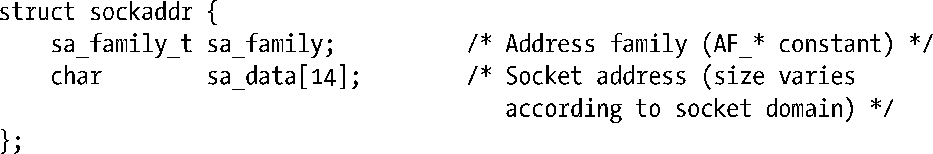

### 56.4　通用socket地址结构：struct sockaddr

传入bind()的addr和addrlen参数比较复杂，有必要对其做进一步解释。从表56-1中可以看出每种socket domain都使用了不同的地址格式。如UNIX domain socket使用路径名，而Internet domain socket使用了IP地址和端口号。对于各种socket domain都需要定义一个不同的结构类型来存储socket地址。然而由于诸如bind()之类的系统调用适用于所有socket domain，因此它们必须要能够接受任意类型的地址结构。为支持这种行为，socket API定义了一个通用的地址结构struct sockaddr。这个类型的唯一用途是将各种domain特定的地址结构转换成单个类型以供socket系统调用中的各个参数使用。sockaddr结构通常被定义成如下所示的结构。

这个结构是所有domain特定的地址结构的模板，其中每个地址结构均以与sockaddr结构中sa_family字段对应的family字段打头。（sa_family_t数据类型在SUSv3中被规定成一个整数类型。）通过family字段的值足以确定存储在这个结构的剩余部分中的地址的大小和格式了。

> 一些UNIX实现还在sockaddr结构中定义了一个额外的字段sa_len，它指定了这个结构的总大小。SUSv3并没有要求这个字段，在socket API的Linux实现中也不存在这个字段。
> 如果定义了_GNU_SOURCE特性测试宏，那么glibc将使用一个gcc扩展在<sys/socket.h>中定义各个socket系统调用的原型，从而就无需进行(struct sockaddr *)转换了，但依赖这个特性是不可移植的（在其他系统上将会导致编译警告）。

