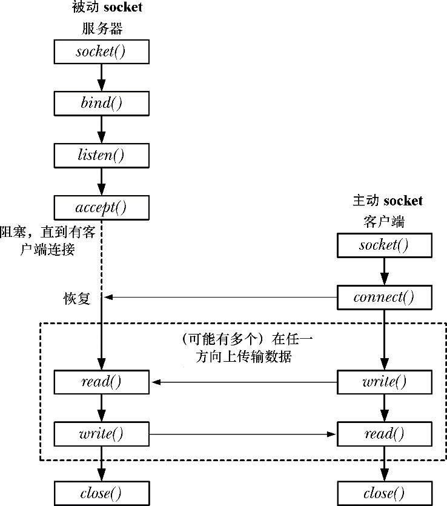

### 56.5　流socket

流socket的运作与电话系统类似。

**1．** socket()系统调用将会创建一个socket，这等价于安装一个电话。为使两个应用程序能够通信，每个应用程序都必须要创建一个socket。

**2．** 通过一个流socket通信类似于一个电话呼叫。一个应用程序在进行通信之前必须要将其socket连接到另一个应用程序的socket上。两个socket的连接过程如下。

(a)一个应用程序调用bind()以将socket绑定到一个众所周知的地址上，然后调用listen()通知内核它接受接入连接的意愿。这一步类似于已经有了一个为众人所知的电话号码并确保打开了电话，这样人们就可以打进电话了。

(b)其他应用程序通过调用connect()建立连接，同时指定需连接的socket的地址。这类似于拨某人的电话号码。

(c)调用listen()的应用程序使用accept()接受连接。这类似于在电话响起时拿起电话。如果在对等应用程序调用connect()之前执行了accept()，那么accept()就会阻塞（“等待电话”）。

**3．** 一旦建立了一个连接之后就可以在应用程序之间（类似于两路电话会话）进行双向数据传输直到其中一个使用close()关闭连接为止。通信是通过传统的read()和write()系统调用或通过一些提供了额外功能的socket特定的系统调用（如send()和recv()）来完成的。

图56-1演示了如何在流socket上使用这些系统调用。

<b class="my_markdown">图56-1：流socket上用到的系统调用概述</b>

#### 主动和被动socket

流socket通常可以分为主动和被动两种。

+ 在默认情况下，使用socket()创建的socket是主动的。一个主动的socket可用在connect()调用中来建立一个到一个被动socket的连接。这种行为被称为执行一个主动的打开。
+ 一个被动socket（也被称为监听socket）是一个通过调用listen()以被标记成允许接入连接的socket。接受一个接入连接通常被称为执行一个被动的打开。

在大多数使用流socket的应用程序中，服务器会执行被动式打开，而客户端会执行主动式打开。在后面的小节中将会假设这种场景，因此不会再说“执行主动socket打开的应用程序”，而是直接说“客户端”。类似地，“服务器”等价于“执行被动socket打开的应用程序”。

