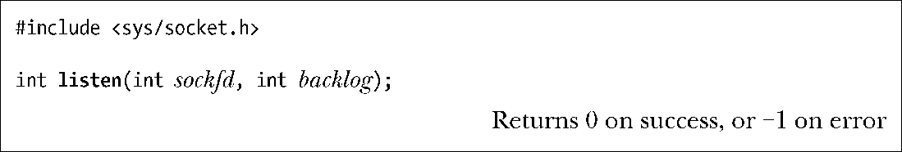
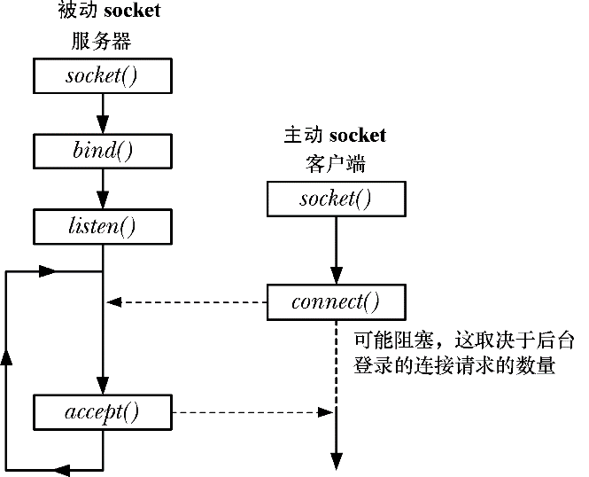

### 56.5.1　监听接入连接：listen()

listen()系统调用将文件描述符sockfd引用的流socket标记为被动。这个socket后面会被用来接受来自其他（主动的）socket的连接。

无法在一个已连接的socket（即已经成功执行connect()的socket或由accept()调用返回的socket）上执行listen()。

要理解backlog参数的用途首先需要注意到客户端可能会在服务器调用accept()之前调用connect()。这种情况是有可能会发生的，如服务器可能正忙于处理其他客户端。这将会产生一个未决的连接，如图56-2所示。

<b class="my_markdown">图56-2：一个未决的socket连接</b>

内核必须要记录所有未决的连接请求的相关信息，这样后续的accept()就能够处理这些请求了。backlog参数允许限制这种未决连接的数量。在这个限制之内的连接请求会立即成功。（对于TCP socket来讲事情就稍微有点复杂了，具体会在61.6.4节中进行介绍。）之外的连接请求就会阻塞直到一个未决的连接被接受（通过accept()），并从未决连接队列删除为止。

SUSv3允许一个实现为backlog的可取值规定一个上限并允许一个实现静默地将backlog值向下舍入到这个限制值。SUSv3规定实现应该通过在<sys/socket.h>中定义SOMAXCONN常量来发布这个限制。在Linux上，这个常量的值被定义成了128。但从内核2.4.25起，Linux允许在运行时通过Linux特有的/proc/sys/net/core/somaxconn文件来调整这个限制。（在早期的内核版本中，SOMAXCONN限制是不可变的。）

> 在最初的BSD socket实现中，backlog的上限是5，并且在较早的代码中可以看到这个数值。所有现代实现允许为backlog指定更高的值，这对于使用TCP socket服务大量客户的网络服务器来讲是有必要的。

