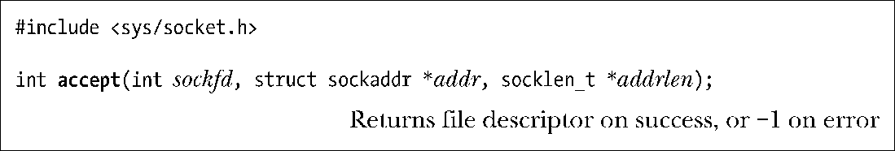

### 56.5.2　接受连接：accept()

accept()系统调用在文件描述符sockfd引用的监听流socket上接受一个接入连接。如果在调用accept()时不存在未决的连接，那么调用就会阻塞直到有连接请求到达为止。

理解accept()的关键点是它会创建一个新socket，并且正是这个新socket会与执行connect()的对等socket进行连接。accept()调用返回的函数结果是已连接的socket的文件描述符。监听socket（sockfd）会保持打开状态，并且可以被用来接受后续的连接。一个典型的服务器应用程序会创建一个监听socket，将其绑定到一个众所周知的地址上，然后通过接受该socket上的连接来处理所有客户端的请求。

传入accept()的剩余参数会返回对端socket的地址。addr参数指向了一个用来返回socket地址的结构。这个参数的类型取决于socket domain（与bind()一样）。

addrlen参数是一个值-结果参数。它指向一个整数，在调用被执行之前必须要将这个整数初始化为addr指向的缓冲区的大小，这样内核就知道有多少空间可用于返回socket地址了。当accept()返回之后，这个整数会被设置成实际被复制进缓冲区中的数据的字节数。

如果不关心对等socket的地址，那么可以将addr和addrlen分别指定为NULL和0。（如果希望的话可以像61.5节中描述的那样在后面某个时刻使用getpeername()系统调用来获取对端的地址。）

> 从内核2.6.28开始，Linux支持一个新的非标准系统调用accept4()。这个系统调用执行的任务与accept()相同，但支持一个额外的参数flags，而这个参数可以用来改变系统调用的行为。目前系统支持两个标记：SOCK_CLOEXEC和SOCK_NONBLOCK。SOCK_CLOEXEC标记导致内核在调用返回的新文件描述符上启用close-on-exec标记（FD_CLOEXEC）。这个标记之所以有用的原因与4.3.1节中描述的open() O_CLOEXEC标记有用的原因是一样的。SOCK_NONBLOCK标记导致内核在底层打开着的文件描述上启用O_NONBLOCK标记，这样在该socket上发生的后续I/O操作将会变成非阻塞了，从而无需通过调用fcntl()来取得同样的结果。

