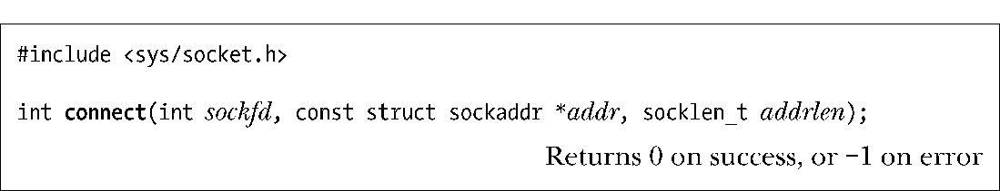

### 56.5.3　连接到对等socket：connect()

connect()系统调用将文件描述符sockfd引用的主动socket连接到地址通过addr和addrlen指定的监听socket上。

addr和addrlen参数的指定方式与bind()调用中对应参数的指定方式相同。

如果connect()失败并且希望重新进行连接，那么SUSv3规定完成这个任务的可移植的方法是关闭这个socket，创建一个新socket，在该新socket上重新进行连接。

