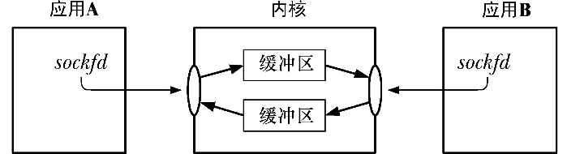

### 56.5.4　流socket I/O

一对连接的流socket在两个端点之间提供了一个双向通信信道，图56-3给出了UNIX domain的情形。

<b class="my_markdown">图56-3：UNIX domain流socket提供了一个双向通信信道</b>

连接流socket上I/O的语义与管道上I/O的语义类似。

+ 要执行I/O需要使用read()和write()系统调用（或在61.3节中描述的socket特有的send()和recv()调用）。由于socket是双向的，因此在连接的两端都可以使用这两个调用。
+ 一个socket可以使用close()系统调用来关闭或在应用程序终止之后关闭。之后当对等应用程序试图从连接的另一端读取数据时将会收到文件结束（当所有缓冲数据都被读取之后）。如果对等应用程序试图向其socket写入数据，那么它就会收到一个SIGPIPE信号，并且系统调用会返回EPIPE错误。在44.2节中曾提及过处理这种情况的常见方式是忽略SIGPIPE信号并通过EPIPE错误找出被关闭的连接。

