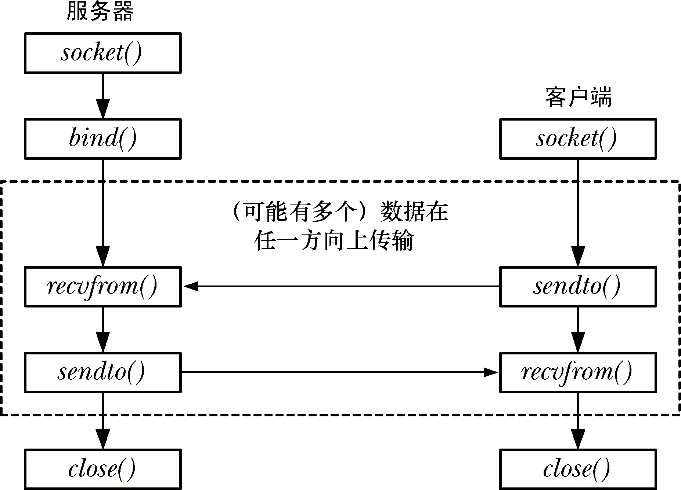

### 56.6　数据报socket

数据报socket的运作类似于邮政系统。

**1．** socket()系统调用等价于创建一个邮箱。（这里假设一个系统与一些国家的农村中的邮政服务类似，取信和送信都是在邮箱中发生的。）所有需要发送和接收数据报的应用程序都需要使用socket()创建一个数据报socket。

**2．** 为允许另一个应用程序发送其数据报（信），一个应用程序需要使用bind()将其socket绑定到一个众所周知的地址上。一般来讲，一个服务器会将其socket绑定到一个众所周知的地址上，而一个客户端会通过向该地址发送一个数据报来发起通信。（在一些domain中——特别是UNIX domain——客户端如果想要接受服务器发送来的数据报的话可能还需要使用bind()将一个地址赋给其socket。）

**3．** 要发送一个数据报，一个应用程序需要调用sendto()，它接收的其中一个参数是数据报发送到的socket的地址。这类似于将收信人的地址写到信件上并投递这封信。

**4．** 为接收一个数据报，一个应用程序需要调用recvfrom()，它在没有数据报到达时会阻塞。由于recvfrom()允许获取发送者的地址，因此可以在需要的时候发送一个响应。（这在发送者的socket没有绑定到一个众所周知的地址上时是有用的，客户端通常是会碰到这种情况。）这里对这个比喻做了一点延伸，因为已投递的信件上是无需标记上发送者的地址的。

**5．** 当不再需要socket时，应用程序需要使用close()关闭socket。

与邮政系统一样，当从一个地址向另一个地址发送多个数据报（信）时是无法保证它们按照被发送的顺序到达的，甚至还无法保证它们都能够到达。数据报还新增了邮政系统所不具备的一个特点：由于底层的联网协议有时候会重新传输一个数据包，因此同样的数据包可能会多次到达。

图56-4演示了数据报socket相关系统调用的使用。

<b class="my_markdown">图56-4：数据报socket系统调用概述</b>

