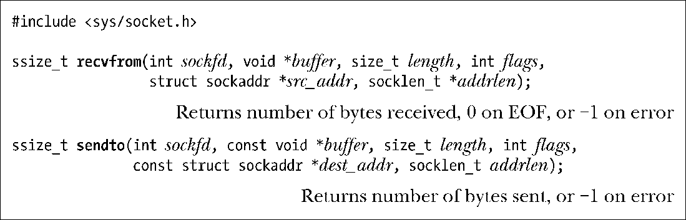

### 56.6.1　交换数据报：recvfrom和sendto()

recvfrom()和sendto()系统调用在一个数据报socket上接收和发送数据报。

这两个系统调用的返回值和前三个参数与read()和write()中的返回值和相应参数是一样的。

第四个参数flags是一个位掩码，它控制着了socket特定的I/O特性。在61.3节中介绍recv()和send(系统调用时将对这些特性进行介绍。如果无需使用其中任何一种特性，那么可以将flags指定为0。

src_addr和addrlen参数被用来获取或指定与之通信的对等socket的地址。

对于recvfrom()来讲，src_addr和addrlen参数会返回用来发送数据报的远程socket的地址。（这些参数类似于accept()中的addr和addrlen参数，它们返回已连接的对等socket的地址。）src_addr参数是一个指针，它指向了一个与通信domain匹配的地址结构。与accept()一样，addrlen是一个值-结果参数。在调用之前应该将addrlen初始化为src_addr指向的结构的大小；在返回之后，它包含了实际写入这个结构的字节数。

如果不关心发送者的地址，那么可以将src_addr和addrlen都指定为NULL。在这种情况下，recvfrom()等价于使用recv()来接收一个数据报。也可以使用read()来读取一个数据报，这等价于在使用recv()时将flags参数指定为0。

不管length的参数值是什么，recvfrom()只会从一个数据报socket中读取一条消息。如果消息的大小超过了length字节，那么消息会被静默地截断为length字节。

> 如果使用了recvmsg()系统调用（61.13.2节），那么通过返回的msghdr结构中的msg_flags字段中的MSG_TRUNC标记来找出被截断的数据报，具体细节请参考recvmsg(2)手册。

对于sendto()来讲，dest_addr和addrlen参数指定了数据报发送到的socket。这些参数的使用方式与connect()中相应参数的使用方式是一样的。dest_addr参数是一个与通信domain匹配的地址结构，它会被初始化成目标socket的地址。addrlen参数指定了addr的大小。

> 在Linux上可以使用sendto()发送长度为0的数据报，但不是所有的UNIX实现都允许这样做的。

