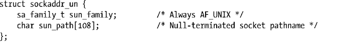
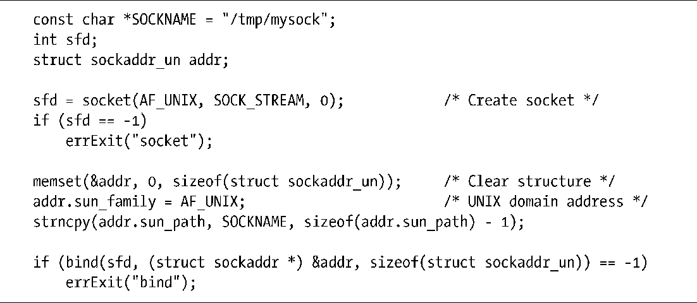

### 57.1　UNIX domain socket地址：struct sockaddr_un

在UNIX domain中，socket地址以路径名来表示，domain特定的socket地址结构的定义如下所示。

> sockaddr_un结构中字段的sun_前缀与Sun Microsystems没有任何关系，它是根据socket unix而来的。

SUSv3并没有规定sun_path字段的大小。早期的BSD实现使用108和104字节，而一个稍微现代一点的实现（HP-UX 11）则使用了92字节。可移植的应用程序在编码时应该采用最低值，并且在向这个字段写入数据时使用snprintf()或strncpy()以避免缓冲区溢出。

为将一个UNIX domain socket绑定到一个地址上，需要初始化一个sockaddr_un结构，然后将指向这个结构的一个（转换）指针作为addr参数传入bind()并将addrlen指定为这个结构的大小，如程序清单57-1所示。

程序清单57-1：绑定一个UNIX domain socket

程序清单57-1使用memset()调用来确保结构中所有字段的值都为0。（后面的strncpy()调用利用这一点并将其最后一个参数指定为sun_path字段的大小减一来确保这个字段总是拥有一个结束的null字节。）使用memset()将整个结构清零而不是一个字段一个字段地进行初始化能够确保一些实现提供的所有非标准字段都会被初始化为0。

> 从BSD衍生出来的bzero()函数是一个可以用来取代memset()对一个结构的内容进行清零的函数。SUSv3规定了bzero()以及相关的bcopy()（与memmove()类似），但将这两个函数标记成了LEGACY并指出首选使用memset()和memmove()。SUSv4则删除了与bzero()和bcopy()有关的规范。

当用来绑定UNIX domain socket时，bind()会在文件系统中创建一个条目。（因此作为socket路径名的一部分的目录需要可访问和可写。）文件的所有权将根据常规的文件创建规则来确定（15.3.1节）。这个文件会被标记为一个socket。当在这个路径名上应用stat()时，它会在stat结构的st_mode字段中的文件类型部分返回值S_IFSOCK（15.1节）。当使用ls –l列出时，UNIX domain socket在第一列将会显示类型s，而ls –F则会在socket路径名后面附加上一个等号（=）。

> 尽管UNIX domain socket是通过路径名来标识的，但在这些socket上发生的I/O无须对底层设备进行操作。

有关绑定一个UNIX domain socket方面还需要注意以下几点。

+ 无法将一个socket绑定到一个既有路径名上（bind()会失败并返回EADDRINUSE错误）。
+ 通常会将一个socket绑定到一个绝对路径名上，这样这个socket就会位于文件系统中的一个固定地址处。当然，也可以使用一个相对路径名，但这种做法并不常见，因为它要求想要connect()这个socket的应用程序知道执行bind()的应用程序的当前工作目录。
+ 一个socket只能绑定到一个路径名上，相应地，一个路径名只能被一个socket绑定。
+ 无法使用open()打开一个socket。
+ 当不再需要一个socket时可以使用unlink()（或remove()）删除其路径名条目（通常也应该这样做）。

在本章给出的大多数示例程序中，将会把UNIX domain socket绑定到/tmp目录下的一个路径名上，因为通常这个目录在所有系统上都是存在并且可写的。这样读者就能够很容易地运行这些程序而无需编辑这些socket路径名了。但需要知道的是这通常不是一种优秀的设计技术。正如在38.7节中指出的那样，在诸如/tmp此类公共可写的目录中创建文件可能会导致各种各样的安全问题。例如在/tmp中创建一个名字与应用程序socket的路径名一样的路径名之后就能够完成一个简单的拒绝服务攻击了。现实世界中的应用程序应该将UNIX domain socket bind()到一个采取了恰当的安全保护措施的目录中的绝对路径名上。

