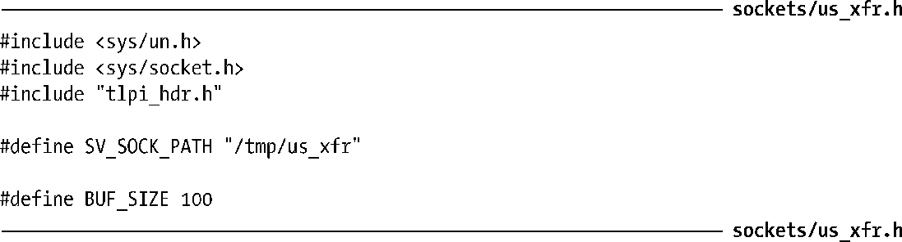
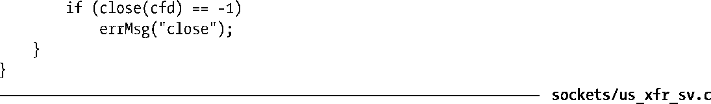
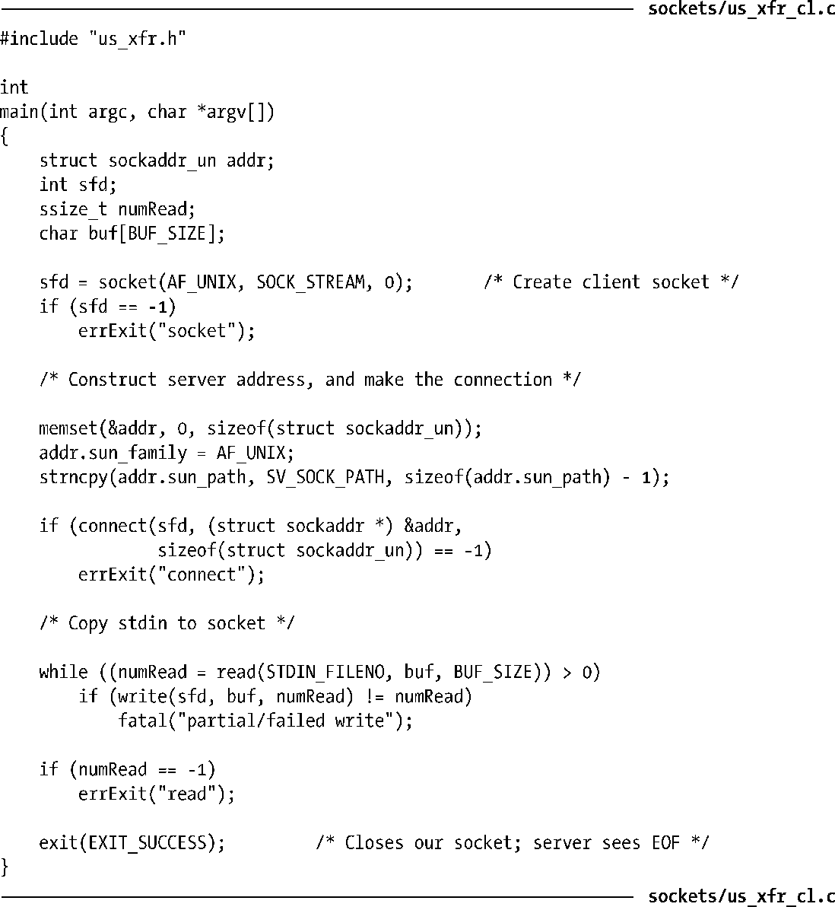
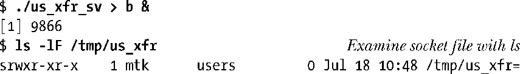
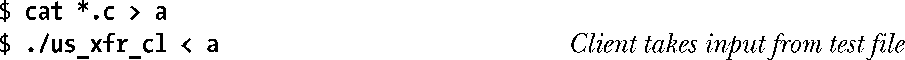
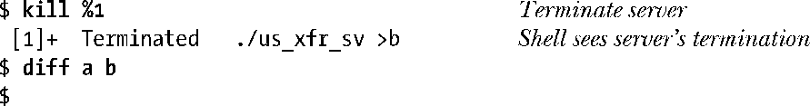

### 57.2　UNIX domain中的流socket

下面讲解一个简单的使用了UNIX domain中的流socket的客户端-服务器应用程序。客户端程序（程序清单57-4）连接到服务器并使用该连接将其标准输入中的数据传输到服务器上。服务器程序（程序清单57-3）接受客户端连接并将客户端在该连接上发过来的数据传输到标准输出上。这个服务器是一个简单的迭代式服务器——服务器在处理下一个客户端之前一次只处理一个客户端。（在第60章中将会考虑更多有关服务器设计方面的细节。）

程序清单57-2是这些程序使用的头文件。

程序清单57-2：us_xfr_sv.c和us_xfr_cl.c的头文件

在下面几页中首先会给出服务器和客户端的源代码，然后讨论这些程序的细节并给出一个使用这两个程序的例子。

程序清单57-3：一个简单的UNIX domain流socket服务器

程序清单57-4：一个简单的UNIX domain流socket客户端

程序清单57-3给出了服务器程序。这个服务器执行了下列任务。

+ 创建一个socket。
+ 删除所有与路径名一致的既有文件，这样就能将socket绑定到这个路径名上。
+ 为服务器socket构建一个地址结构，将socket绑定到该地址上，将这个socket标记为监听socket。
+ 执行一个无限循环来处理进入的客户端请求。每次循环迭代执行下列任务。
      + 接受一个连接，为该连接获取一个新socket cfd。
    + 从已连接的socket中读取所有数据并将这些数据写入到标准输出中。
    + 关闭已连接的socket cfd。

服务器必须要手工终止（如向其发送一个信号）。

客户端程序（程序清单57-4）执行下列任务。

+ 创建一个socket。
+ 为服务器socket构建一个地址结构并连接到位于该地址处的socket。
+ 执行一个循环将其标准输入复制到socket连接上。当遇到标准输入中的文件结尾时客户端就终止，其结果是客户端socket将会被关闭并且服务器在从连接的另一端的socket中读取数据时会看到文件结束。

下面的shell会话日志演示了如何使用这些程序。首先在后台运行服务器。

然后创建一个客户端用作输入的测试文件并运行客户端。

此刻子进程已经结束了。现在终止服务器并检查服务器的输出是否与客户端的输入匹配。

diff命令没有产生任何输出，表示输入和输出文件是一致的。

注意在服务器终止之后，socket路径名会继续存在。这就是为何服务器在调用bind()之前使用remove()删除socket路径名的所有既有实例。（假设拥有合适的权限，这个remove()调用将会删除名称为这个路径名的所有类型的文件，即使这个文件不是一个socket。）如果没有这样做，那么bind()调用在上一次调用服务器时创建了这个socket路径名时就会失败。

