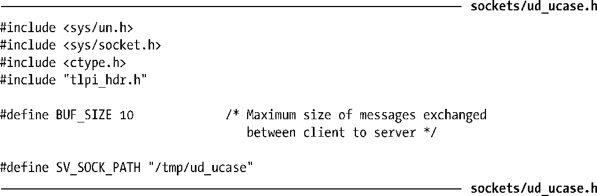
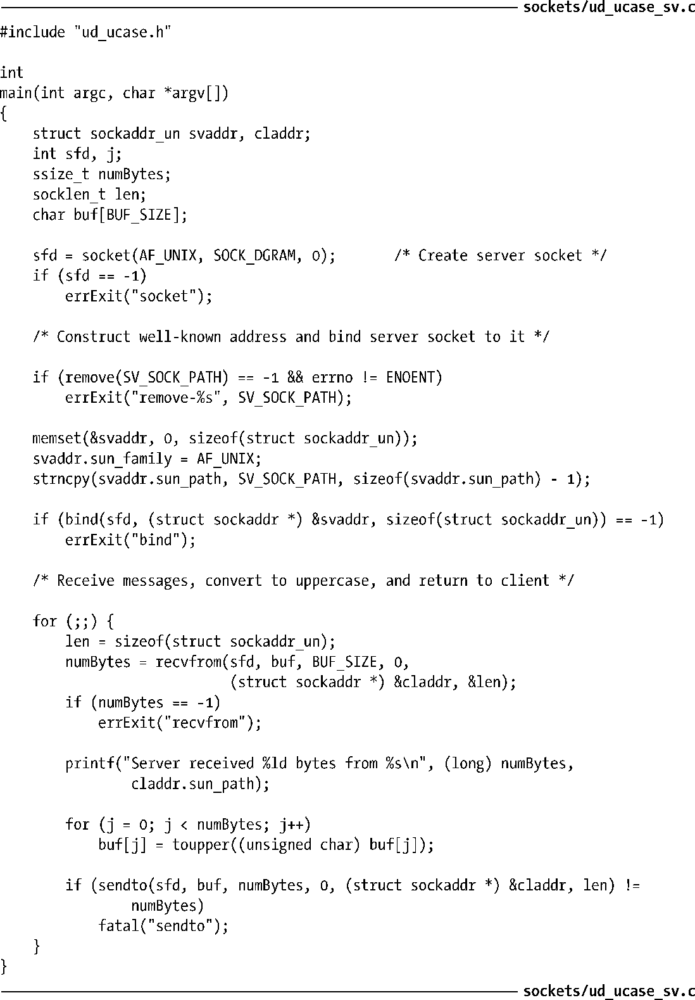
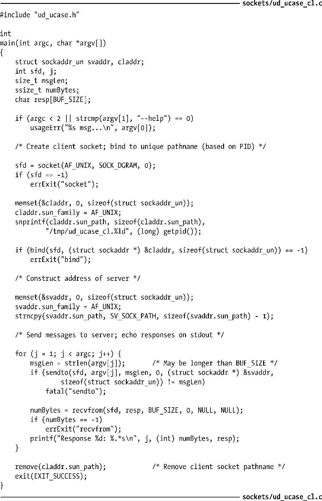
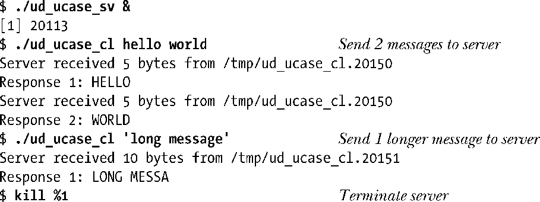

### 57.3　UNIX domain中的数据报socket

在56.6节中有关数据报socket的一般性描述中指出过使用数据报socket的通信是不可靠的。这个论断适用于通过网络传输的数据报。但对于UNIX domain socket来讲，数据报的传输是在内核中发生的，并且也是可靠的。所有消息都会按序被递送并且也不会发生重复的状况。

#### UNIX domain数据报socket能传输的数据报的最大大小

SUSv3并没有规定通过UNIX domain socket传输的数据报的最大大小。在Linux上可以发送一个相当大的数据报，其限制是通过SO_SNDBUF socket选项和各个/proc文件来控制的，具体可参考socket(7)手册。但其他一些UNIX实现采用的限制值更小一些，如2048字节。采用了UNIX domain数据报socket的可移植的应用程序应该考虑为所使用的数据报大小的上限值设定一个较低的值。

#### 示例程序

程序清单57-6和程序清单57-7给出了一个简单的使用UNIX domain数据报socket的客户端/服务器应用程序。程序清单57-5给出了这两个程序所用到的头文件。

程序清单57-5：ud_ucase_sv.c和ud_ucase_cl.c使用的头文件

服务器程序（程序清单57-6）首先创建一个socket并将其绑定到一个众所周知的地址上。（服务器先删除了与该地址匹配的路径名，以防出现这个路径名已经存在的情况。）服务器然后进入一个无限循环，在循环中使用recvfrom()接收来自客户端的数据报，将接收到的文本转换成大小格式并使用通过recvfrom()获取的地址将转换过的文本返回给客户端。

客户端程序（程序清单57-7）创建一个socket并将这个socket绑定到一个地址上，这样服务器就能够发送响应了。客户端地址的唯一性是通过在路径名中包含客户端的进程ID来保证的。然后客户端循环，将所有命令行参数作为一个个独立的消息发送给服务器。在发送完每条消息之后，客户端读取服务器的响应并将内容显示在标准输出上。

程序清单57-6：一个简单的UNIX domain数据报服务器

程序清单57-7：一个简单的UNIX domain数据报客户端

下面的shell会话日志演示了如何使用服务器和客户端程序。

对客户端程序的第二个调用有意在recvfrom()调用中指定了一个比消息更小的length值（BUF_SIZE在程序清单57-5中被定义成了10）以说明消息会被静默地截断。读者可以看出这种截断确实发生了，因为服务器打印出了一条消息声称它只收到了10个字节，而客户端发送的消息则由12个字节构成。

