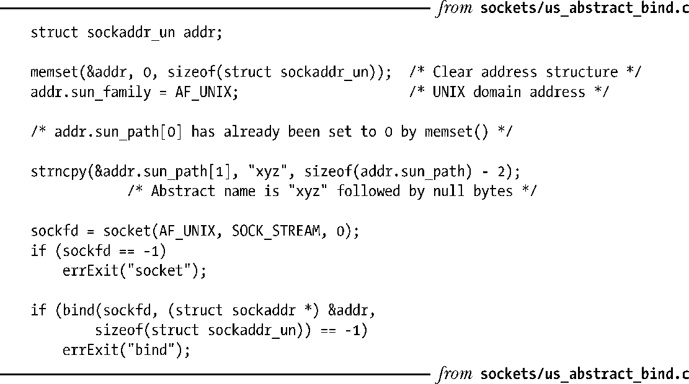

### 57.6　Linux抽象socket名空间

所谓的抽象路径名空间是Linux特有的一项特性，它允许将一个UNIX domain socket绑定到一个名字上但不会在文件系统中创建该名字。这种做法具备几点优势。

+ 无需担心与文件系统中的既有名字产生冲突。
+ 没有必要在使用完socket之后删除socket路径名。当socket被关闭之后会自动删除这个抽象名。
+ 无需为socket创建一个文件系统路径名了。这对于chroot环境以及在不具备文件系统上的写权限时是比较有用的。

要创建一个抽象绑定就需要将sun_path字段的第一个字节指定为null字节（\0）。这样就能够将抽象socket名字与传统的UNIX domain socket路径名区分开来，因为传统的名字是由一个或多个非空字节以及一个终止null字节构成的字符串。sun_path字段的余下的字节为socket定义了抽象名字。在解释这个名字时需要用到全部字节，而不是将其看成是一个以null结尾的字符串。

程序清单57-8演示了如何创建一个抽象socket绑定。

程序清单57-8：创建一个抽象socket绑定

使用一个初始null字节来区分抽象socket名和传统的socket名会带来不同寻常的结果。假设变量name正好指向了一个长度为零的字符串并将一个UNIX domain socket绑定到一个按照下列方式初始化sun_path的名字上。

在Linux上，就会在无意中创建了一个抽象socket绑定。但这种代码可能并不是期望中的代码（即一个bug）。在其他UNIX实现中，后续的bind()调用会失败。

