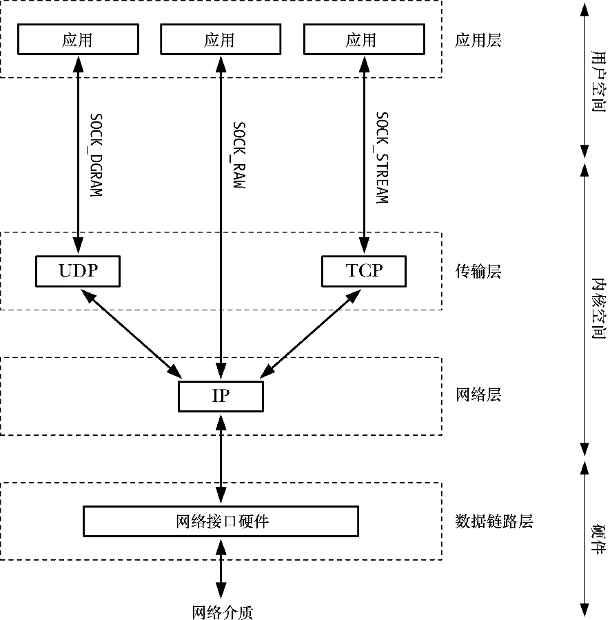
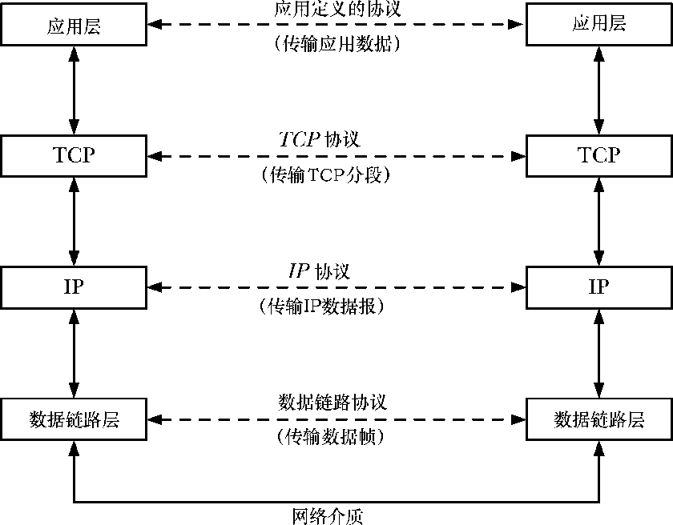
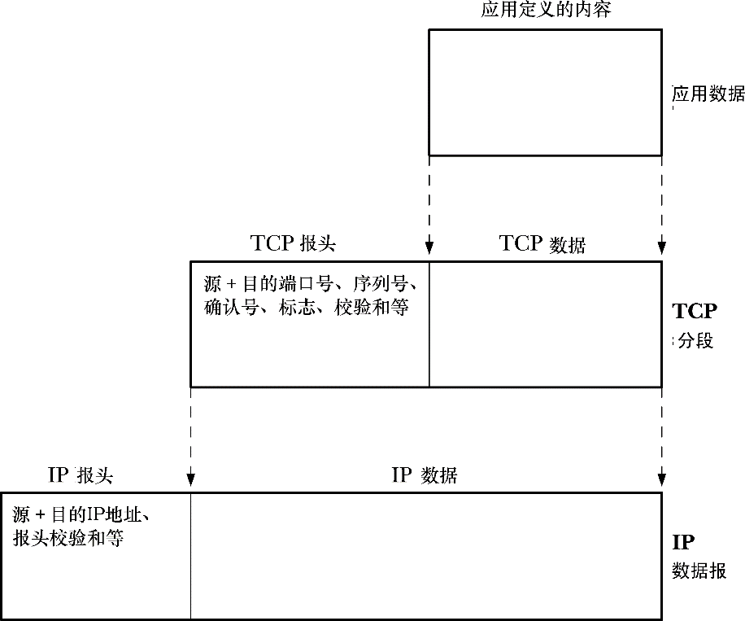

### 58.2　联网协议和层

一个联网协议是定义如何在一个网络上传输信息的一组规则。联网协议通常会被组织成一系列的层，其中每一层都构建于下层之上并提供特性以供上层使用。

TCP/IP协议套件是一个分层联网协议（图58-2），它包括因特网协议（IP）和位于其上层的各个协议层。（实现这些层的代码通常被称为协议栈。）名字TCP/IP是从传输控制协议（TCP）是使用最为广泛的传输层协议这样一个事实而得出来的。

<b class="my_markdown">图58-2：TCP/IP套件中的协议</b>

> 在图58-2中省略了其他一些TCP/IP协议，因为它们与本章的主题无关。地址解析协议（ARP）关注的是如何将因特网地址映射到硬件（如以太网）地址。因特网控制消息协议（ICMP）用来在网络中传输错误和控制信息。（ping和traceroute程序使用的是ICMP协议，人们通常使用ping来检查一台特定的主机是否存活以及是否在TCP/IP网络中可见，使用traceroute来跟踪一个IP包在网络中的传输路径。）主机和路由器使用因特网组管理协议（IGMP）来支持IP数据报的多播。

协议分层如此强大和灵活的其中一个原因是透明——每一个协议层都对上层隐藏下层的操作和复杂性，如一个使用TCP的应用程序只需要使用标准的socket API并清楚自己正在使用一项可靠的字节流传输服务，而无需理解TCP操作的细节。（在61.9节中介绍socket选项时将会看到严格地讲这一论断并不总是正确的，应用程序偶尔也需要弄清楚底层传输协议的操作细节。）应用程序也无需知道IP和数据链路层的操作细节。从应用程序的角度来讲，它就像是通过socket API直接与其他层进行通信了，如图58-3所示，其中虚横线表示对应应用程序之间的虚拟通信路径以及两个主机上的TCP和IP实体。

<b class="my_markdown">图58-3：通过TCP/IP协议进行的分层通信</b>

#### 封装

封装是分层联网协议中的一个重要的原则。图58-4给出了TCP/IP协议层中的封装。封装中的关键概念是低层会将从高层向低层传递的信息（如应用程序数据、TCP段、IP数据报）当成不透明的数据来处理。换句话说，低层不会尝试对高层发送过来的信息进行解释，而只会将这些信息放到低层所使用的包中并在将这个包向下传递到低层之前添加自身这一层的头信息。当数据从低层传递到高层时将会进行一个逆向的解包过程。

<b class="my_markdown">图58-4：TCP/IP协议层中的封装</b>

> 封装的概念还延伸到了数据链路层，其中IP数据报会被封装进网络帧中，但在图58-4中并没有显示出这些。封装可能还会延伸到应用层中，其中应用程序可能会按照自己的方式对数据进行打包。

