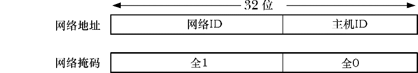
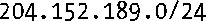
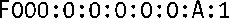
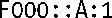
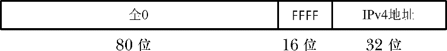

### 58.5　IP地址

一个IP地址包含两个部分：一个是网络ID，它指定了主机所属的网络；另一个是主机ID，它标识出了位于该网络中的主机。

#### IPv4地址

一个IPv4地址包含32位（图58-5）。当以人类可读的形式来表示时，这些地址通常的书写通常采用点分十进制标记法，即将地址的4个字节写成一个十进制数字，中间以点号隔开，如204.152.189.116。

<b class="my_markdown">图58-5：一个IPv4网络地址和对应的网络掩码</b>

当一个组织为其主机申请一组IPv4地址时，它会收到一个32位的网络地址以及一个对应的32位的网络掩码。在二进制形式中，这个掩码最左边的位由1构成，掩码中剩余的位用0填充。这些1表示地址中哪些部分包含了所分配到的网络ID，而这些0则表示地址中哪些部分可供组织用来为网络中的主机分配唯一的ID。掩码中网络ID部分的大小会在分配地址时确定。由于网络ID部分总是占据着掩码最左边的部分，因此可以通过下面的标记法来指定分配的地址范围。

这里的/24表示分配的地址的网络ID由最左边的24位构成，剩余的8位用于指定主机ID。或者在这种情况下也可以说网络掩码的点分十进制标记是255.255.255.0。

拥有这个地址的组织可以将254个唯一的因特网地址分配给其计算机——204.152.189.1到204.152.189.254。有两个地址是无法分配给计算机的，其中一个地址的主机ID的位都是0，它用来标识网络本身，另一个地址的主机ID的位都是1——在本例中是204.152.189.255——它是子网广播地址。

一些IPv4地址拥有特殊的含义。特殊地址127.0.0.1一般被定义为回环地址，它通常会被分配给主机名localhost。（网络127.0.0.0/8中的所有地址都可以被指定为IPv4回环地址，但通常会选择127.0.0.1。）发送到这个地址的数据报实际上不会到达网络，它会自动回环变成发送主机的输入。使用这个地址可以便捷地在同一主机上测试客户端和服务器程序。在C程序中定义了整数常量INADDR_LOOPBACK来表示这个程序。

常量INADDR_ANY就是所谓的IPv4通配地址。通配IP地址对于将Internet domain socket绑定到多宿主机上的应用程序来讲是比较有用的。如果位于一台多宿主机上的应用程序只将socket绑定到其中一个主机IP地址上，那么该socket就只能接收发送到该IP地址上的UDP数据报和TCP连接请求。但一般来讲都希望位于一台多宿主机上的应用程序能够接收指定任意一个主机IP地址的数据报和连接请求，而将socket绑定到通配IP地址上使之成为了可能。SUSv3并没有为INADDR_ANY规定一个特定的值，但大多数实现将其定义成了0.0.0.0（全是0）。

一般来讲，IPv4地址是划分子网的。划分子网将一个IPv4地址的主机ID部分分成两个部分：一个子网ID和一个主机ID（图58-6）。（如何划分主机ID的位完全是由网络管理员来决定的。）子网划分的原理在于一个组织通常不会将其所有主机接到单个网络中。相反，组织可能会开启一组子网（一个“内部互联网络”），每个子网使用网络ID和子网ID组合起来标识。这种组合通常被称为扩展网络ID。在一个子网中，子网掩码所扮演的角色与之前描述的网络掩码的角色是一样的，并且可以使用类似的标记法来表示分配给一个特定子网的地址范围。

<b class="my_markdown">图58-6：IPv4子网划分</b>

例如假设分配到的网络ID是204.152.189.0/24，这样可以通过将主机ID的8位中的4位划分成子网ID并将剩余的4位划分成主机ID来对这个地址范围划分子网。在这种情况下，子网掩码将由28个前导1后面跟着4个0构成，ID为1的子网将会被表示为204.152.189.16/28。

#### IPv6地址

IPv6地址的原理与IPv4地址是类似的，它们之间关键的差别在于IPv6地址由128位构成，其中地址中的前面一些位是一个格式前缀，表示地址类型。（这里不会深入介绍这些地址类型的细节，细节信息可参考[Stevens et al., 2004]的附录A和RFC 3513。）

IPv6地址通常被书写成一系列用冒号隔开的16位的十六进制数字，如下所示。

IPv6地址通常包含一个0序列，并且为了标记方便，可以使用两个分号（::）来表示这种序列。因此上面的地址可以被重写成：

在IPv6地址中只能出现一个双冒号标记，出现多次的话会造成混淆。

IPv6也像IPv4地址那样提供了环回地址（127个0后面跟着一个1，即::1）和通配地址（所有都为0，可以书写成0::0或::）。

为允许IPv6应用程序与只支持IPv4的主机进行通信，IPv6提供了所谓的IPv4映射的IPv6地址，图58-7给出了这些地址的格式。

<b class="my_markdown">图58-7：IPv4映射的IPv6地址的格式</b>

在书写IPv4映射的IPv6地址时，地址的IPv4部分（即最后4个字节）会被书写成IPv4的点分十进制标记。因此与204.152.189.116等价的IPv4映射的IPv6地址是::FFFF:204.152.189.116。

