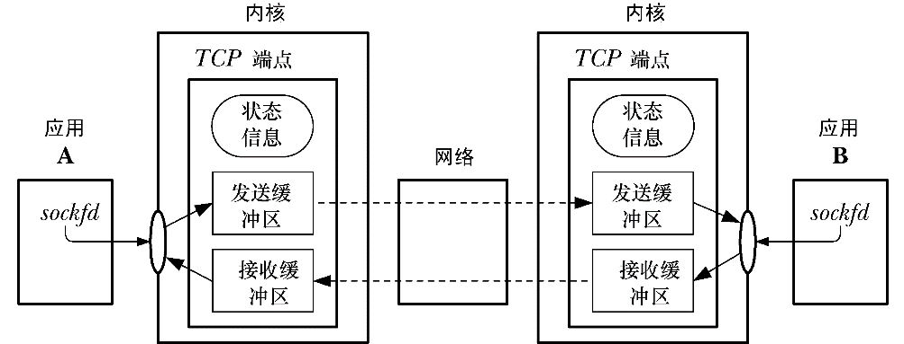

### 58.6.3　传输控制协议（TCP）

TCP在两个端点（即应用程序）之间提供了可靠的、面向连接的、双向字节流通信信道，如图58-8所示。为提供这些特性，TCP必须要执行本节中描述的任务。（有关所有这些特性的详细描述可以在[Stevens, 1994]中找到。）

<b class="my_markdown">图58-8：已连接的TCP socket</b>

这里使用术语TCP端点来表示TCP连接一端的内核所维护的信息。（通常会进一步对这个术语进行缩写，如仅书写“一个TCP”来表示“一个TCP端点”或“客户端TCP”来表示“客户端应用程序维护的TCP端点。”）这部分信息包括连接这一端的发送和接收缓冲区以及维护的用来同步两个已连接的端点的操作的状态信息。（在61.6.3节中介绍TCP状态迁移图时将深入介绍状态信息的细节。）在本书余下的部分中将使用术语接收TCP和发送TCP来表示一个用来在特定方向上传输数据的流socket连接两端的接收和发送应用程序。

#### 连接建立

在开始通信之前，TCP需要在两个端点之间建立一个通信信道。在连接建立期间，发送者和接收者需要交换选项来协商通信的参数。

#### 将数据打包成段

数据会被分解成段，每一个段都包含一个校验和，从而能够检测出端到端的传输错误。每一个段使用单个IP数据报来传输。

#### 确认、重传以及超时

当一个TCP段无错地达到目的地时，接收TCP会向发送者发送一个确认，通知它数据发送递送成功了。如果一个段在到达时是存在错误的，那么这个段就会被丢弃，确认信息也不会被发送。为处理段永远不到达或被丢弃的情况，发送者在发送每一个段时会开启一个定时器。如果在定时器超时之前没有收到确认，那么就会重传这个段。

> 由于所使用的网络以及当前的流量负载会影响传输一个段和接收其确认所需的时间，因此TCP采用了一个算法来动态地调整重传超时时间（RTO）的大小。
> 接收TCP可能不会立即发送确认，而是会等待几毫秒来观察一下是否可以将确认塞进接收者返回给发送者的响应中。（每个TCP段都包含一个确认字段，这样就能将确认塞进TCP段中了。）这项被称为延迟ACK的技术的目的是能少发送一个TCP段，从而降低网络中包的数量以及降低发送和接收主机的负载。

#### 排序

在TCP连接上传输的每一个字节都会分配到一个逻辑序号。这个数字指出了该字节在这个连接的数据流中所处的位置。（这个连接中的两个流各自都有自己的序号计数系统。）当传输一个TCP分段时会在其中一个字段中包含这个段的第一个字节的序号。

在每一个段中加上一个序号有几个作用。

+ 这个序号使得TCP分段能够以正确的顺序在目的地进行组装，然后以字节流的形式传递给应用层。（在任意一个时刻，在发送者和接收者之间可能存在多个正在传输的TCP分段，这些分段的到达顺序可能与被发送的顺序可能是不同的。）
+ 由接收者返回给发送者的确认消息可以使用序号来标识出收到了哪个TCP分段。
+ 接收者可以使用序号来移除重复的分段。发生重复的原因可能是因为IP数据段重复，也可能是因为TCP自己的重传算法会在一个段的确认丢失或没有按时收到时重传一个成功递送出去的段。

一个流的初始序号（ISN）不是从0开始的，相反，它是通过一个算法来生成的，该算法会递增分配给后续TCP连接的ISN（为防止出现前一个连接中的分段与这个连接中的分段混淆的情况）。这个算法也使得猜测ISN变得困难起来。序号是一个32位的值，当到达最大取值时会回到0。

#### 流量控制

流量控制防止一个快速的发送者将一个慢速的接收者压垮。要实现流量控制，接收TCP就必须要为进入的数据维护一个缓冲区。（每个TCP在连接建立阶段会通告其缓冲区的大小。）当从发送TCP端收到数据时会将数据累积在这个缓冲区中，当应用程序读取数据时会从缓冲区中删除数据。在每个确认中，接收者会通知发送者其进入数据缓冲区的可用空间（即发送者可以发送多少字节）。TCP流量控制算法采用了所谓的滑动窗口算法，它允许包含总共N字节（提供的窗口大小）的未确认段同时在发送者和接收者之间传输。如果接收TCP的进入数据缓冲区完全被充满了，那么窗口就会关闭，发送TCP就会停止传输数据。

> 接收者可以使用SO_RCVBUF socket选项来覆盖进入数据缓冲区的默认大小（参见socket(7)手册）。

#### 拥塞控制：慢启动和拥塞避免算法

TCP的拥塞控制算法被设计用来防止快速的发送者压垮整个网络。如果一个发送TCP发送包的速度要快于一个中间路由器转发的速度，那么该路由器就会开始丢弃包。这将会导致较高的包丢失率，其结果是如果TCP保持以相同的速度发送这些被丢弃的分段的话就会极大地降低性能。TCP的拥塞控制算法在下列两个场景中是比较重要的。

+ 在连接建立之后：此时（或当传输在一个已经空闲了一段时间的连接上恢复时），发送者可以立即向网络中注入尽可能多的分段，只要接收者公告的窗口大小允许即可。（事实上，这就是早期的TCP实现的做法。）这里的问题在于如果网络无法处理这种分段洪泛，那么发送者会存在立即压垮整个网络的风险。
+ 当拥塞被检测到时：如果发送TCP检测到发生了拥塞，那么它就必须要降低其传输速率。TCP是根据分段丢失来检测是否发生了拥塞，因为传输错误率是非常低的，即如果一个包丢失了，那么就认为发生了拥塞。

TCP的拥塞控制策略组合采用了两种算法：慢启动和拥塞避免。

慢启动算法会使发送TCP在一开始的时候以低速传输分段，但同时允许它以指数级的速度提高其速率，只要这些分段都得到接收TCP的确认。慢启动能够防止一个快速的TCP发送者压垮整个网络。但如果不加限制的话，慢启动在传输速率上的指数级增长意味着发送者在短时间内就会压垮整个网络。TCP的拥塞避免算法用来防止这种情况的发生，它为速率的增长安排了一个管理实体。

有了拥塞避免之后，在连接刚建立时，发送TCP会使用一个较小的拥塞窗口，它会限制所能传输的未确认的数据数量。当发送者从对等TCP处接收到确认时，拥塞窗口在一开始时会呈现指数级增长。但一旦拥塞窗口增长到一个被认为是接近网络传输容量的阈值时，其增长速度就会变成线性，而不是指数级的。（对网络容量的估算是根据检测到拥塞时的传输速率来计算得出的或者在一开始建立连接时设定为一个固定值。）在任何时刻，发送TCP传输的数据数量还会受到接收TCP的通告窗口和本地的TCP发送缓冲器的大小的限制。

慢启动和拥塞避免算法组合起来使得发送者可以快速地将传输速度提升至网络的可用容量，并且不会超出该容量。这些算法的作用是允许数据传输快速地到达一个平衡状态，即发送者传输包的速率与它从接收者处接收确认的速率一致。

