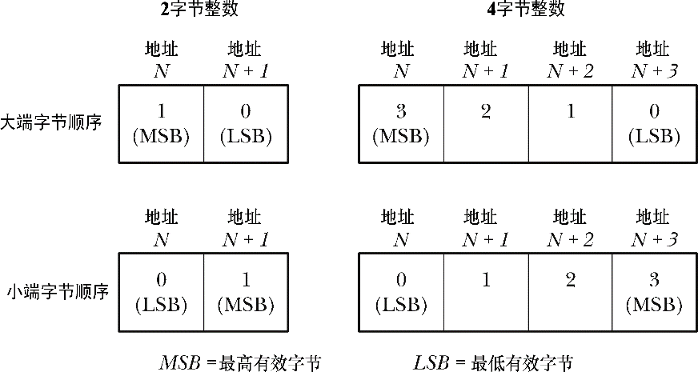
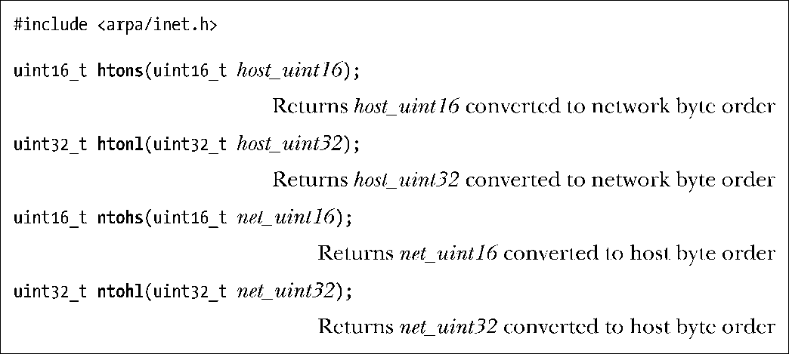

### 59.2　网络字节序

IP地址和端口号是整数值。在将这些值在网络中传递时碰到的一个问题是不同的硬件结构会以不同的顺序来存储一个多字节整数的字节。从图59-1中可以看出，存储整数时先存储（即在最小内存地址处）最高有效位的被称为大端，那些先存储最低有效位的被称为小端。（这两个术语出自Jonathan Swift在1726年发表的讽刺小说《格列佛游记》，在那篇小说中这两个术语指在另一端打开煮鸡蛋的敌对政治派别。）小端架构中最值得关注的是x86。（从历史上来讲，Digital的VAX架构也是一个重要的例子，因为BSD大多是用于这种机器上的。）其他群大多数架构都是大端的。一些硬件结构可以在这两种格式之间切换。在特定主机上使用的字节序被称为主机字节序。

<b class="my_markdown">图59-1：2字节和4字节整数的大端和小端字节序</b>

由于端口号和IP地址必须在网络中的所有主机之间传递并且需要被它们所理解，因此必须要使用一个标准的字节序。这种字节序被称为网络字节序，它是大端的。

在本章后面将会介绍各种用于将主机名（如www.kernel.org）和服务名（如http）转换成对应的数字形式的函数。这些函数一般会返回用网络字节序表示的整数，并且可以直接将这些整数复制进一个socket地址结构的相关字段中。

有时候可能会直接使用IP地址和端口号的整数常量形式，如可能会选择将端口号硬编码进程序中，或者将端口号作为一个命令行参数传递给程序，或者在指定一个IPv4地址时使用诸如INADDR_ANY和INADDR_LOOPBACK之类的常量。这些值在C中是按照主机的规则来表示的，因此它们是主机字节序的，在将它们存储进socket地址结构中之前需要将这些值转换成网络字节序。

htons()、htonl()、ntohs()以及ntohl()函数被定义（通常为宏）用来在主机和网络字节序之间转换整数。

在早期，这些函数的原型如下。

这揭示出了函数名的由来——在本例中是host to network long。在大多数实现socket的早期系统中，短整数是16位的，长整数是32位的。但在现代系统中这种论断已经不再正确了（至少对于长整数是这样的），因此上面给出的原型实际上是为这些函数所处理的类型提供了更加精确的定义，尽管所使用的名称未发生变化。uint16_t和uint32_t数据类型是16位和32位的无符号整数。

严格地讲，只需要在主机字节序与网络字节序不同的系统上使用这四个函数，但开发人员应该总是使用这些函数，这样程序就能够在不同的硬件结构之间移植了。在主机字节序与网络字节序一样的系统上，这些函数只是简单地原样返回传递给它们的参数。

