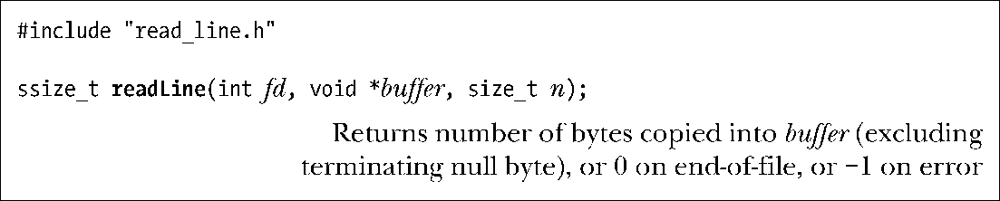
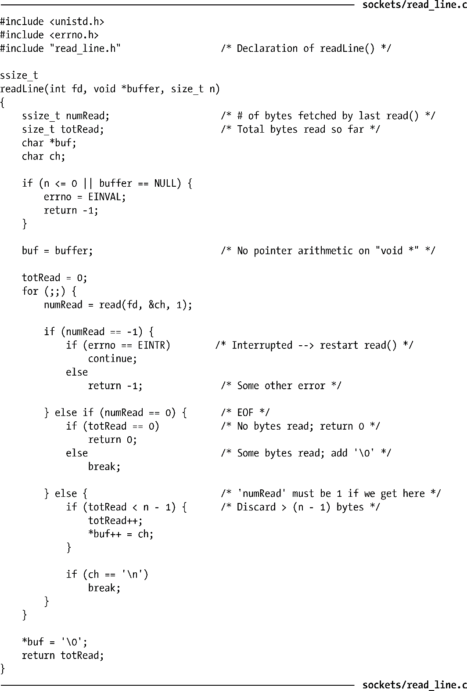

### 59.3　数据表示

在编写网络程序时需要清楚不同的计算机架构使用不同的规则来表示各种数据类型。本章之前已经指出过整数类型可以以大端或小端的形式存储。此外，还存在其他的差别，如C long数据类型在一些系统中可能是32位的，但在其他系统上可能是64位的。当考虑结构时，问题就更加复杂了，因为不同的实现采用了不同的规则来将一个结构中的字段对齐到主机系统的地址边界，从而使得字段之间的填充字节数量是不同的。

由于在数据表现上存在这些差异，因此在网络中的异构系统之间交换数据的应用程序必须要采用一些公共规则来编码数据。发送者必须要根据这些规则来对数据进行编码，而接收者则必须要遵循同样的规则对数据进行解码。将数据变成一个标准格式以便在网络上传输的过程被称为信号编集（marshalling）。目前，存在多种信号编集标准，如XDR（ExterExternalData Representation，在RFC 1014中描述）、ASN.1-BER（Abstract SyntaxNotation 1, http://www.asn1.org/）、CORBA以及XML。一般来讲，这些标准会为每一种数据类型都定义一个固定的格式（如定义了字节序和使用的位数）。除了按照所需的格式进行编码之外，每一个数据项都需要使用额外的字段来标识其类型（以及可能的话还会加上长度）。

然而，一种比信号编集更简单的方法通常会被采用：将所有传输的数据编码成文本形式，其中数据项之间使用特定的字符来分隔开，这个特定的字符通常是换行符。这种方法的一个优点是可以使用telnet来调试一个应用程序。要完成这项任务需要使用下面的命令。

接着可以输入一行传给应用程序的文本并查看应用程序发来的响应，在59.11节中将会演示这项技术。

> 与异构系统在数据表示上的差异相关的问题不仅仅存在于网络间的数据传输中，还存在于此类系统之间的任何数据交换机制中，如在传输异构系统间磁盘或磁带上的文件时会碰到同样的问题。现在，网络编程只不过是可能会碰到这类问题的最常见的编程场景。

如果将在一个流socket上传输的数据编码成使用换行符分隔的文本，那么定义一个诸如readLine()之类的函数将是比较便捷的，如程序清单59-1所示。

readLine()函数从文件描述符参数fd引用的文件中读取字节直到碰到换行符为止。输入字节序列将会返回在buffer指向的位置处，其中buffer指向的内存区域至少为n字节。返回的字符串总是以null结尾，因此实际上至多有（n–1）个字节会返回。在成功时，readLine()会返回放入buffer的数据的字节数，结尾的null字节不会计算在内。

程序清单59-1：一次读取一行数据

如果在遇到换行符之前读取的字节数大于或等于（n–1），那么readLine()函数会丢弃多余的字节（包括换行符）。如果在前面的（n–1）字节中读取了换行符，那么在返回的字符串中就会包含这个换行符。（因此可以通过检查在返回的buffer中结尾null字节前是否是一个换行符来确定是否有字节被丢弃了。）采用这种方法之后，将输入以行为单位进行处理的应用程序协议就不会将一个很长的行处理成多行了。当然，这可能会破坏协议，因为两端的应用程序不再同步了。另一种做法是让readLine()只读取足够的字节数来填充提供的缓冲器，而将到下一行新行为止的剩余字节留给下一个readLine()调用。在这种情况下，readLine()的调用者需要处理读取部分行的情况。

在59.11节中给出的示例程序中将会使用readLine()函数。

