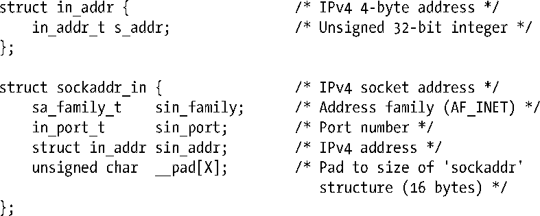
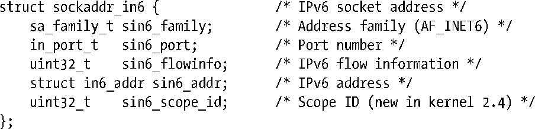
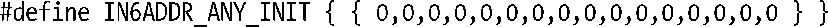
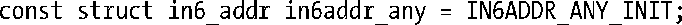
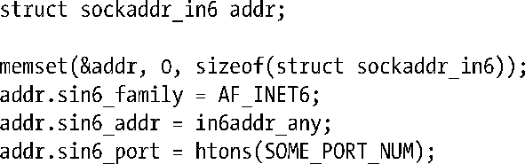
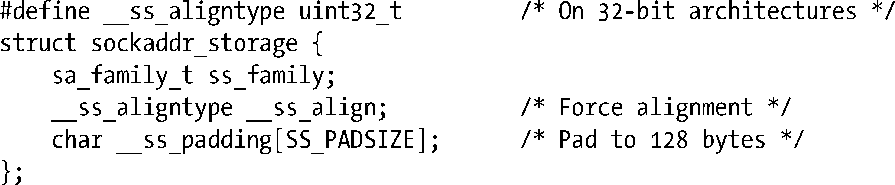

### 59.4　Internet socket地址

Internet domain socket地址有两种：IPv4和IPv6。

#### IPv4 socket地址：struct sockaddr_in

一个IPv4 socket地址会被存储在一个sockaddr_in结构中，该结构在<netinet/in.h>中进行定义，具体如下。

在56.4节中曾讲过普通的sockaddr结构中有一个字段来标识socket domain，该字段对应于sockaddr_in结构中的sin_family字段，其值总为AF_INET。sin_port和sin_addr字段是端口号和IP地址，它们都是网络字节序的。in_port_t和in_addr_t数据类型是无符号整型，其长度分别为16位和32位。

#### IPv6 socket地址：struct sockaddr_in6

与IPv4地址一样，一个IPv6 socket地址包含一个IP地址和一个端口号，它们之间的差别在于IPv6地址是128位而不是32位的。一个IPv6 socket地址会被存储在一个sockaddr_in6结构中，该结构在<netinet/in.h>中进行定义，具体如下。

sin_family字段会被设置成AF_INET6。sin6_port和sin6_addr字段分别是端口号和IP地址。（uint8_t数据类型被用来定义in6_addr结构中字节的类型，它是一个8位的无符号整型。）剩余的字段sin6_flowinfo和sin6_scope_id则超出了本书的范围，在本书给出所有例子中都会将它们设置为0。sockaddr_in6结构中的所有字段都是以网络字节序存储的。

> IPv6地址是在RFC 4291中进行描述的。与IPv6流量控制（sin6_flowinfo）有关的信息可以在[Stevens et al., 2004]的附录A和RFC 2460以及3697中找到。RFC 3491和4007提供了与sin6_scope_id有关的信息。

IPv6和IPv4一样也有通配和回环地址，但它们的用法要更加复杂一些，因为IPv6地址是存储在数组中的（并没有使用标量类型），下面将会使用IPv6通配地址（0::0）来说明这一点。系统定义了常量IN6ADDR_ANY_INIT来表示这个地址，具体如下。

> 在Linux上，头文件中的一些细节与本节中的描述是不同的。特别地，in6_addr结构包含了一个union定义将128位的IPv6地址划分成16字节或八个2字节的整数或四个32字节的整数。由于存在这样的定义，因此glibc提供的IN6ADDR_ANY_INIT常量的定义实际上比正文中给出的定义多了一组嵌套的花括号。

在变量声明的初始化器中可以使用IN6ADDR_ANY_INIT常量，但无法在一个赋值语句的右边使用这个常量，因为C语法并不允许在赋值语句中使用一个结构化的常量。取而代之的做法是必须要使用一个预先定义的变量in6addr_any，C库会按照下面的方式对该变量进行初始化。

因此可以像下面这样使用通配地址来初始化一个IPv6 socket地址。

IPv6环回地址（::1）的对应常量和变量是IN6ADDR_LOOPBACK_INIT和in6addr _loopback。

与IPv4中相应字段不同的是IPv6的常量和变量初始化器是网络字节序的，但就像上面给出的代码那样，开发人员仍然必须要确保端口号是网络字节序的。

如果IPv4和IPv6共存于一台主机上，那么它们将共享同一个端口号空间。这意味着如果一个应用程序将一个IPv6 socket绑定到了TCP端口2000上（使用IPv6通配地址），那么IPv4 TCP socket将无法绑定到同一个端口上。（TCP/IP实现确保位于其他主机上的socket能够与这个socket进行通信，不管那些主机运行的是IPv4还是IPv6。）

#### sockaddr_storage结构

在IPv6 socket API中新引入了一个通用的sockaddr_storage结构，这个结构的空间足以存储任意类型的socket地址（即可以将任意类型的socket地址结构强制转换并存储在这个结构中）。特别地，这个结构允许透明地存储IPv4或IPv6 socket地址，从而删除了代码中的IP版本依赖性。sockaddr_storage结构在Linux上的定义如下所示。

