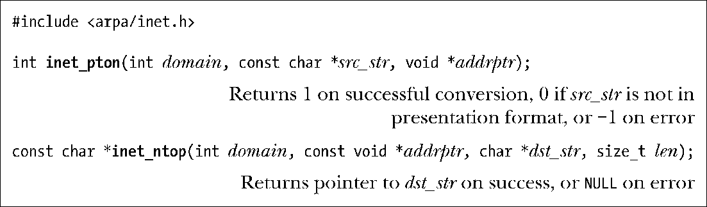
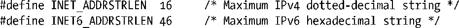

### 59.6　inet_pton()和inet_ntop()函数

inet_pton()和inet_ntop()函数允许在IPv4和IPv6地址的二进制形式和点分十进制表示法或十六进制字符串表示法之间进行转换。

这些函数名中的p表示“展现（presentation）”，n表示“网络（network）”。展现形式是人类可读的字符串，如：

+ 204.152.189.116（IPv4点分十进制地址）；
+ ::1（IPv6冒号分隔的十六进制地址）；
+ ::FFFF:204.152.189.116（IPv4映射的IPv6地址）。

inet_pton()函数将src_str中包含的展现字符串转换成网络字节序的二进制IP地址。domain参数应该被指定为AF_INET或AF_INET6。转换得到的地址会被放在addrptr指向的结构中，它应该根据在domain参数中指定的值指向一个in_addr或in6_addr结构。

inet_ntop()函数执行逆向转换。同样，domain应该被指定为AF_INET或AF_INET6，addrptr应该指向一个待转换的in_addr或in6_addr结构。得到的以null结尾的字符串会被放置在dst_str指向的缓冲器中。len参数必须被指定为这个缓冲器的大小。inet_ntop()在成功时会返回dst_str。如果len的值太小了，那么inet_ntop()会返回NULL并将errno设置成ENOSPC。

要正确计算dst_str指向的缓冲器的大小可以使用在<netinet/in.h>中定义的两个常量。这些常量标识出了IPv4和IPv6地址的展现字符串的最大长度（包括结尾的null字节）。

下一节将会给出使用inet_pton()和inet_ntop()的例子。

