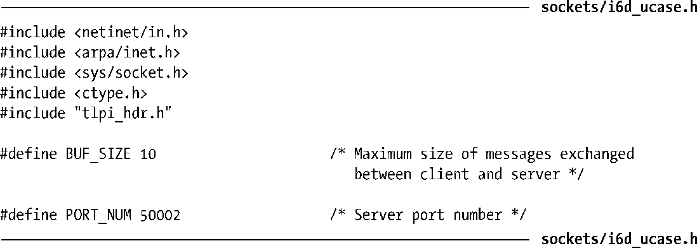
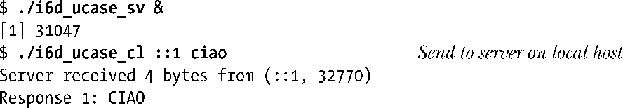
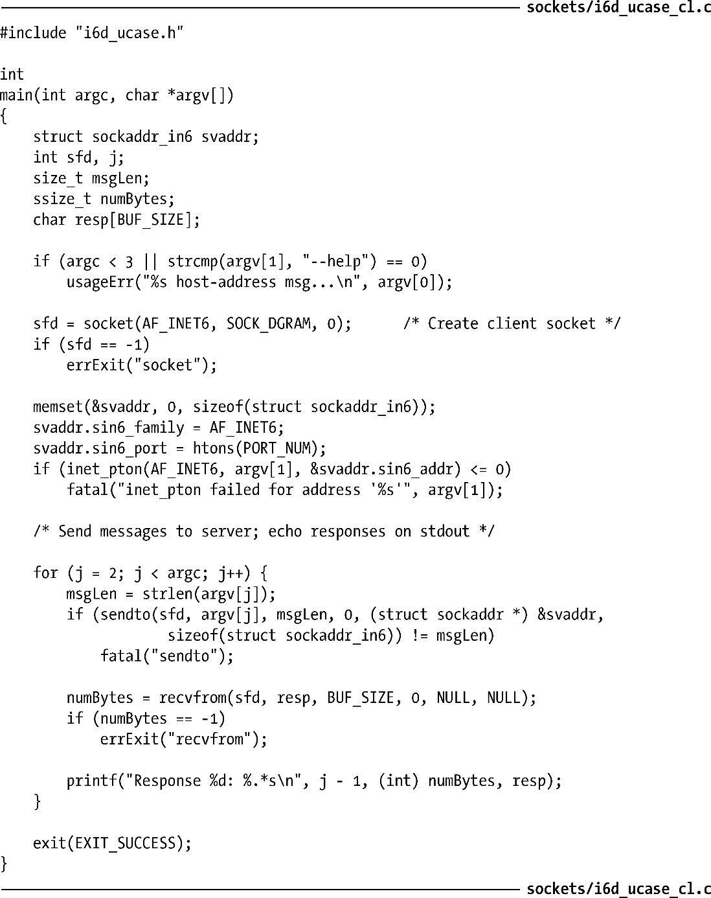

### 59.7　客户端/服务器示例（数据报socket）

本节将修改在57.3节中给出的大小写转换服务器和客户端程序，使之使用AF_INET6 domain中的数据报socket。本节给出的这两个程序中的注释较少，因为它们的结构与之前给出的程序的结构是类似的。新程序中的主要差别在于59.4节中介绍的IPv6 socket地址结构的申明和初始化。

客户端和服务器都使用了程序清单59-2中给出的头文件。这个头文件定义了服务器的端口号和客户端与服务器可交换的最大消息数量。

程序清单59-2：i6d_ucase_sv.c和i6d_ucase_cl.c使用的头文件

程序清单59-3给出了服务器程序。服务器使用inet_ntop()函数将客户端的主机地址（通过recvfrom()调用获得）转换成可打印的形式。

程序清单59-4给出的客户端程序与之前的UNIX domain中的版本（程序清单57-7）相比存在两个显著的改动。第一个差别在于客户端会将其第一个命令行参数解释成服务器的IPv6地址。（剩余的命令行参数是作为单独的数据报被传递给服务器的。）客户端使用inet_pton()将服务器地址转换成二进制形式。另一个差别在于客户端并没有将其socket绑定到一个地址上。在58.6.1节中曾指出过如果一个Internet domain socket没有被绑定到一个地址上，那么内核会将该socket绑定到主机系统上的一个临时端口上。这一点可以从下面的shell会话日志中看出，其中服务器和客户端运行于同一个主机上。

从上面的输出中可以看出服务器的recvfrom()调用能够获取客户端socket的地址，包括临时端口号，不管客户端是否调用了bind()。

程序清单59-3：使用数据报socket的IPv6大小写转换服务器

程序清单59-4：使用数据报socket的IPv6大小写转换客户端

