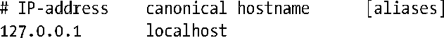
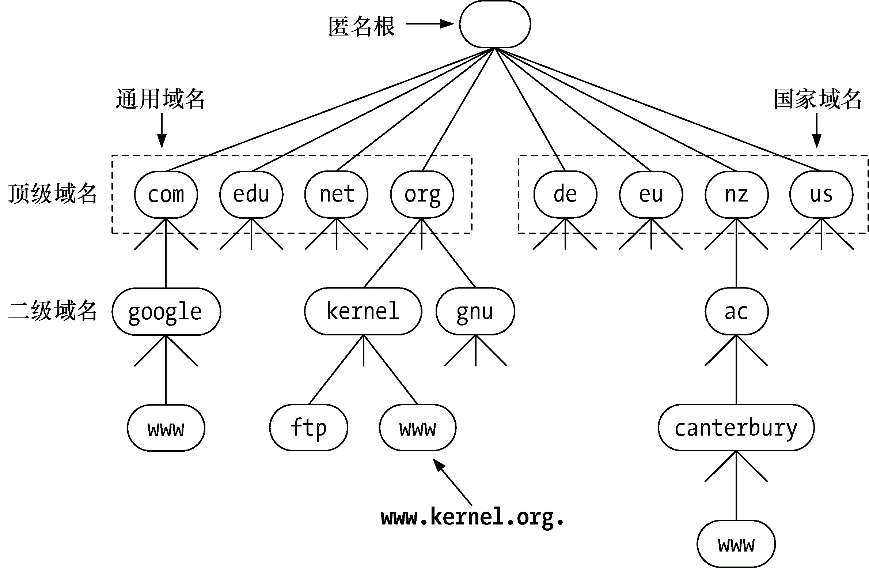

### 59.8　域名系统（DNS）

在59.10节中将会介绍获取与一个主机名对应的IP地址的getaddrinfo()函数和执行逆向转换的getnameinfo()函数，但在介绍这些函数之前需要解释如何使用DNS来维护主机名和IP地址之间的映射关系。

在DNS出现以前，主机名和IP地址之间的映射关系是在一个手工维护的本地文件/etc/hosts中进行定义的，该文件包含了形如下面的记录。

gethostbyname()函数（被getaddrinfo()取代的函数）通过搜索这个文件并找出与规范主机名（即主机的官方或主要名称）或其中一个别名（可选的，以空格分隔）匹配的记录来获取一个IP地址。

然而，/etc/hosts模式的扩展性交叉，并且随着网络中主机数量的增长（如因特网中存在着数以亿计的主机），这种方式已经变得不太可行了。

DNS被设计用来解决这个问题。DNS的关键想法如下。

+ 将主机名组织在一个层级名空间中（图59-2）。DNS层级中的每一个节点都有一个标签（名字），该标签最多可包含63个字符。层级的根是一个无名子的节点，即“匿名节点”。

<b class="my_markdown">图59-2：DNS层级的一个子集</b>

+ 一个节点的域名由该节点到根节点的路径中所有节点的名字连接而成，各个名字之间用点（.）分隔。如google.com是节点google的域名。
+ 完全限定域名（fully qualified domain name，FQDN），如www.kernel.org.，标识出了层级中的一台主机。区分一个完全限定域名的方法是看名字是否已点结尾，但在很多情况下这个点会被省略。
+ 没有一个组织或系统会管理整个层级。相反，存在一个DNS服务器层级，每台服务器管理树的一个分支（一个区域）。通常，每个区域都有一个主要主名字服务器。此外，还包含一个或多个从名字服务器（有时候也被称为次要主名字服务器），它们在主要主名字服务器崩溃时提供备份。区域本身可以被划分成一个个单独管理的更小的区域。当一台主机被添加到一个区域中或主机名到IP地址之间的映射关系发生变化时，管理员负责更新本地名字服务器上的名字数据中的对应名字。（无需手动更改层级中其他名字服务器数据库）。

> Linux上采用的DNS服务器实现是被广泛使用的BerkeleyInternet Name Domain（BIND）实现，named(8)，它是由Internet Systems Consortium (http://www.isc.org/)维护的。这个daemon的运作是由文件/etc/named.conf控制的（参见named.conf(5)手册）。有关DNS和BIND的关键参考资料可以在[Albitz & Liu, 2006]中找到。有关DNS的信息也可以在[Stevens, 1994]的第14章、[Stevens et al., 2004]的第11章以及[Comer, 2000]的第24章中找到。

+ 当一个程序调用getaddrinfo()来解析（即获取IP地址）一个域名时，getaddrinfo()会使用一组库函数（resolver库）来与本地的DNS服务器通信。如果这个服务器无法提供所需的信息，那么它就会与位于层级中的其他DNS服务器进行通信以便获取信息。有时候，这个解析过程可能会花费很多时间，DNS服务器采用了缓存技术来避免在查询常见域名时所发生的不必要的通信。

使用上面的方法使得DNS能够处理大规模的名空间，同时无需对名字进行集中管理。

#### 递归和迭代的解析请求

DNS解析请求可以分为两类：递归和迭代。在一个递归请求中，请求者要求服务器处理整个解析任务，包括在必要的时候与其他DNS服务器进行通信的任务。当位于本地主机上的一个应用程序调用getaddrinfo()时，该函数会向本地DNS服务器发起一个递归请求。如果本地DNS服务器自己并没有相关信息来完成解析，那么它就会迭代地解析这个域名。

下面通过一个例子来解释迭代解析。假设本地DNS服务器需要解析一个名字www.otago.ac.nz。要完成这个任务，它首先与每个DNS服务器都知道的一小组根名字服务器中的一个进行通信。（使用命令dig . NS或从网页http://www.root-servers.org/上可以获取这组服务器列表。）给定名字www.otago.ac.nz，根名字服务器会告诉本DNS服务器到其中一台nz DNS服务器上查询。然后本地DNS服务器会在nz服务器上查询名字www.otago.ac.nz，并收到一个到ac.nz服务器上查询的响应。之后本地DNS服务器会在ac.nz服务器上查询名字www.otago.ac.nz并被告知查询otago.ac.nz服务器。最后本地DNS服务器会在otago.ac.nz服务器上查询www.otago.ac.nz并获取所需的IP地址。

如果向gethostbyname()传递了一个不完整的域名，那么解析器在解析之前会尝试补全。域名补全的规则是在/etc/resolv.conf中定义的（参见resolv.conf(5)手册）。在默认情况下，解析器至少会使用本机的域名来补全。例如，如果登录机器oghma.otago.ac.nz并输入了命令ssh octavo，得到的DNS查询将会以octavo.otago.ac.nz作为其名字。

#### 顶级域

紧跟在匿名根节点下面的节点被称为顶级域（TLD）。（在这些之下的节点是二级域，以此类推。）TLD可以分为两类：通用的和国家的。

在历史上存在七个通用的TLD，其中大多数都可以被看成是国际的。在图59-2中给出了其中4个原始通用的TLD。另外三个是int、mil和gov，其中后两个是保留给美国使用的。近来，一组新的通用TLD被添加进来了（如info、name以及museum）。

每个国家都有一个对应的国家（或地理）TLD（在ISO 3166-1中进行了标准化），它是一个由2个字符组成的名字。在图59-2中给出了其中一些：de（德国，Deutschland）、eu（欧洲联盟的超国家地理TLD）、nz（新西兰）以及us（美利坚合众国）。一些国家将它们的TLD划分成一组二级域名，其划分方式与通用域类似。如新西兰用ac.nz（学术机构）、co.nz（商业）以及govt.nz（政府）。

