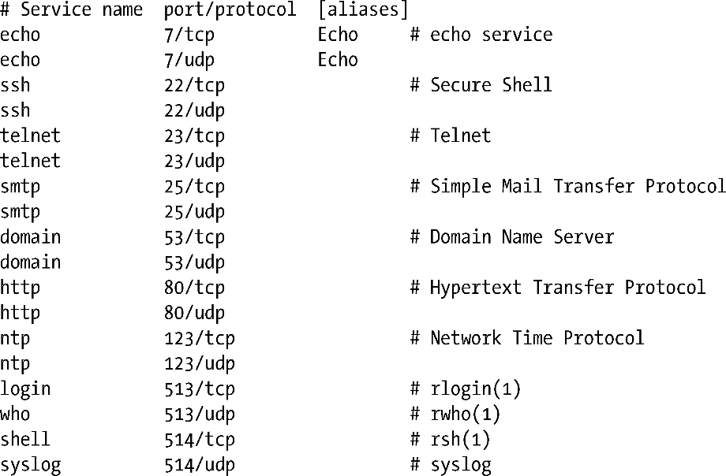

### 59.9　/etc/services文件

正如在58.6.1节中指出的那样，众所周知的端口号是由IANA集中注册的，其中每个端口都有一个对应的服务名。由于服务号是集中管理并且不会像IP地址那样频繁变化，因此没有必要采用DNS服务器来管理它们。相反，端口号和服务名会记录在文件/etc/services中。getaddrinfo()和getnameinfo()函数会使用这个文件中的信息在服务名和端口号之间进行转换。

协议通常是tcp或udp。可选的（以空格分隔）别名指定了服务的其他名字。此外，每一行中都可能会包含以#字符打头的注释。

正如之前指出的那样，一个给定的端口号引用UDP和TCP的的唯一实体，但IANA的策略是将两个端口都分配给服务，即使服务只使用了其中一种协议。如telnet、ssh、HTTP以及SMTP，它们都只使用TCP，但对应的UDP端口也被分配给了这些服务。相应地，NTP只使用UDP，但TCP端口123也被分配给了这个服务。在一些情况中，一个服务既会使用TCP也会使用UDP，DNS和encho就是这样的服务。最后，还有一些极少出现的情况会将数值相同的UDP和TCP端口分配给不同的服务，如rsh使用TCP端口514，而syslog daemon（37.5节）则是使用了UDP端口514。这是因为这些端口在采用现行的IANA策略之前就分配出去了。

> /etc/services文件仅仅记录着名字到数字的映射关系。它不是一种预留机制：在/etc/services中存在一个端口号并不能保证在实际环境中特定的服务就能够绑定到该端口上。

