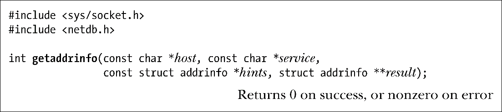
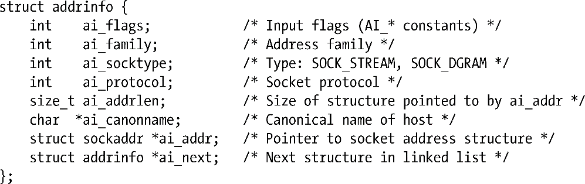
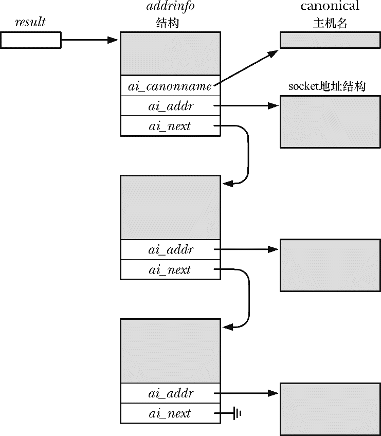

### 59.10.1　getaddrinfo()函数

给定一个主机名和服务器名，getaddrinfo()函数返回一个socket地址结构列表，每个结构都包含一个地址和端口号。

成功时返回0，发生错误时返回非零值。

getaddrinfo()以host、service以及hints参数作为输入，其中host参数包含一个主机名或一个以IPv4点分十进制标记或IPv6十六进制字符串标记的数值地址字符串。（准确地讲，getaddrinfo()接受在59.13.1节中描述的更通用的数字和点标记的IPv4数值字符串。）service参数包含一个服务名或一个十进制端口号。hints参数指向一个addrinfo结构，该结构规定了选择通过result返回的socket地址结构的标准。稍后会介绍有关hints参数的更多细节。

getaddrinfo()会动态地分配一个包含addrinfo结构的链表并将result指向这个列表的表头。每个addrinfo结构包含一个指向与host和service对应的socket地址结构的指针（图59-3）。addrinfo结构的形式如下。

<b class="my_markdown">图59-3：getaddrinfo()分配和返回的结构</b>

result参数返回一个结构列表而不是单个结构，因为与在host、service以及hints中指定的标准对应的主机和服务组合可能有多个。如查询拥有多个网络接口的主机时可能会返回多个地址结构。此外，如果将hints.ai_socktype指定为0，那么就可能会返回两个结构——一个用于SOCK_DGRAM socket，另一个用于SOCK_STREAM socket——前提是给定的service同时对TCP和UDP可用。

通过result返回的addrinfo结构的字段描述了关联socket地址结构的属性。ai_family字段会被设置成AF_INET或AF_INET6，表示该socket地址结构的类型。ai_socktype字段会被设置成SOCK_STREAM或SOCK_DGRAM，表示这个地址结构是用于TCP服务还是用于UDP服务。ai_protocol字段会返回与地址族和socket类型匹配的协议值。（ai_family、ai_socktype以及ai_protocol三个字段为调用socket()创建该地址上的socket时所需的参数提供了取值。）ai_addrlen字段给出了ai_addr指向的socket地址结构的大小（字节数）。in_addr字段指向socket地址结构（IPv4时是一个in_addr结构，IPv6时是一个in6_addr结构）。ai_flags字段未用（它用于hints参数）。ai_canonname字段仅由第一个addrinfo结构使用并且其前提是像下面所描述的那样在hints.ai_flags中使用了AI_CANONNAME字段。

与gethostbyname()一样，getaddrinfo()可能需要向一台DNS服务器发送一个请求，并且这个请求可能需要花费一段时间来完成。同样的过程也适用于getnameinfo()，具体可参考59.10.4节中的描述。

在59.11　节中将会演示如何使用getaddrinfo()。

#### hints参数

hints参数为如何选择getaddrinfo()返回的socket地址结构指定了更多的标准。当用作hints参数时只能设置addrinfo结构的ai_flags、ai_family、ai_socktype以及ai_protocol字段，其他字段未用到，并将应该根据具体情况将其初始化为0或NULL。

hints.ai_family字段选择了返回的socket地址结构的域，其取值可以是AF_INET或AF_INET6（或其他一些AF_*常量，只要实现支持它们）。如果需要获取所有种类socket地址结构，那么可以将这个字段的值指定为AF_UNSPEC。

hints.ai_socktype字段指定了使用返回的socket地址结构的socket类型。如果将这个字段指定为SOCK_DGRAM，那么查询将会在UDP服务上执行，对应的socket地址结构会通过result返回。如果指定了SOCK_STREAM，那么将会执行一个TCP服务查询。如果将hints.ai_socktype指定为0，那么任意类型的socket都是可接受的。

hints.ai_protocol字段为返回的地址结构选择了socket协议。在本书中，这个字段的值总是会被设置为0，表示调用者接受任何协议。

hints.ai_flags字段是一个位掩码，它会改变getaddrinfo()的行为。这个字段的取值是下列值中的零个或多个取OR得来的。

##### AI_ADDRCONFIG

在本地系统上至少配置了一个IPv4地址时返回IPv4地址（不是IPv4回环地址），在本地系统上至少配置了一个IPv6系统时返回IPv6地址（不是IPv6回环地址）。

##### AI_ALL

参见下面对AI_V4MAPPED的描述。

##### AI_CANONNAME

如果host不为NULL，那么返回一个指向以null结尾的字符串，该字符串包含了主机的规范名。这个指针会在通过result返回的第一个addrinfo结构中的ai_canonname字段指向的缓冲器中返回。

##### AI_NUMERICHOST

强制将host解释成一个数值地址字符串。这个常量用于在不必要解析名字时防止进行名字解析，因为名字解析可能会花费较长的时间。

##### AI_NUMERICSERV

将service解释成一个数值端口号。这个标记用于防止调用任意的名字解析服务，因为当service为一个数值字符串时这种调用是没有必要的。

##### AI_PASSIVE

返回一个适合进行被动式打开（即一个监听socket）的socket地址结构。在这种情况下，host应该是NULL，通过result返回的socket地址结构的IP地址部分将会包含一个通配IP地址（即INADDR_ANY或IN6ADDR_ANY_INIT）。如果没有设置这个标记，那么通过result返回的地址结构将能用于connect()和sendto()；如果host为NULL，那么返回的socket地址结构中的IP地址将会被设置成回环IP地址（根据所处的域，其值为INADDR_LOOPBACK或IN6ADDR_LOOPBACK_INIT）。

##### AI_V4MAPPED

如果在hints的ai_family字段中指定了AF_INET6，那么在没有找到匹配的IPv6地址时应该在result返回IPv4映射的IPv6地址结构。如果同时指定了AI_ALL和AI_V4MAPPED，那么在result中会同时返回IPv6和IPv4地址，其中IPv4地址会被返回成IPv4映射的IPv6地址结构。

正如前面介绍AI_PASSIVE时指出的那样，host可以被指定为NULL。此外，还可以将service指定为NULL，在这种情况下，返回的地址结构中的端口号会被设置为0（即只关心将主机名解析成地址）。然而无法将host和service同时指定为NULL。

如果无需在hints中指定上述的选取标准，那么可以将hints指定为NULL，在这种情况下会将ai_socktype和ai_protocol假设为0，将ai_flags假设为（AI_V4MAPPED | AI_ADDRCONFIG），将ai_family假设为AF_UNSPEC。（glibc实现有意与SUSv3背道而驰，它声称如果hints为NULL，那么会将ai_flags假设为0。）

