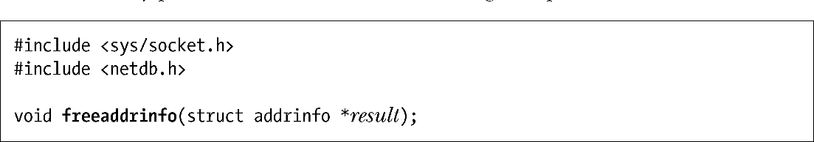

### 59.10.2　释放addrinfo列表：freeaddrinfo()

getaddrinfo()函数会动态地为result引用的所有结构分配内存（图59-3），其结果是调用者必须要在不再需要这些结构时释放它们。使用freeaddrinfo()函数可以方便地在一个步骤中执行这个释放任务。

如果希望保留addrinfo结构或其关联的socket地址结构的一个副本，那么必须要在调用freeaddrinfo()之前复制这些结构。

