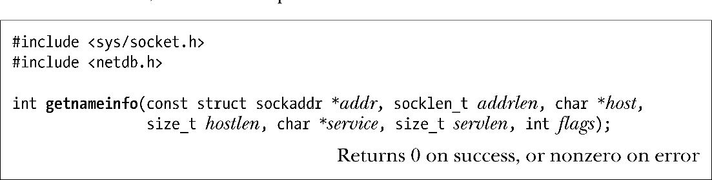

### 59.10.4　getnameinfo()函数

getnameinfo()函数是getaddrinfo()的逆函数。给定一个socket地址结构（IPv4或IPv6），它会返回一个包含对应的主机和服务名的字符串或者在无法解析名字时返回一个等价的数值。

addr参数是一个指向待转换的socket地址结构的指针，该结构的长度是由addrlen指定的。通常，addr和addrlen的值是从accept()、recvfrom()、getsockname()或getpeername()调用中获得的。

得到的主机和服务名是以null结尾的字符串，它们会被存储在host和service指向的缓冲器中。调用者必须要为这些缓冲器分配空间并将它们的大小传入hostlen和servlen。<netdb.h>头文件定义了两个常量来辅助计算这些缓冲器的大小。NI_MAXHOST指出了返回的主机名字符串的最大字节数，其取值为1025。NI_MAXSERV指出了返回的服务名字符串的最大字节数，其取值为32。这两个常量没有在SUSv3中得到规定，但所有提供getnameinfo()的UNIX实现都对它们进行了定义。（从glibc 2.8起，必须要定义_BSD_SOURCE、_SVID_SOURCE或_GNU_SOURCE中的其中一个特性文本宏才能获取NI_MAXHOST和NI_MAXSERV的定义。）

如果不想获取主机名，那么可以将host指定为NULL并且将hostlen指定为0。同样地，如果不需要服务名，那么可以将service指定为NULL并且将servlen指定为0。但是host和service中至少有一个必须为非NULL值（并且对应的长度参数必须为非零）。

最后一个参数flags是一个位掩码，它控制着getnameinfo()的行为，其取值为下面这些常量取OR。

##### NI_DGRAM

在默认情况下，getnameinfo()返回与流socket（即TCP）服务对应的名字。通常，这是无关紧要的，因为正如59.9节中指出的那样，与TCP和UDP端口对应的服务名通常是相同的，但在一些名字不同的场景中，NI_DGRAM标记会强制返回数据报socket（即UDP）服务的名字。

##### NI_NAMEREQD

在默认情况下，如果无法解析主机名，那么在host中会返回一个数值地址字符串。如果指定了NI_NAMEREQD，那么就会返回一个错误（EAI_NONAME）。

##### NI_NOFQDN

在默认情况下会返回主机的完全限定域名。指定NI_NOFQDN标记会导致当主机位于局域网中时只返回名字的第一部分（即主机名）。

##### NI_NUMERICHOST

强制在host中返回一个数值地址字符串。这个标记在需要避免可能耗时较长的DNS服务器调用时是比较有用的。

##### NI_NUMERICSERV

强制在service中返回一个十进制端口号字符串。这个标记在知道端口号不对应于服务名时——如它是一个由内核分配给socket的临时端口号——以及需要避免不必要的搜索/etc/services的低效性时是比较有用的。

getnameinfo()在成功时会返回0，发生错误时会返回表59-1中给出的其中一个非零错误码。

