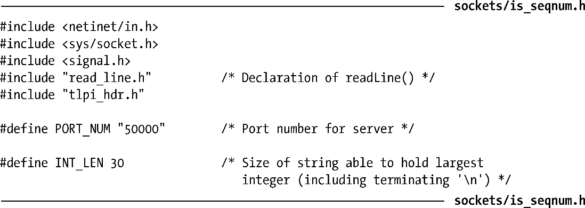
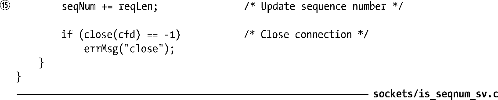
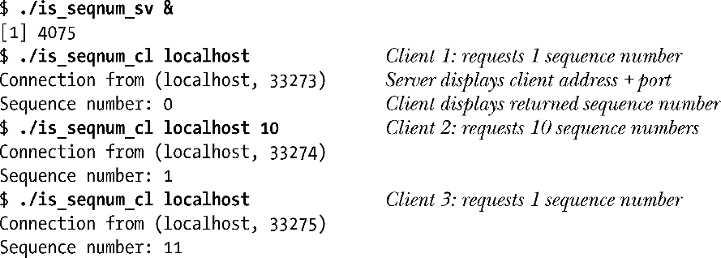
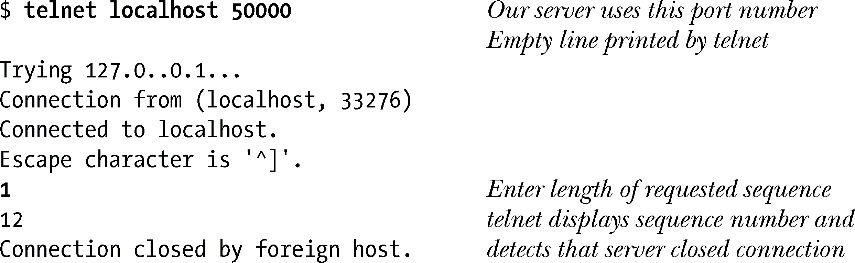
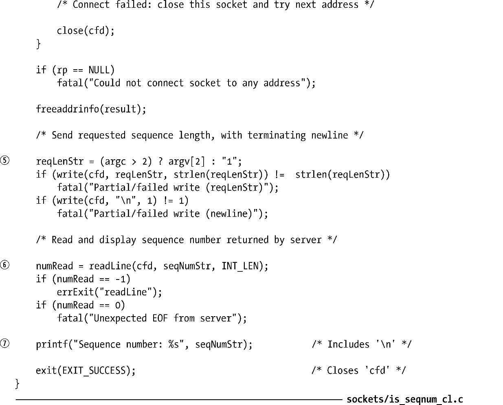

### 59.11　客户端/服务器示例（流式socket）

现在已经可以介绍一个简单的使用TCP socket的客户端/服务器应用程序了。这个应用程序执行的任务与44.8节中给出的FIFO客户端/服务器应用程序所执行的任务是一样的：给客户端分配唯一的序号（或一组序号）。

为处理服务器和客户端主机可能以不同的格式来表示整数的情况，需要将所有传输的整数编码成以换行符结尾的字符串并使用readLine()函数（程序清单59-1）来读取这些字符串。

#### 公共头文件

服务器和客户端都需要包含程序清单59-5给出的头文件。这个文件包含了其他各种头文件并定义了应用程序使用的TCP端口号。

#### 服务器程序

程序清单59-6给出的服务器程序执行了下列任务。

+ 将服务器的序号初始化为1或通过可选的命令行参数提供的值①。
+ 忽略SIGPIPE信号②。这样就能够防止服务器在尝试向一个对端已经被关闭的socket写入数据时收到SIGPIPE信号；反之，write()会失败并返回EPIPE错误。
+ 调用getaddrinfo()④获取使用端口号PORT_NUM的TCP socket的socket地址结构组。（通常会使用一个服务名，而不会使用一个硬编码的端口号。）这里指定了AI_PASSIVE标记③，这样得到的socket会被绑定到通配地址上（58.5节），其结果是当服务器运行在一个多宿主机上时可以接受发到主机的任意一个网络地址上的连接请求。
+ 进入一个循环迭代上一步中返回的socket地址结构⑤。这个循环在程序找到一个能成功地用来创建和绑定到一个socket上的地址结构时结束。
+ 在上一步创建的socket上设置SO_REUSEADDR选项⑥。有关这个选项的讨论将会放在61.10节中进行，在那一节中将会指出一个TCP服务器通常应该在其监听socket上设置这个选项。
+ 将socket标记成一个监听socket⑧。
+ 开启一个无限的for循环⑨以迭代服务客户端（第60章）。每个客户端的请求会在接受下一个客户端的请求之前得到服务。对于每个客户端，服务器将会执行下列任务。
      + 接受一个新连接⑩。服务器向accept()的第二个和第三个参数传入了一个非NULL指针以便获取客户端的地址。服务器会在标准输出上显示客户端的地址⑪（IP地址加上端口号）。
    + 读取客户端的消息⑫，该消息由一个以换行符结尾的指定了客户端请求的序号数量的字符串构成。服务器将这个字符串转换成一个整数并将其存储在变量reqLen中⑬。
    + 将序号的当前值（seqNum）发回给客户端并将该值编码成一个以换行符结尾的字符串⑭。客户端可以假定它已经分配到了范围在seqNum到（seqNum + reqLen–1）之间的序号。
    + 将reqLen加到seqNum上以更新服务器的序号值⑮。

程序清单59-5：is_seqnum_sv.c和is_seqnum_cl.c使用的头文件

程序清单59-6：使用流socket与客户端进行通信的迭代式服务器

#### 客户端程序

程序清单59-7给出了客户端程序。这个程序接受两个参数。第一个参数是运行服务器的主机名，该参数是必需的。第二个可选的参数是客户端所需的序号长度。默认的长度是1。客户端执行了下列任务。

+ 调用getaddrinfo()获取一组适合连接到绑定在指定主机上的TCP服务器的socket地址结构①。对于端口号，客户端会将其指定为PORT_NUM。
+ 进入一个循环②遍历上一步中返回的socket地址结构直到客户端找到一个能够成功用来创建③并连接④到服务器socket的地址结构为止。由于客户端不会绑定其socket，因此connect()调用会导致内核为该socket分配一个临时端口。
+ 发送一个整数指定客户端所需的序号长度⑤。这个整数将会被编码成以换行符结尾的字符串来发送。
+ 读取服务器发送回来的序号（同样也是一个以换行符结尾的字符串）⑥并将其打印到标准输出上⑦。

当在同一台主机上运行服务器和客户端上时会看到下列输出。

下面演示了如何使用telnet来调试这个应用程序。

> 在上面的shell会话日志中可以看出内核按序循环使用临时端口号。（其他实现也表现出了类似的行为。）在Linux上，这个行为是最小化对内核的本地socket绑定关系表的哈希查询的结果。当到达这些数字的上限时内核会从范围的下限（由Linux特有的/proc/sys/net/ipv4/ip_local_port_range文件定义）开始重新分配一个可用的数字。

程序清单59-7：使用流socket的客户端

