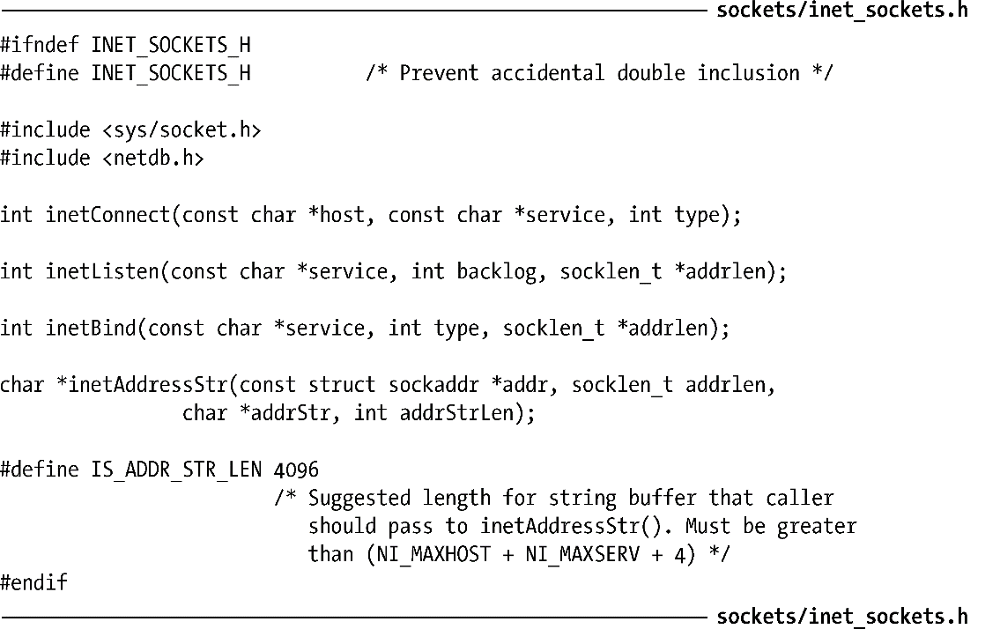
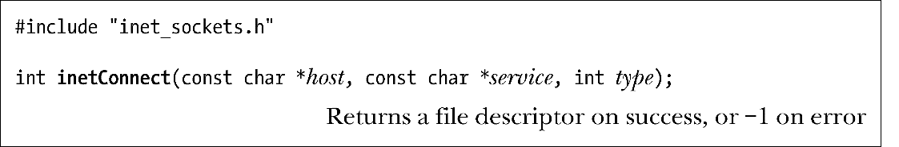
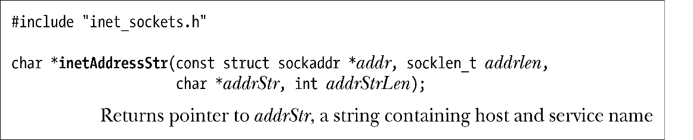
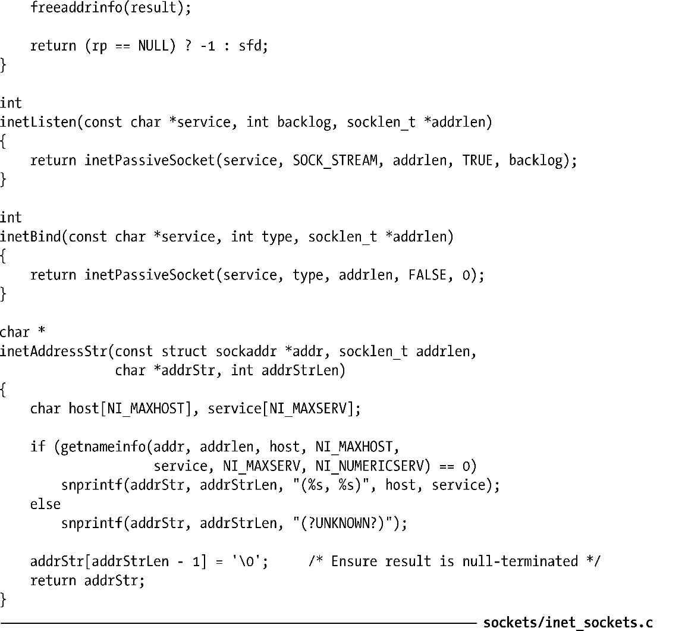

### 59.12　Internet domain socket库

本节将使用59.10节中介绍的函数来实现一个函数库，它执行了使用Internet domain socket时碰到的常见任务。（这个库对59.11节中给出的示例程序中的很多任务都进行了抽象。）由于这些函数使用了协议独立的getaddrinfo()和getnameinfo()函数，因此它们既可以用于IPv4也可以用于IPv6。程序清单59-8给出了声明这些函数的头文件。

这个库中的很多函数都接收类似的参数。

+ host参数是一个字符串，它包含一个主机名或一个数值地址（以IPv4的点分十进制表示或IPv6的十六进制字符串表示）。或者也可以将host指定为NULL来表明使用回环IP地址。
+ service参数是一个服务名或者是一个以十进制字符串表示的端口号。
+ type参数是socket的类型，其取值为SOCK_STREAM或SOCK_DGRAM。

程序清单59-8：inet_sockets.c使用的头文件

inetConnect()函数根据给定的socket type创建一个socket并将其连接到通过host和service指定的地址。这个函数可供需将自己的socket连接到一个服务器socket的TCP或UDP客户端使用。

新socket的文件描述符会作为函数结果返回。

inetListen()函数创建一个监听流（SOCK_STREAM）socket，该socket会被绑定到由service指定的TCP端口的通配IP地址上。这个函数被设计供TCP服务器使用。

新socket的文件描述符会作为函数结果返回。

backlog参数指定了允许积压的未决连接数量（与listen()一样）。

如果将addrlen指定为一个非NULL指针，那么与返回的文件描述符对应的socket地址结构的大小会返回在它所指向的位置中。通过这个值可以在需要获取一个已连接socket的地址时为传入给后面的accept()调用的socket地址缓冲器分配一个合适的大小。

inetBind()函数根据给定的type创建一个socket并将其绑定到由service和type指定的端口的通配IP地址上。（socket type指定了该socket是一个TCP服务还是一个UDP服务器。）这个函数被设计（主要）供UDP服务器和创建socket并将其绑定到某个具体地址上的客户端使用。

新socket的文件描述符会作为函数结果返回。

与inetListen()一样，inetBind()会将关联socket地址结构的长度返回在addrlen指向的位置中。这对于需要为传递给recvfrom()的缓冲器分配空间以获取发送数据报的socket的地址来讲是比较有用的。（inetListen()和inetBind()所需做的很多工作是相同的，这些工作是通过库中的单个函数inetPassiveSocket()来实现的。）

返回一个指向addrStr的指针，该字符串包含了主机和服务名。

假设在addr中给定了socket地址结构，其长度在addrlen中指定，那么inetAddressStr()会返回一个以null结尾的字符串，该字符串包含了对应的主机名和端口号，其形式如下。

返回的字符串是存放在addrStr指向的缓冲器中的。调用者必须要在addrStrLen中指定这个缓冲器的大小。如果返回的字符串超过了（addrStrLen−1）字节，那么它就会被截断。常量IS_ADDR_STR_LEN为addrStr缓冲器的大小定义了一个建议值，它的取值应该足以存放所有可能的返回字符串了。inetAddressStr()返回addrStr作为其函数结果。

程序清单59-9给出了本节中描述的这些函数的实现。

程序清单59-9：一个Internet domain socket库

