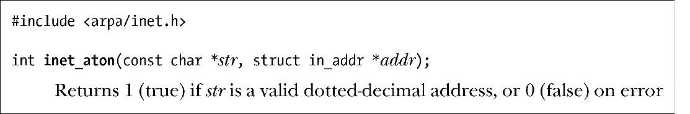
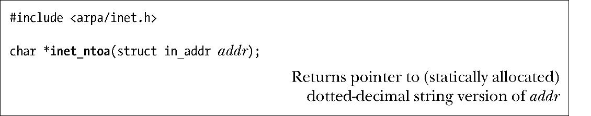

### 59.13.1　inet_aton()和inet_ntoa()函数

inet_aton()和inet_ntoa()函数将一个IPv4地址在点分十进制标记法和二进制形式（以网络字节序）之间进行转换。这些函数现在已经被inet_pton()和inet_ntop()所取代了。

inet_aton()（“ASCII到网络”）函数将str指向的点分十进制字符串转换成一个网络字节序的IPv4地址，转换得到的地址将会返回在addr指向的in_addr结构中。

inet_aton()函数在转换成功时返回1，在str无效时返回0。

传入inet_aton()的字符串的数值部分无需是十进制的，它可以是八进制的（通过前导0指定），也可以是十六进制的（通过前导0x或0X指定）。此外，inet_aton()还支持简写形式，这样就能够使用少于四个的数值部分来指定一个地址了。（具体细节请参考inet(3)手册。）术语数字和点标记法用于表示此类采用了这些特性的更通用的地址字符串。

SUSv3并没有规定inet_aton()，然而在大多数实现上都存在这个函数。在Linux上要获取<arpa/inet.h>中的inet_aton()声明就必须要定义_BSD_SOURCE、_SVID_SOURCE或_GNU_SOURCE这三个特性测试宏的一个。

给定一个in_addr结构（一个32位的网络字节序IPv4地址），inet_ntoa()返回一个指向（静态分配的）包含用点分十进制标记法标记的地址的字符串的指针。

由于inet_ntoa()返回的字符串是静态分配的，因此它们会被后续的调用所覆盖。

