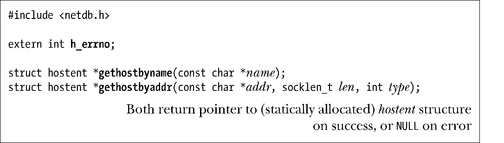
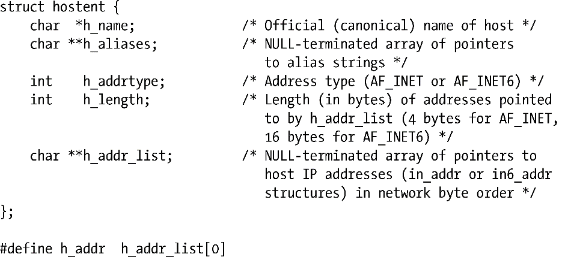
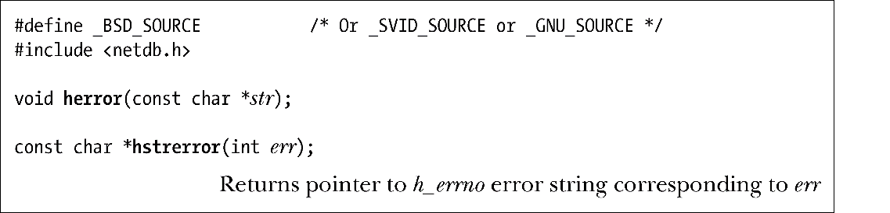
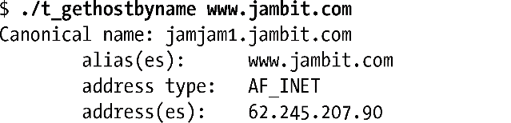
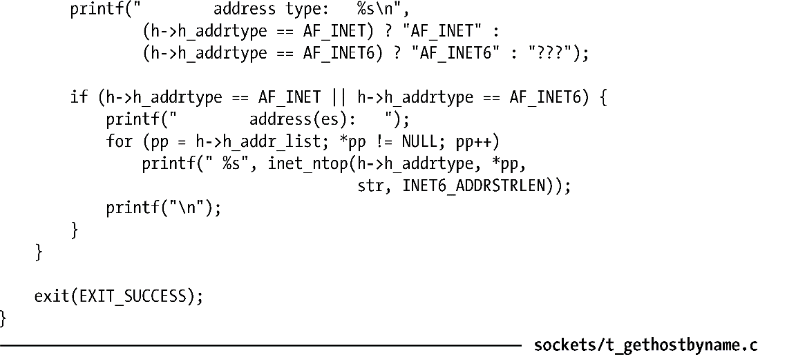

### 59.13.2　gethostbyname()和gethostbyaddr()函数

gethostbyname()和gethostbyaddr()函数允许在主机名和IP地址之间进行转换。现在这些函数已经被getaddrinfo()和getnameinfo()所取代了。

gethostbyname()函数解析由name给出的主机名并返回一个指向静态分配的包含了主机名相关信息的hostent结构的指针。该结构的形式如下。

h_name字段返回主机的官方名字，它是一个以null结尾的字符串。h_aliases字段指向一个指针数组，数组中的指针指向以null结尾的包含了该主机名的别名（可选名）的字符串。

h_addr_list字段是一个指针数组，数组中的指针指向这个主机的IP地址结构。（一个多宿主机拥有的地址数超过一个。）这个列表由in_addr或in6_addr结构构成，通过h_addrtype字段可以确定这些结构的类型，其取值为AF_INET或AF_INET6；通过h_length字段可以确定这些结构的长度。提供h_addr定义是为了与在hostent结构中只返回一个地址的早期实现（如4.2BSD）保持向后兼容，一些既有代码依赖于这个名字（因此无法感知多宿主机）。

在现代版本的gethostbyname()中也可以将name指定为一个数值IP地址字符串，即IPv4的数字和点标记法与IPv6的十六进制字符串标记法。在这种情况下不会执行任何的查询工作；相反，name会被复制到hostent结构的h_name字段，h_addr_list会被设置成name的二进制表示形式。

gethostbyaddr()函数执行gethostbyname()的逆操作。给定一个二进制IP地址，它会返回一个包含与配置了该地址的主机相关的信息的hostent结构。

在发生错误时（如无法解析一个名字），gethostbyname()和gethostbyaddr()都会返回一个NULL指针并设置全局变量h_errno。正如其名字所表达的那样，这个变量与errno类似（gethostbyname(3)手册描述了这个变量的可取值），herror()和hstrerror()函数类似于perror()和strerror()。

herror()函数（在标准错误上）显示了在str中给出的字符串，后面跟着一个冒号(:)，然后再显示一条与当前位于h_errno中的错误对应的消息。或者可以使用hstrerror()获取一个指向与在err中指定的错误值对应的字符串的指针。

程序清单59-10演示了如何使用gethostbyname()。这个程序显示了名字通过命令行指定的各个主机的hostent信息。下面的shell会话演示了这个程序的用法。

程序清单59-10：使用gethostbyname()获取主机信息

