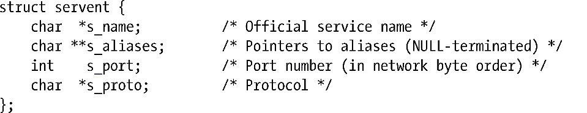

### 59.13.3　getserverbyname()和getserverbyport()函数

getservbyname()和getservbyport()函数从/etc/services文件（59.9节）中获取记录。现在这些函数已经被getaddrinfo()和getnameinfo()所取代了。

getservbyname()函数查询服务名（或其中一个别名）与name匹配以及协议与proto匹配的记录。proto参数是一个诸如tcp或udp之类的字符串，或者也可以将它设置为NULL。如果将proto指定为NULL，那么就会返回任意一个服务名与name匹配的记录。（这种做法通常已经足够了，因为当拥有同样名字的UDP和TCP记录都位于/etc/services文件时，它们通常使用同样的端口号。）如果找到了一个匹配的记录，那么getservbyname()会返回一个指向静态分配的如下类型的结构的指针。

一般来讲，调用getservbyname()只为了获取端口号，该值会通过s_port字段返回。

getservbyport()函数执行getservbyname()的逆操作，它返回一个servent记录，该记录包含了/etc/services文件中端口号与port匹配、协议与proto匹配的记录相关的信息。同样，可以将proto指定为NULL，这样这个调用就会返回任意一个端口号与port中指定的值匹配的记录。（在前面提到的一些同一个端口号被映射到不同的UDP和TCP服务名的情况下可能不会返回期望的结果。）

> 本书随带发行的源代码的files/t_getservbyname.c文件中提供了一个使用getservbyname()函数的例子。

