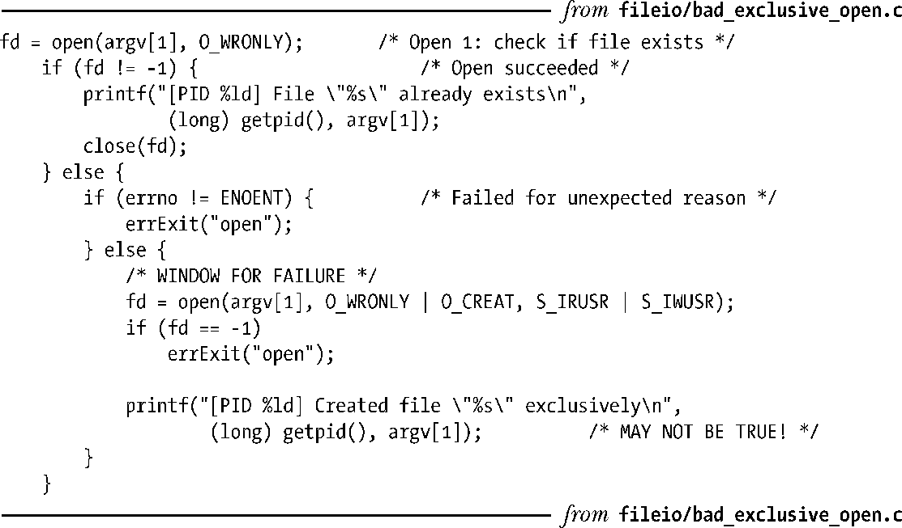
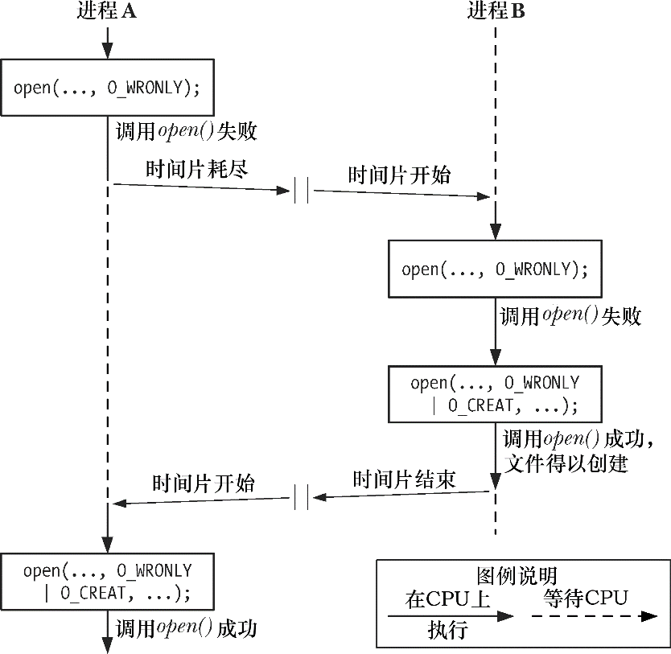
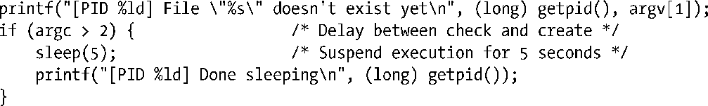
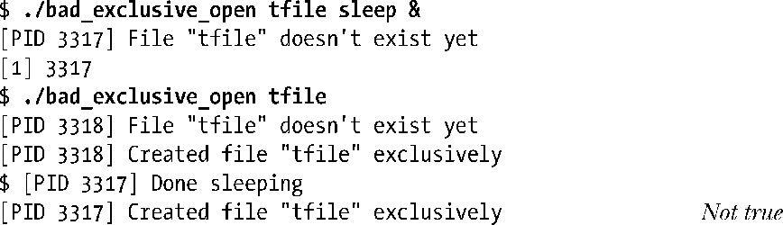
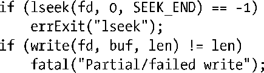

### 5.1　原子操作和竞争条件

在探究系统调用时会反复涉及原子操作的概念。所有系统调用都是以原子操作方式执行的。之所以这么说，是指内核保证了某系统调用中的所有步骤会作为独立操作而一次性加以执行，其间不会为其他进程或线程所中断。

原子性是某些操作得以圆满成功的关键所在。特别是它规避了竞争状态（race conditions）（有时也称为竞争冒险）。竞争状态是这样一种情形：操作共享资源的两个进程（或线程），其结果取决于一个无法预期的顺序，即这些进程①获得CPU使用权的先后相对顺序。

接下来，将讨论涉及文件I/O的两种竞争状态，并展示了如何使用open()的标志位，来保证相关文件操作的原子性，从而消除这些竞争状态。

22.9节将介绍sigsuspend()系统调用。24.4节将介绍fork()调用，届时将再次探讨竞争状态。

#### 以独占方式创建一个文件

4.3.1节曾述及：当同时指定O_EXCL与O_CREAT作为open()的标志位时，如果要打开的文件已然存在，则open()将返回一个错误。这提供了一种机制，保证进程是打开文件的创建者。对文件是否存在的检查和创建文件属于同一原子操作。要理解这一点的重要性，请思考程序清单5-1所示代码，该段代码中并未使用O_EXCL标志。（在此，为了对执行该程序的不同进程加以区分，在输出信息中打印有通过调用getpid()所返回的进程号。）

程序清单5-1：试图以独占方式打开文件的错误代码

程序清单5-1中所示的代码，除了要啰啰嗦嗦地调用open()两次外，还潜伏着一个bug。假设如下情况：当第一次调用open()时，希望打开的文件还不存在，而当第二次调用open()时，其他进程已经创建了该文件。如图5-1所示，若内核调度器判断出分配给A进程的时间片已经耗尽，并将CPU使用权交给B进程，就可能会发生这种问题。再比如两个进程在一个多CPU系统上同时运行时，也会出现这种情况。图5-1展示了两个进程同时执行程序清单5-1中代码的情形。在这一场景下，进程A将得出错误的结论：目标文件是由自己创建的。因为无论目标文件存在与否，进程A对open()的第二次调用都会成功。

<b class="my_markdown">图5-1：未能以独占方式创建文件</b>

虽然进程将自己误认为文件创建者的可能性相对较小，但毕竟是存在的，这已然将此段代码置于不可靠的境地。操作的结果将依赖于对两个进程的调度顺序，这一事实也就意味着出现了竞争状态。

为了说明这段代码的确存在问题，可以用一段代码替换程序清单5-1中的注释行“处理文件不存在的情况”，在检查文件是否存在与创建文件这两个动作之间人为制造一个长时间的等待。

sleep()库函数可将当前执行的进程挂起指定的秒数。23.4节将讨论该函数。

如果同时运行程序清单5-1中程序的两个实例，两个进程都会声称自己以独占方式创建了文件。

> 从上面输出的倒数第二行可以发现，shell提示符里夹杂了第一个实例的输出信息。

由于第一个进程在检查文件是否存在和创建文件之间发生了中断，造成两个进程都声称自己是文件的创建者。结合O_CREAT和O_EXCL标志来一次性地调用open()可以防止这种情况，因为这确保了检查文件和创建文件的步骤属于一个单一的原子（即不可中断的）操作。

#### 向文件尾部追加数据

用以说明原子操作必要性的第二个例子是：多个进程同时向同一个文件（例如，全局日志文件）尾部添加数据。为了达到这一目的，也许可以考虑在每个写进程中使用如下代码。

但是，这段代码存在的缺陷与前一个例子如出一辙。如果第一个进程执行到lseek()和write()之间，被执行相同代码的第二个进程所中断，那么这两个进程会在写入数据前，将文件偏移量设为相同位置，而当第一个进程再次获得调度时，会覆盖第二个进程已写入的数据。此时再次出现了竞争状态，因为执行的结果依赖于内核对两个进程的调度顺序。

要规避这一问题，需要将文件偏移量的移动与数据写操作纳入同一原子操作。在打开文件时加入O_APPEND标志就可以保证这一点。

> 有些文件系统（例如NFS）不支持 O_APPEND 标志。在这种情况下，内核会选择按如上代码所示的方式，施之以非原子操作的调用序列，从而可能导致上述的文件脏写入问题。

