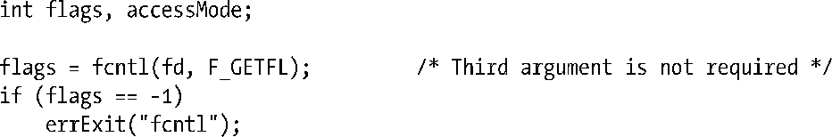
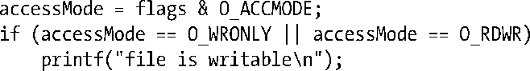

### 5.3　打开文件的状态标志

fcntl()的用途之一是针对一个打开的文件，获取或修改其访问模式和状态标志（这些值是通过指定open()调用的flag参数来设置的）。要获取这些设置，应将fcntl()的cmd参数设置为F_GETFL。

在上述代码之后，可以以如下代码测试文件是否以同步写方式打开：

> SUSv3规定：针对一个打开的文件，只有通过open()或后续fcntl()的F_SETFL操作，才能对该文件的状态标志进行设置。然而在如下方面，Linux实现与标准有所偏离：如果一个程序编译时采用了5.10节所提及的打开大文件技术，那么当使用F_GETFL命令获取文件状态标志时，标志中将总是包含O_LARGEFILE标志。

判定文件的访问模式有一点复杂，这是因为O_RDONLY(0)、O_WRONLY(1)和O_RDWR(2)这3个常量并不与打开文件状态标志中的单个比特位对应。因此，要判定访问模式，需使用掩码O_ACCMODE与flag相与，将结果与3个常量进行比对，示例代码如下：

可以使用fcntl()的F_SETFL命令来修改打开文件的某些状态标志。允许更改的标志有O_APPEND、O_NONBLOCK、O_NOATIME、O_ASYNC和O_DIRECT。系统将忽略对其他标志的修改操作。（有些其他的UNIX实现允许fcntl()修改其他标志，如O_SYNC。）

使用fcntl()修改文件状态标志，尤其适用于如下场景。

+ 文件不是由调用程序打开的，所以程序也无法使用open()调用来控制文件的状态标志（例如，文件是3个标准输入输出描述符中的一员，这些描述符在程序启动之前就被打开）。
+ 文件描述符的获取是通过open()之外的系统调用。比如pipe()调用，该调用创建一个管道，并返回两个文件描述符分别对应管道的两端。再比如socket()调用，该调用创建一个套接字并返回指向该套接字的文件描述符。

为了修改打开文件的状态标志，可以使用fcntl()的F_GETFL命令来获取当前标志的副本，然后修改需要变更的比特位，最后再次调用fcntl()函数的F_SETFL命令来更新此状态标志。因此，为了添加O_APPEND标志，可以编写如下代码：

