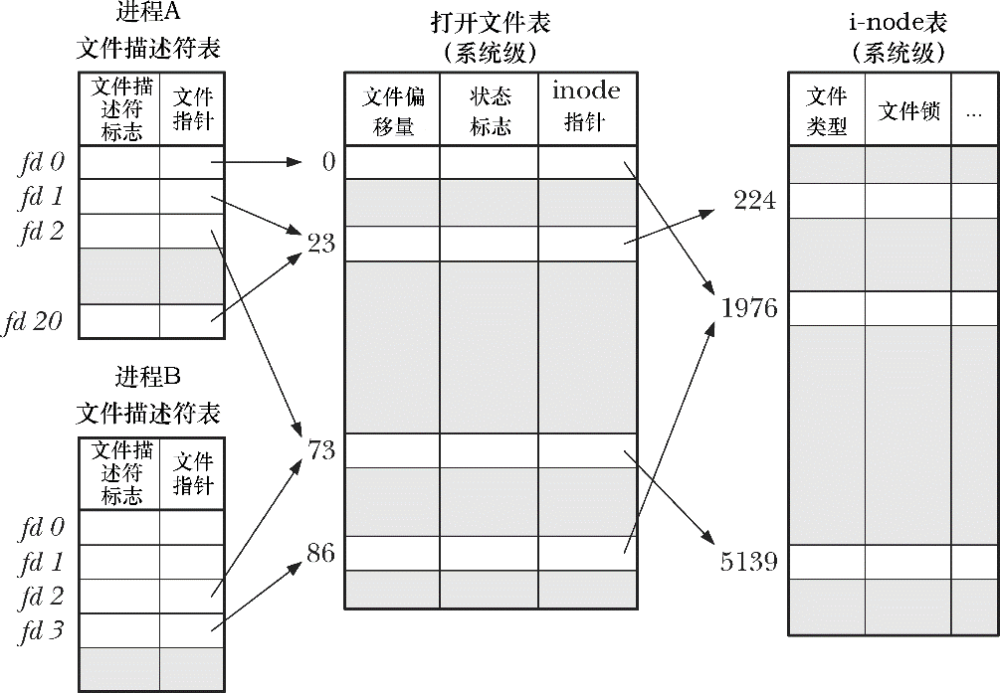

### 5.4　文件描述符和打开文件之间的关系

到目前为止，文件描述符和打开的文件之间似乎呈现出一一对应的关系。然而，实际并非如此。多个文件描述符指向同一打开文件，这既有可能，也属必要。这些文件描述符可在相同或不同的进程中打开。

要理解具体情况如何，需要查看由内核维护的3个数据结构。

+ 进程级的文件描述符表。
+ 系统级的打开文件表。
+ 文件系统的i-node表。

针对每个进程，内核为其维护打开文件的描述符（open file descriptor）表。该表的每一条目都记录了单个文件描述符的相关信息，如下所示。

+ 控制文件描述符操作的一组标志。（目前，此类标志仅定义了一个，即close-on-exec标志，将在27.4节予以介绍。）
+ 对打开文件句柄的引用。

内核对所有打开的文件维护有一个系统级的描述表格（open file description table）。有时，也称之为打开文件表（open file table），并将表中各条目称为打开文件句柄（open file handle）②。一个打开文件句柄存储了与一个打开文件相关的全部信息，如下所示。

+ 当前文件偏移量（调用read()和write()时更新，或使用lseek()直接修改）。
+ 打开文件时所使用的状态标志（即，open()的flags参数）。
+ 文件访问模式（如调用open()时所设置的只读模式、只写模式或读写模式）。
+ 与信号驱动I/O相关的设置（见63.3节）。
+ 对该文件i-node对象的引用。

每个文件系统都会为驻留其上的所有文件建立一个i-node表。第14章将详细讨论i-node结构和文件系统的总体结构。这里只是列出每个文件的i-node信息，具体如下。

+ 文件类型（例如，常规文件、套接字或FIFO）和访问权限。
+ 一个指针，指向该文件所持有的锁的列表。
+ 文件的各种属性，包括文件大小以及与不同类型操作相关的时间戳。

> 此处将忽略i-node在磁盘和内存中的表示差异。磁盘上的i-node记录了文件的固有属性，诸如：文件类型、访问权限和时间戳。访问一个文件时，会在内存中为i-node创建一个副本，其中记录了引用该i-node的打开文件句柄数量以及该i-node所在设备的主、从设备号，还包括一些打开文件时与文件相关的临时属性，例如：文件锁。

图5-2展示了文件描述符、打开的文件句柄以及i-node之间的关系。在下图中，两个进程拥有诸多打开的文件描述符。

<b class="my_markdown">图5-2：文件描述符、打开的文件句柄和i-node之间的关系</b>

在进程A中，文件描述符1和20都指向同一个打开的文件句柄（标号为23）。这可能是通过调用dup()、dup2()或fcntl()而形成的（参见5.5节）。

进程A的文件描述符2和进程B的文件描述符2都指向同一个打开的文件句柄（标号为73）。这种情形可能在调用fork()后出现（即，进程A与进程B之间是父子关系），或者当某进程通过UNIX域套接字将一个打开的文件描述符传递给另一进程时，也会发生（参见61.13.3节）。

此外，进程A的描述符0和进程B的描述符3分别指向不同的打开文件句柄，但这些句柄均指向i-node表中的相同条目（1976），换言之，指向同一文件。发生这种情况是因为每个进程各自对同一文件发起了open()调用。同一个进程两次打开同一文件，也会发生类似情况。

上述讨论揭示出如下要点。

+ 两个不同的文件描述符，若指向同一打开文件句柄，将共享同一文件偏移量。因此，如果通过其中一个文件描述符来修改文件偏移量（由调用read()、write()或lseek()所致），那么从另一文件描述符中也会观察到这一变化。无论这两个文件描述符分属于不同进程，还是同属于一个进程，情况都是如此。
+ 要获取和修改打开的文件标志（例如，O_APPEND、O_NONBLOCK和O_ASYNC），可执行fcntl()的F_GETFL和F_SETFL操作，其对作用域的约束与上一条颇为类似。
+ 相形之下，文件描述符标志（亦即，close-on-exec标志）为进程和文件描述符所私有。对这一标志的修改将不会影响同一进程或不同进程中的其他文件描述符。

