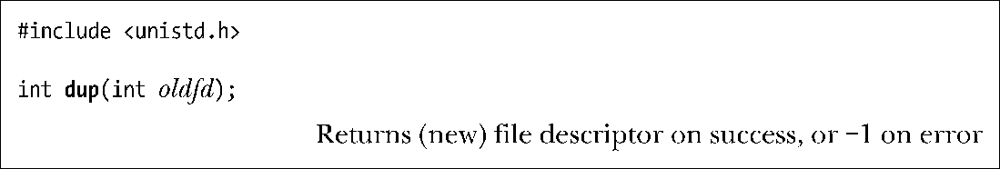
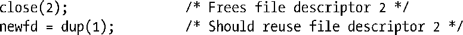
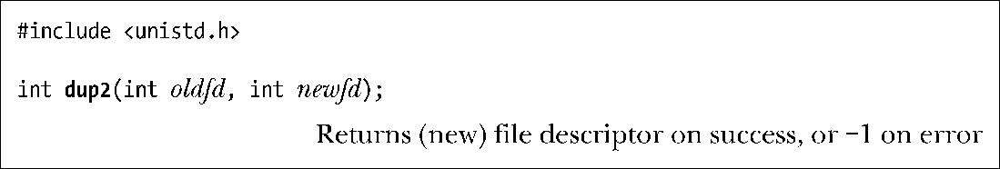

### 5.5　复制文件描述符

Bourne shell的I/O重定向语法2>&1，意在通知shell把标准错误（文件描述符2）重定向到标准输出（文件描述符1）。因此，下列命令将把（因为shell按从左至右的顺序处理I/O重定向语句）标准输出和标准错误写入result.log文件：

shell通过复制文件描述符2③实现了标准错误的重定向操作，因此文件描述符2与文件描述符1指向同一个打开文件句柄（类似于图5-2中进程A的描述符1和20指向同一打开文件句柄的情况）。可以通过调用dup()和dup2()来实现此功能。

请注意，要满足shell的这一要求，仅仅简单地打开results.log文件两次是远远不够的（第一次在描述符1上打开，第二次在描述符2上打开）。首先两个文件描述符不能共享相同的文件偏移量指针，因此有可能导致相互覆盖彼此的输出。再者打开的文件不一定就是磁盘文件。在如下命令中，标准错误就将和标准输出一起送达同一管道：

dup()调用复制一个打开的文件描述符oldfd，并返回一个新描述符，二者都指向同一打开的文件句柄。系统会保证新描述符一定是编号值最低的未用文件描述符。

假设发起如下调用：

再假定在正常情况下，shell已经代表程序打开了文件描述符0、1和2，且没有其他描述符在用，dup()调用会创建文件描述符1的副本，返回的文件描述符编号值为3。

如果希望返回文件描述符2，可以使用如下技术：

只有当描述符0已经打开时，这段代码方可工作。如果想进一步简化上述代码，同时总是能获得所期望的文件描述符，可以调用dup2()。

dup2()系统调用会为oldfd参数所指定的文件描述符创建副本，其编号由newfd参数指定。如果由newfd参数所指定编号的文件描述符之前已经打开，那么dup2()会首先将其关闭。（dup2()调用会默然忽略newfd关闭期间出现的任何错误。故此，编码时更为安全的做法是：在调用dup2()之前，若newfd已经打开，则应显式调用close()将其关闭。）

前述调用close()和dup()的代码可以简化为：

若调用dup2()成功，则将返回副本的文件描述符编号（即newfd参数指定的值）。

如果oldfd并非有效的文件描述符，那么dup2()调用将失败并返回错误EBADF，且不关闭newfd。如果oldfd有效，且与newfd值相等，那么dup2()将什么也不做，不关闭newfd，并将其作为调用结果返回。

fcntl()的F_DUPFD操作是复制文件描述符的另一接口，更具灵活性。

该调用为oldfd创建一个副本，且将使用大于等于startfd的最小未用值作为描述符编号。该调用还能保证新描述符（newfd）编号落在特定的区间范围内。总是能将dup()和dup2()调用改写为对close()和fcntl()的调用，虽然前者更为简洁。（还需注意，正如手册页中所描述的，dup2()和fcntl()二者返回的errno错误码存在一些差别。）

由图5-2可知，文件描述符的正、副本之间共享同一打开文件句柄所含的文件偏移量和状态标志。然而，新文件描述符有其自己的一套文件描述符标志，且其close-on-exec标志（FD_CLOEXEC）总是处于关闭状态。下面将要介绍的接口，可以直接控制新文件描述符的close-on-exec标志。

dup3()系统调用完成的工作与dup2()相同，只是新增了一个附加参数flag，这是一个可以修改系统调用行为的位掩码。

目前，dup3()只支持一个标志O_CLOEXEC，这将促使内核为新文件描述符设置 close-on-exec标志（FD_CLOEXEC）。设计该标志的缘由，类似于4.3.1节对open()调用中O_CLOEXEC标志的描述。

dup3()系统调用始见于Linux 2.6.27，为Linux所特有。

Linux从2.6.24开始支持fcntl()用于复制文件描述符的附加命令：F_DUPFD_CLOEXEC。该标志不仅实现了与F_DUPFD相同的功能，还为新文件描述符设置close-on-exec标志。同样，此命令之所以得以一显身手，其原因也类似于open()调用中的O_CLOEXEC标志。SUSv3并未论及F_DUPFD_CLOEXEC标志，但SUSv4对其作了规范。

