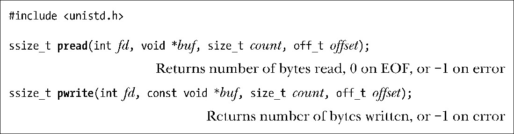
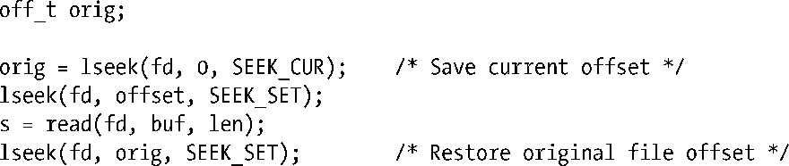

### 5.6　在文件特定偏移量处的I/O：pread()和pwrite()

系统调用pread()和pwrite()完成与read()和write()相类似的工作，只是前两者会在offset参数所指定的位置进行文件I/O操作，而非始于文件的当前偏移量处，且它们不会改变文件的当前偏移量。

pread()调用等同于将如下调用纳入同一原子操作：

对pread()和pwrite()而言，fd所指代的文件必须是可定位的（即允许对文件描述符执行lseek()调用）。

多线程应用为这些系统调用提供了用武之地。正如第29章所述，进程下辖的所有线程将共享同一文件描述符表。这也意味着每个已打开文件的文件偏移量为所有线程所共享。当调用pread()或pwrite()时，多个线程可同时对同一文件描述符执行I/O操作，且不会因其他线程修改文件偏移量而受到影响。如果还试图使用lseek()和read()(或write())来代替pread()（或pwrite()），那么将引发竞争状态，这类似于5.1节讨论O_APPEND标志时的描述（当多个进程的文件描述符指向相同的打开文件句柄时，使用pread()和 pwrite()系统调用同样能够避免进程间出现竞争状态）。

> 如果需要反复执行lseek()，并伴之以文件I/O，那么pread()和pwrite()系统调用在某些情况下是具有性能优势的。这是因为执行单个pread()（或pwrite()）系统调用的成本要低于执行lseek()和read()（或write()）两个系统调用。然而，较之于执行I/O实际所需的时间，系统调用的开销就有些相形见绌了④。

