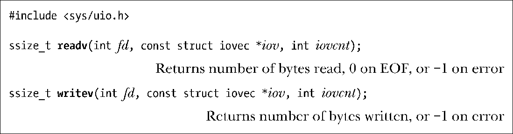
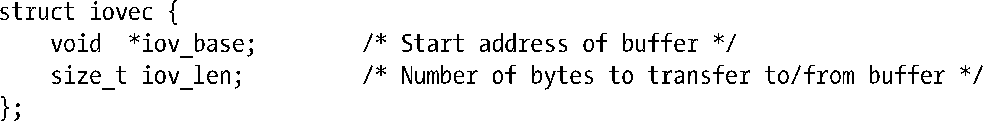
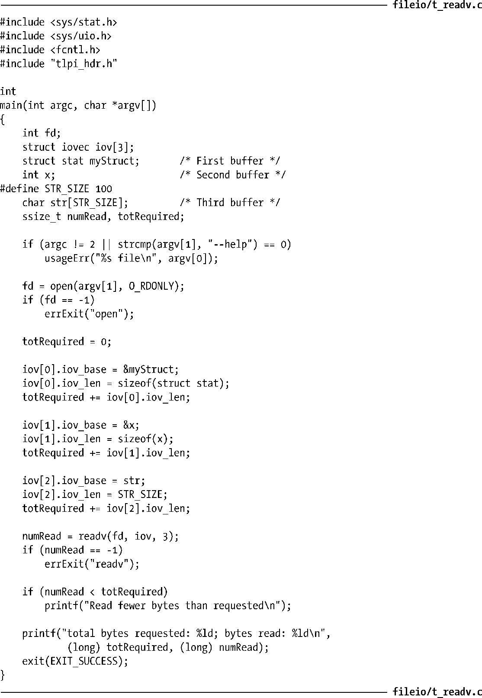
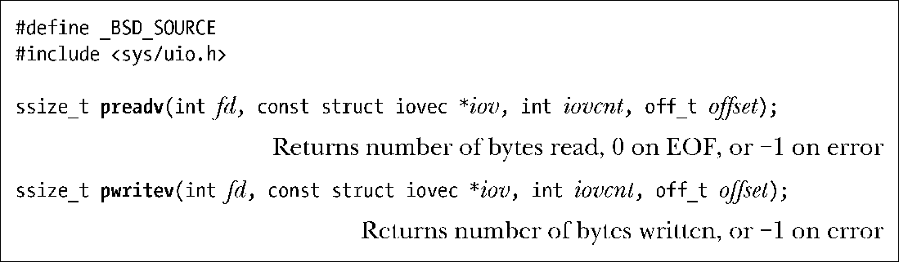

### 5.7　分散输入和集中输出（Scatter-Gather I/O）：readv()

和writev() readv()和writev()系统调用分别实现了分散输入和集中输出的功能。

这些系统调用并非只对单个缓冲区进行读写操作，而是一次即可传输多个缓冲区的数据。数组iov定义了一组用来传输数据的缓冲区。整型数iovcnt则指定了iov的成员个数。iov中的每个成员都是如下形式的数据结构。

> SUSv3标准允许系统实现对iov中的成员个数加以限制。系统实现可以通过定义<limits.h>文件中IOV_MAX来通告这一限额，程序也可以在系统运行时调用sysconf (_SC_IOV_MAX)来获取这一限额。（11.2节将介绍sysconf()。）SUSv3要求该限额不得少于16。Linux将IOV_MAX的值定义为1024，这是与内核对该向量大小的限制（由内核常量UIO_MAXIOV定义）相对应的。
> 然而，glibc对readv()和writev()的封装函数⑤还悄悄做了些额外工作。若系统调用因iovcnt参数值过大而失败，外壳函数将临时分配一块缓冲区，其大小足以容纳iov参数所有成员所描述的数据缓冲区，随后再执行read()或write()调用（参见后文对使用write()实现writev()功能的讨论）。

图5-3展示的是一个关于iov、iovcnt以及iov指向缓冲区之间关系的示例。

<b class="my_markdown">图5-3：iovec数组及其相关缓冲区的示例</b>

#### 分散输入

readv()系统调用实现了分散输入的功能：从文件描述符fd所指代的文件中读取一片连续的字节，然后将其散置（“分散放置”）于iov指定的缓冲区中。这一散置动作从iov[0]开始，依次填满每个缓冲区。

原子性是readv()的重要属性。换言之，从调用进程的角度来看，当调用readv()时，内核在fd所指代的文件与用户内存之间一次性地完成了数据转移。这意味着，假设即使有另一进程（或线程）与其共享同一文件偏移量，且在调用readv()的同时企图修改文件偏移量，readv()所读取的数据仍将是连续的。

调用readv()成功将返回读取的字节数，若文件结束⑥将返回0。调用者必须对返回值进行检查，以验证读取的字节数是否满足要求。若数据不足以填充所有缓冲区，则只会占用⑦部分缓冲区，其中最后一个缓冲区可能只存有部分数据。

程序清单5-2展示了readv()的用法。

> 在本书中，当以函数名称冠以“t_”来命名示例程序时（例如：程序清单5-2中的程序t_readv.c），意在表明该程序主要用于展示单个系统调用或库函数的用法。

程序清单5-2：使用readv()执行分散输入

#### 集中输出

writev()系统调用实现了集中输出：将iov所指定的所有缓冲区中的数据拼接（“集中”）起来，然后以连续的字节序列写入文件描述符fd指代的文件中。对缓冲区中数据的“集中”始于iov[0]所指定的缓冲区，并按数组顺序展开。

像readv()调用一样，writev()调用也属于原子操作，即所有数据将一次性地从用户内存传输到fd指代的文件中。因此，在向普通文件写入数据时，writev()调用会把所有的请求数据连续写入文件，而不会在其他进程（或线程）写操作的影响下⑧分散地写入文件⑨。

如同write()调用，writev()调用也可能存在部分写的问题。因此，必须检查writev()调用的返回值，以确定写入的字节数是否与要求相符。

readv()调用和writev()调用的主要优势在于便捷。如下两种方案，任选其一都可替代对writev()的调用。

+ 编码时，首先分配一个大缓冲区，随即再从进程地址空间的其他位置将数据复制过来，最后调用write()输出其中的所有数据。
+ 发起一系列write()调用，逐一输出每个缓冲区中的数据。

尽管方案一在语义上等同于writev()调用，但需要在用户空间内分配缓冲区，进行数据复制，很不方便（效率也低）。

方案二在语义上就不同于单次的writev()调用，因为发起多次write()调用将无法保证原子性。更何况，执行一次writev()调用比执行多次write()调用开销要小（参见3.1节关于系统调用的讨论）。

#### 在指定的文件偏移量处执行分散输入/集中输出

Linux 2.6.30版本新增了两个系统调用：preadv()、pwritev()，将分散输入/集中输出和于指定文件偏移量处的I/O二者集于一身。它们并非标准的系统调用，但获得了现代BSD的支持。

preadv()和pwritev()系统调用所执行的任务与readv()和writev()相同，但执行I/O的位置将由offset参数指定（类似于pread()和pwrite()系统调用）⑩。

对于那些既想从分散-集中I/O中受益，又不愿受制于当前文件偏移量的应用程序（比如，多线程的应用程序）而言，这些系统调用恰好可以派上用场。

