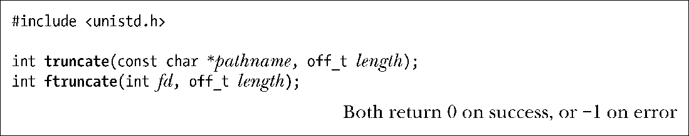

### 5.8　截断文件：truncate()和ftruncate()系统调用

truncate()和ftruncate()系统调用将文件大小设置为length参数指定的值。

若文件当前长度大于参数length，调用将丢弃超出部分，若小于参数length，调用将在文件尾部添加一系列空字节或是一个文件空洞。

两个系统调用之间的差别在于如何指定操作文件。truncate()以路径名字符串来指定文件，并要求可访问该文件⑪，且对文件拥有写权限。若文件名为符号链接，那么调用将对其进行解引用。而调用ftruncate()之前，需以可写方式打开操作文件，获取其文件描述符以指代该文件，该系统调用不会修改文件偏移量。

若ftruncate()的length参数值超出文件的当前大小，SUSv3允许两种行为：要么扩展该文件（如Linux），要么返回错误。而符合XSI标准的系统则必须采取前一种行为。相同的情况，对于truncate()系统调用，SUSv3则要求总是能扩展文件。

> truncate()无需先以open()（或是一些其他方法）来获取文件描述符，却可修改文件内容，在系统调用中可谓独树一帜。

