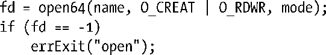
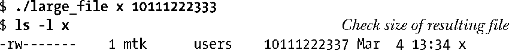
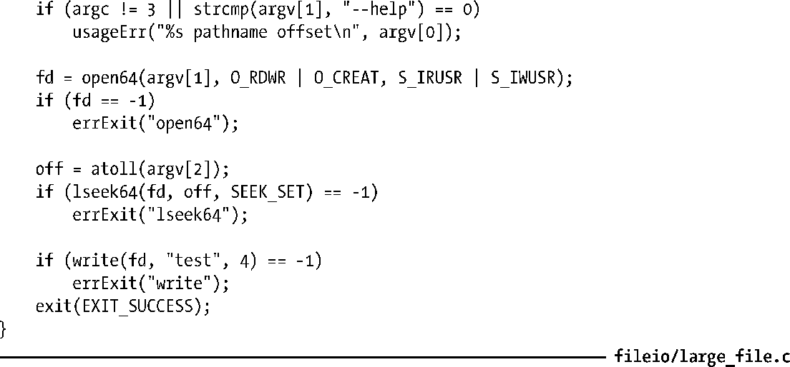
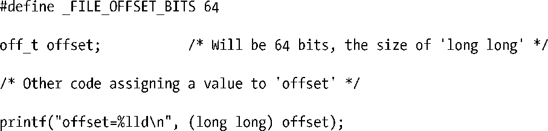

### 5.10　大文件I/O

通常将存放文件偏移量的数据类型 off_t 实现为一个有符号的长整型。（之所以采用有符号数据类型，是要以−1来表示错误情况。）在32位体系架构中（比如x86-32），这将文件大小置于231−1个字节（即2GB）的限制之下。

然而，磁盘驱动器的容量早已超出这一限制，因此32位UNIX实现有处理超过2GB大小文件的需求，这也在情理之中。由于问题较为普遍，UNIX厂商联盟在大型文件峰会（Large File Summit）上就此进行了协商，并针对必需的大文件访问功能，形成了对SUSv2规范的扩展。本节将概述LFS的增强特性。（完整的LFS规范定稿于1996年，可通过http://opengroup.org/platform/lfs.html访问。）

始于内核版本2.4，32位Linux系统开始提供对LFS的支持（glibc版本必须为2.2或更高）。另一个前提是，相应的文件系统也必须支持大文件操作。大多数“原生”Linux文件系统提供了LFS支持，但一些“非原生”文件系统则未提供该功能（微软的 VFAT 和NFSv2系统是其中较为知名的范例，无论系统是否启用了LFS扩展功能，2GB的文件大小限制都是硬杠杠）。

> 由于64位系统架构（例如，Alpha、IA-64）的长整型类型长度为64位，故而LFS增强特性所要突破的限制对其而言并不是问题。然而，即便在64位系统中，一些“原生”Linux文件系统的实现细节还是将文件大小的理论值默认为不会超过263−1个字节。在大多数情况下，此限额远远超出了目前的磁盘容量，故而这一对文件大小的限制并无实际意义。

应用程序可使用如下两种方式之一以获得LFS功能。

+ 使用支持大文件操作的备选API。该API由LFS设计，意在作为SUS规范的“过渡型扩展”。因此，尽管大部分系统都支持这一API，但这对于符合SUSv2或SUSv3规范的系统其实并非必须。这一方法现已过时。
+ 在编译应用程序时，将宏_FILE_OFFSET_BITS的值定义为64。这一方法更为可取，因为符合SUS规范的应用程序无需修改任何源码即可获得LFS功能。

#### 过渡型LFS API

要使用过渡型的LFS API，必须在编译程序时定义_LARGEFILE64_SOURCE功能测试宏，该定义可以通过命令行指定，也可以定义于源文件中包含所有头文件之前的位置。该API所属函数具有处理64位文件大小和文件偏移量的能力。这些函数与其32位版本命名相同，只是尾部缀以64以示区别。其中包括：fopen64()、open64()、lseek64()、truncate64()、stat64()、mmap64()和setrlimit64()。（针对这些函数的32位版本，本书前面已然讨论了一部分，还有一些将在后续章节中描述。）

要访问大文件，可以使用这些函数的64位版本。例如，打开大文件的编码示例如下：

> 调用open64()，相当于在调用open()时指定O_LARGEFILE标志。若调用open()时未指定此标志，且欲打开的文件大小大于2GB，那么调用将返回错误。

另外，除去上述提及的函数之外，过渡型LFS API还增加了一些新的数据类型，如下所示。

+ struct stat64：类似于stat结构（参见15.1节），支持大文件尺寸。
+ off64_t：64位类型，用于表示文件偏移量。

如程序清单5-3所示，除去使用了该API中的其他64位函数之外，lseek64()就用到了数据类型off64_t。该程序接受两个命令行参数：欲打开的文件名称和给定的文件偏移量（整型）值。程序首先打开指定的文件，然后检索至给定的文件偏移量处，随即写入一串字符。如下所示的shell会话中，程序检索到一个超大的文件偏移量处（超过10GB），再写入一些字节：

程序清单5-3：访问大文件

#### _FILE_OFFSET_BITS宏

要获取LFS功能，推荐的作法是：在编译程序时，将宏_FILE_OFFSET_BITS的值定义为64。做法之一是利用C语言编译器的命令行选项：

另外一种方法，是在C语言的源文件中，在包含所有头文件之前添加如下宏定义：

所有相关的32位函数和数据类型将自动转换为64位版本。因而，例如，实际会将open()转换为open64()，数据类型off_t的长度也将转而定义为64位。换言之，无需对源码进行任何修改，只要对已有程序进行重新编译，就能够实现大文件操作。

显然，使用宏_FILE_OFFSET_BITS要比采用过渡型的LFS API更为简单，但这也要求应用程序的代码编写必须规范（例如，声明用于放置文件偏移量的变量，应正确地使用off_t，而不能使用“原生”的C语言整型）。

LFS 规范对于支持_FILE_OFFSET_BITS 宏未作硬性规定，仅仅提及将该宏作为指定数据类型 off_t 大小的可选方案。一些 UNIX 实现使用不同的特性测试宏来获取此功能。

> 若试图使用32位函数访问大文件（即在编译程序时，未将宏_FILE_OFFSET_BITS的值设置为64），调用可能会返回EOVERFLOW错误。例如，为获取大小超过2G文件的信息，若使用stat的32位版本时就会遇到这一错误。

#### 向printf()调用传递off_t值

LFS扩展功能没有解决的问题之一是，如何向printf()调用传递off_t值。3.6.2节曾特别指出，对于预定义的系统数据类型（诸如pid_t、uid_t），展示其值的可移植方法是将该值强制转换为long型，并在printf()中使用限定符%ld。然而，一旦使用了LFS扩展功能，%ld将不足以处理off_t数据类型，因为对该数据类型的定义可能会超出long类型的范围，一般为long long类型。据此，若要显示off_t类型的值，则先要将其强制转换为long long类型，然后使用printf()函数的%lld限定符显示，如下所示：

在处理stat结构所使用的blkcnt_t 数据类型时，也应予以类似关注（参见15.1节的描述）。

> 如需在独立的编译模块之间传递off_t或stat类型的参数值，则需确保在所有模块中，这些数据类型的大小相同（即编译这些模块时，要么将宏_FILE_OFFSET_BITS的值都定义为64，要么都不做定义）。

