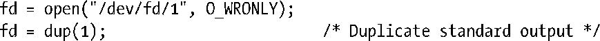

### 5.11　/dev/fd目录

对于每个进程，内核都提供有一个特殊的虚拟目录/dev/fd。该目录中包含“/dev/fd/n”形式的文件名，其中n是与进程中的打开文件描述符相对应的编号。因此，例如，/dev/fd/0就对应于进程的标准输入。（SUSv3对/dev/fd特性未做规定，但有些其他的UNIX实现也提供了这一特性。）

打开/dev/fd目录中的一个文件等同于复制相应的文件描述符，所以下列两行代码是等价的：

在为open()调用设置flag参数时，需要注意将其设置为与原描述符相同的访问模式。这一场景下，在flag标志的设置中引入其他标志，诸如O_CREAT，是毫无意义的（系统会将其忽略）。

> /dev/fd实际上是一个符号链接，链接到Linux所专有的/proc/self/fd目录。后者又是Linux特有的/proc/PID/fd目录族的特例之一，此目录族中的每一目录都包含有符号链接，与一进程所打开的所有文件相对应。

程序中很少会使用/dev/fd目录中的文件。其主要用途在shell中。许多用户级shell命令将文件名作为参数，有时需要将命令输出至管道，并将某个参数替换为标准输入或标准输出。出于这一目的，有些命令（例如，diff、ed、tar和comm）提供了一个解决方法，使用“-”符号作为命令的参数之一，用以表示标准输入或输出（视情况而定）。所以，要比较ls命令输出的文件名列表与之前生成的文件名列表，命令就可以写成：

这种方法有不少问题。首先，该方法要求每个程序都对“-”符号做专门处理，但是许多程序并未实现这样的功能，这些命令只能处理文件，不支持将标准输入或输出作为参数。其次，有些程序还将单个“-”符解释为表征命令行选项结束的分隔符。

使用/dev/fd目录，上述问题将迎刃而解，可以把标准输入、标准输出和标准错误作为文件名参数传递给任何需要它们的程序。所以，可以将前一个shell命令改写成如下形式：

方便起见，系统还提供了3个符号链接：/dev/stdin、/dev/stdout和/dev/stderr，分别链接到/dev/fd/0、/dev/fd/1和/dev/fd/2。

