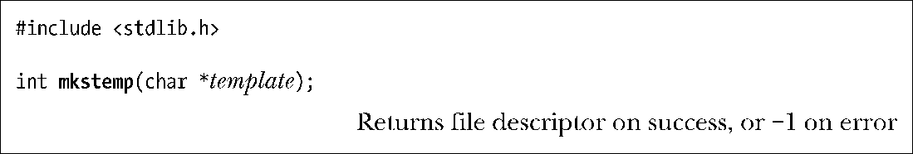
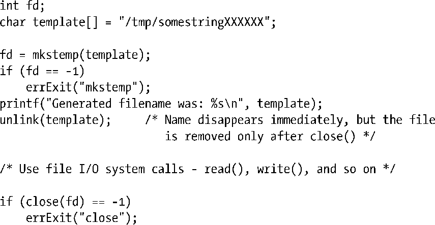

### 5.12　创建临时文件

有些程序需要创建一些临时文件，仅供其在运行期间使用，程序终止后即行删除。例如，很多编译器程序会在编译过程中创建临时文件。GNU C语言函数库为此而提供了一系列库函数。（之所以有“一系列”的库函数，部分原因是由于这些函数分别继承自各种UNIX实现。）本节将介绍其中的两个函数：mkstemp()和tmpfile()。

基于调用者提供的模板，mkstemp()函数生成一个唯一文件名并打开该文件，返回一个可用于I/O调用的文件描述符。

模板参数采用路径名形式，其中最后6个字符必须为XXXXXX。这6个字符将被替换，以保证文件名的唯一性，且修改后的字符串将通过template参数传回。因为会对传入的template参数进行修改，所以必须将其指定为字符数组，而非字符串常量。

文件拥有者对mkstemp()函数建立的文件拥有读写权限（其他用户则没有任何操作权限），且打开文件时使用了O_EXCL标志，以保证调用者以独占方式访问文件。

通常，打开临时文件不久，程序就会使用unlink系统调用（参见18.3节）将其删除。故而，mkstemp()函数的示例代码如下所示：

> 使用tmpnam()、tempnam()和mktemp()函数也能生成唯一的文件名。然而，由于这会导致应用程序出现安全漏洞，应当避免使用这些函数。关于这些函数的进一步细节请参考手册页。

tmpfile()函数会创建一个名称唯一的临时文件，并以读写方式将其打开。（打开该文件时使用了O_EXCL标志，以防一个可能性极小的冲突，即另一个进程已经创建了一个同名文件。）

tmpfile()函数执行成功，将返回一个文件流供stdio库函数使用。文件流关闭后将自动删除临时文件。为达到这一目的，tmpfile()函数会在打开文件后，从内部立即调用unlink()来删除该文件名⑬。

