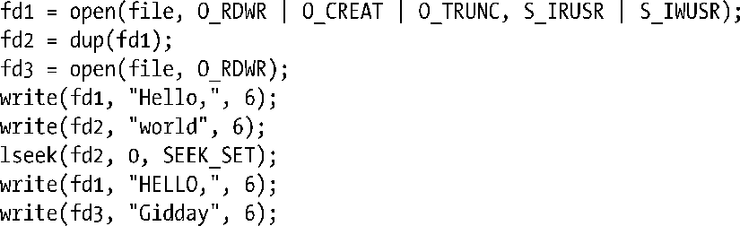

### 5.14　练习

**5-1.** 　请使用标准文件I/O系统调用（open()和lseek()）和off_t数据类型修改程序清单5-3中的程序。将宏_FILE_OFFSET_BITS的值设置为64进行编译，并测试该程序是否能够成功创建一个大文件。

**5-2.** 　编写一个程序，使用 O_APPEND 标志并以写方式打开一个已存在的文件，且将文件偏移量置于文件起始处，再写入数据。数据会显示在文件中的哪个位置？为什么？

**5-3.** 　本习题的设计目的在于展示为何以O_APPEND标志打开文件来保障操作的原子性是必要的。请编写一程序，可接收多达3个命令行参数：

该程序应打开所指定的文件（如有必要，则创建之），然后以每次调用write()写入一个字节的方式，向文件尾部追加num-bytes个字节。缺省情况下，程序使用O_APPEND标志打开文件，但若存在第三个命令行参数（x），那么打开文件时将不再使用O_APPEND标志，代之以在每次调用write()前调用lseek(fd,0,SEEK_END)。同时运行该程序的两个实例，不带x参数，将100万个字节写入同一文件：

重复上述操作，将数据写入另一文件，但运行时加入x参数：

使用ls-1命令检查文件f1和f2的大小，并解释两文件大小不同的原因。

**5-4.** 　使用fcntl()和close()（若有必要）来实现dup()和dup2()。（对于某些错误，dup2()和fcntl()返回的errno值并不相同，此处可不予考虑。）务必牢记dup2()需要处理的一种特殊情况，即oldfd与newfd相等。这时，应检查oldfd是否有效，测试fcntl (oldfd，F_GETFL)是否成功就能达到这一目的。若oldfd无效，则dup2()将返回-1，并将errno置为EBADF。

**5-5.** 　编写一程序，验证文件描述符及其副本是否共享了文件偏移量和打开文件的状态标志。

**5-6.** 　说明下列代码中每次执行write()后，输出文件的内容是什么，为什么。

**5-7.** 　使用read()、write()以及malloc函数包（见7.1.2节）中的必要函数以实现readv()和writev()功能。

①译者注：或线程。

②译者注：为避免混淆，译文将原文中的open file description table和open file description分别以“打开文件表”和“打开文件句柄”替换。但在给译者的回信中，作者尽管承认这一表述方式容易使读者产生混淆，但仍坚持open file description table和open file description的称谓，原因有二：一，open file description是相关标准所采用的术语，而与标准保持一致实属必要；二，handle通常用于引用用户空间中的应用对象，而此处的open file description则无法由用户空间中的应用直接访问。

③译者注：将文件描述符1复制到文件描述符2。

④译者注：执行实际I/O的开销要远大于执行系统调用，系统调用的性能优势作用有限。

⑤译者注：又称外壳函数。

⑥译者注：EOF。

⑦译者注：按iov数组顺序。

⑧译者注：即不受其他进（线）程改变文件偏移量的影响。

⑨译者注：应当指出，readv()和writev()会改变打开文件句柄的当前文件偏移量。

⑩译者注：作者于此处暗示，这两个系统调用所执行的I/O将不影响文件的当前偏移量。

⑪译者注：即对组成路径名的各目录拥有可执行（x）权限。

⑫译者注：此处所谓非阻塞意指O_NDELAY。另外，原文表述似有错误，酌改，请参见APUEv2第14.2节。

⑬译者注：进程终止时会关闭所有打开的文件描述符，关闭文件就会删除这些临时文件（参考mkstmp代码示例中的注释），由此可以推导出，进程退出时将自动删除临时文件。

