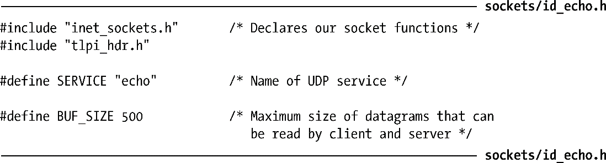
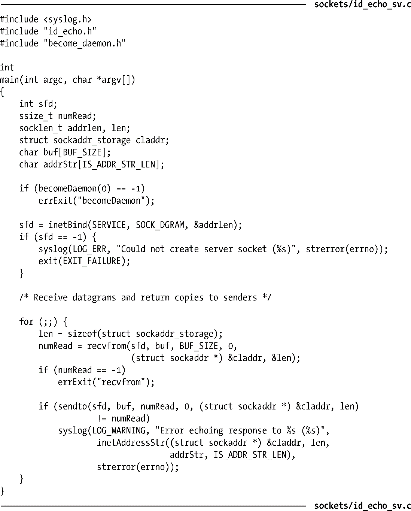
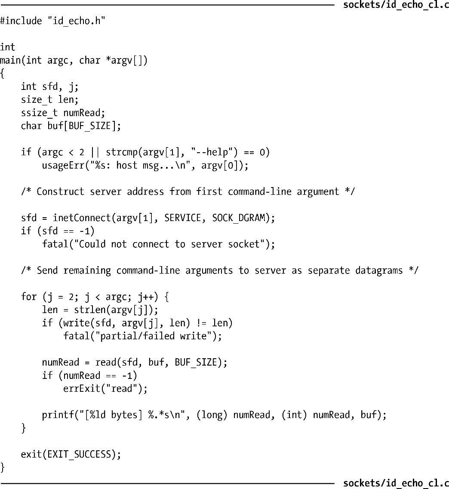
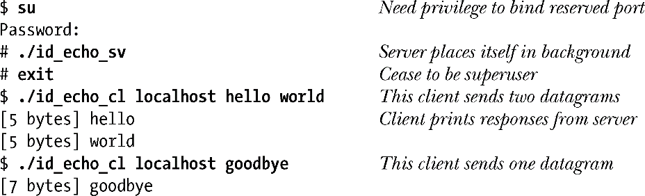

### 60.2　迭代型UDP echo服务器

在本节以及下一节中，我们展示了echo服务的服务器端程序。echo服务支持UDP和TCP，工作在端口7上。（由于端口7是保留端口，echo服务器必须以超级用户权限运行）。

UDP echo服务器连续读取数据报，将每个数据报的拷贝返回给发送者。由于服务器一次只需处理一条单独的消息，因此设计为迭代型服务器就足够了。服务器端程序的头文件如程序清单60-1所示。

程序清单60-1：id_echo_sv.c和id_echo_cl.c的头文件

程序清单60-2展示了服务器端的实现。关于服务器的实现，请注意以下几点。

+ 我们使用37.2节中的becomeDaemon()函数将服务器转换为一个守护进程。
+ 为了使程序更短小，我们使用了59.12节中开发的Internet域套接字函数库。
+ 如果服务器无法将回复发送给客户端，就使用syslog()记录一条日志消息。

在现实世界的应用程序中，我们可能会针对syslog()写入的消息做一些速率限制。这不仅是为了防止攻击者将系统日志灌满，还因为syslog()的调用开销是很昂贵的，因为（默认情况下）syslog()会反过来调用到fsync()。

程序清单60-2：实现迭代型的UDP echo服务器

要测试服务器的功能，我们需要用到程序清单60-3中展示的客户端程序。这个程序同样采用了59.12节中开发的Internet域套接字函数库。从第一个命令行参数来看，客户端程序期望得到运行着服务器程序的主机名称。客户端程序执行一个循环，在循环中将剩下的命令行参数作为数据报发送给服务器，读取和打印出每个由服务器发回的响应数据报。

程序清单60-3：UDP echo服务的客户端程序

例如，当我们运行服务器程序以及两个客户端实例时，我们将看到如下输出。

