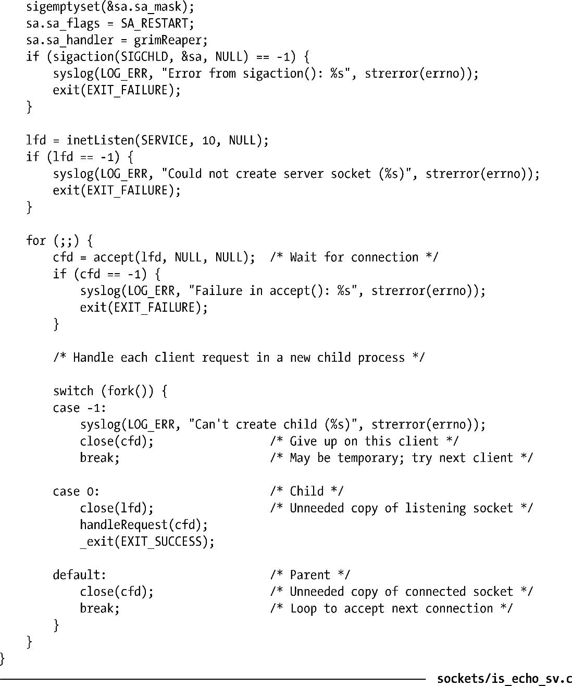

### 60.3　并发型TCP echo服务器

TCP echo服务同样也工作在端口7上。TCP echo服务器接受一条连接然后不断循环，读取所有已传输的数据并在同一个套接字上将它们发回给客户端。服务器不断读取数据直到它检测到文件结尾为止，此时服务器就关闭它的套接字（因此如果客户端仍在从套接字中读取数据的话，就可以看到文件结尾了）。

由于客户端可能会发送无限量的数据给服务器（因而服务这样的客户端可能需要无限的时间），因此这种情况下适合将服务器设计为并发型，这样多个客户端能够同时得到服务。程序清单60-4给出了服务器的实现。（我们在61.2节中给出了该服务的客户端实现。）关于实现的细节，需要注意以下几点。

+ 服务器通过调用37.2节中的becomeDaemon()成为了一个守护进程。
+ 为了使程序更短小，我们使用了程序清单59-9中的Internet域套接字函数库。
+ 由于服务器为每一个客户端连接创建了一个子进程，我们必须确保不会出现僵尸进程。这可以通过为信号SIGCHLD安装信号处理例程来实现。
+ 服务器程序的主体部分由for循环组成，在循环中我们接受客户端的连接，然后通过fork()创建子进程。在子进程中调用handleRequest()函数来处理客户端。同时，父进程继续在for循环中接受下一个客户端的连接。

> 在现实世界的应用中，我们可能应该在服务器中包含一些限制创建子进程数量的代码。这是为了防止攻击者试图利用该服务在系统中创建大量的子进程（fork bomb）从而使系统变得不可用。我们可以计数当前正在执行的子进程数量，通过在服务器端增加额外的代码来强加这个限制。（计数应该在fork()调用成功后递增，而在SIGCHLD信号处理例程清除子进程时得到递减）。如果子进程的数量达到了上限，我们可以暂停接受新的连接（或者还有一种可选方案是接受连接后立刻关闭它们）。

+ 每次调用fork()后，监听套接字和连接套接字都在子进程中得到复制（见24.2.1节）。这意味着父子进程都可以通过连接套接字和客户端通信。但是，只有子进程才需要进行这样的通信，因此父进程应该在fork()调用之后立刻关闭连接套接字的文件描述符。（如果父进程不这么做的话，那么套接字将永远不会真正关闭；此外，父进程最终会用完所有的文件描述符。）由于子进程不接受新的连接，它需要将监听套接字的文件描述符副本关闭。
+ 每个子进程在处理完一个客户端后终止。

程序清单60-4：并发型TCP echo服务器的实现

