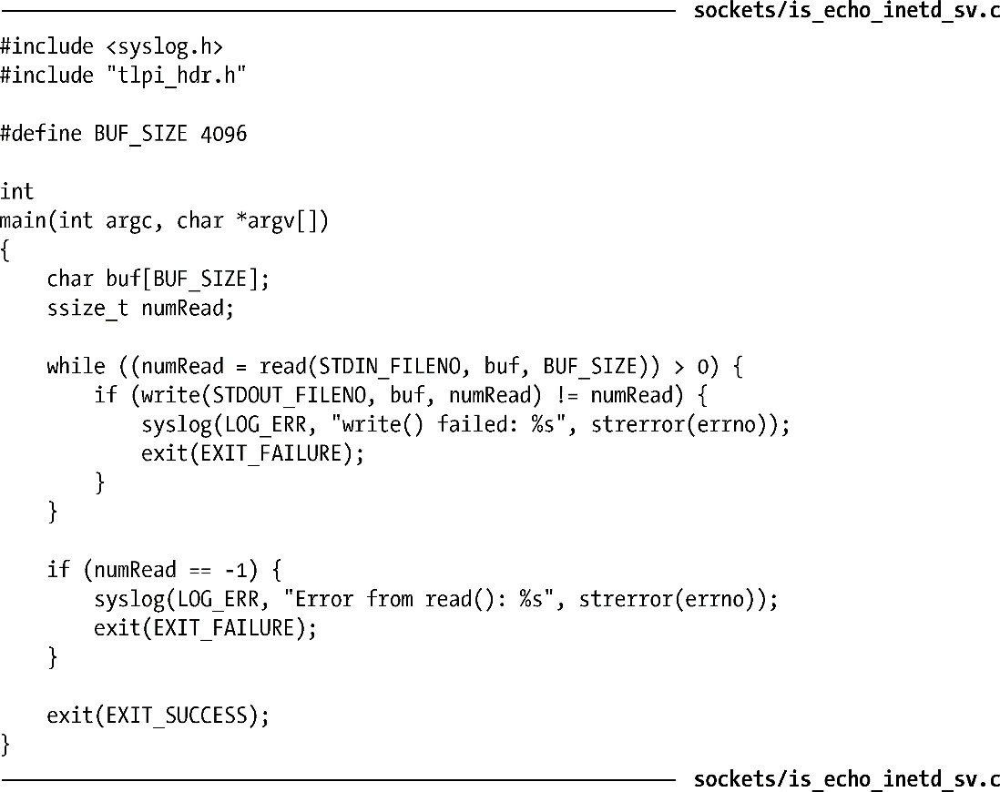

### 60.5　inetd（Internet超级服务器）守护进程

如果我们查看一下/etc/services的内容，可以看到列出了数百个不同的服务项目。这暗示了一个系统理论上可以运行数量庞大的服务器进程。但是，大部分服务器进程通常只是等待着偶尔发送过来的连接请求或数据报，除此之外它们什么都不做。所有这些服务器进程依然会占用内核进程表中的槽位，而且也会占用一些内存和交换空间，因而对系统产生了负载。

守护进程inetd被设计为用来消除运行大量非常用服务器进程的需要。inetd可提供两个主要的好处。

+ 与其为每个服务运行一个单独的守护进程，现在只用一个进程——inetd守护进程——就可以监视一组指定的套接字端口，并按照需要启动其他的服务。因此可降低系统上运行的进程数量。
+ inetd简化了启动其他服务的编程工作。因为由inetd执行的一些步骤通常在所有的网络服务启动时都会用到。

由于inetd监管着一系列的服务，可按照需要启动其他的服务，因此inetd有时候也被称为Internet超级服务器。

> 在一些Linux发行版中提供有inetd的扩展版本——xinetd。除了包含inetd的功能外，xinetd在安全性方面做了一些增强。关于xinetd的信息可在http://www.xinetd.org/上找到。

#### inetd守护进程所做的操作

inetd守护进程通常在系统启动时运行。在成为守护进程后（见37.2节），inetd执行如下步骤。

**1．** 对于在配置文件/etc/inetd.conf中指定的每项服务，inetd都会创建一个恰当类型的套接字（即流式套接字或数据报套接字），然后绑定到指定的端口号上。此外，每个TCP套接字都会通过listen()调用允许客户端发来连接。

**2．** 通过select()调用（见63.2.1节），inetd对前一步中创建的所有套接字进行监视，看是否有数据报或请求连接发送过来。

**3．** select()调用进入阻塞态，直到一个UDP套接字上有数据报可读或者TCP套接字上收到了连接请求。在TCP连接中，inetd在进入下一个步骤之前会先为连接执行accept()调用。

**4．** 要启动这个套接字上指定的服务，inted调用fork()创建一个新的进程，然后通过exec()启动服务器程序。在执行exec()前，子进程执行如下的步骤。

（a）除了用于UDP数据报和接受TCP连接的文件描述符外，将其他所有从父进程继承而来的文件描述符都关闭。

（b）使用本书5.5节中描述的技术，在文件描述符0、1和2上复制套接字文件描述符，并关闭套接字文件描述符本身（因为已经不需要它了）。完成这一步之后，启动的服务器进程就能通过这三个标准的文件描述符同套接字通信了。

（c）这一步是可选的。为启动的服务器进程设定用户和组ID，设定的值可在/etc/inetd.conf中的相应条目找到。

**5．** 第3步中，如果在TCP套接字上接受了一个连接，inetd就关闭这个连接套接字（因为这个套接字只会在稍后启动的服务器进程中使用）。

**6．** inetd服务跳转回第2步继续执行。

#### /etc/inetd.conf文件

inetd守护进程的操作由一个配置文件来控制，通常是/etc/inetd.conf。该文件中的每一行都描述了一种由inetd处理的服务。程序清单60-5展示了一些/etc/inetd.conf文件中的条目以作为示例。

程序清单60-5：/etc/inetd.conf中的示例行

程序清单60-5中的前两行由字符#打头，因此它们被注释掉了。我们这里给出这两行是因为稍后会简单提到echo服务。

/etc/inetd.conf文件中的每一行都由以下字段组成，由空格来将它们分隔开。

+ 服务名称（service name）：该字段指定了一项服务的名称，这项服务可在/etc/services文件中找到。结合协议字段（protocol），就可以通过查找/etc/services文件以确定inetd应该为这项服务监视哪一个端口号。
+ 套接字类型（Socket type）：该字段指定了这项服务所用的套接字类型——例如，流式套接字（stream）还是数据报套接字（dgram）。
+ 协议（protocol）：该字段指定了这个套接字所使用的协议。这个字段可以包含文件/etc/protocols中所列出的任何Internet协议（在protocol(5)用户手册页中注明），但几乎所有的服务都会指定tcp（针对TCP协议）或udp（针对UDP协议）。
+ 标记（flags）：该字段的内容要么是wait，要么是nowait。这个字段指明了由inetd启动的服务器（暂时的）是否会接管用于该服务的套接字。如果启动的服务器需要管理这个套接字，那么该字段被指定为wait。这将导致inetd把这个套接字从它所监视（通过select()实现对多个文件描述符的监视）的文件描述符集合中移除，直到这个服务器程序退出为止（inetd可以通过SIGCHLD的信号处理例程来检测子进程是否退出）。对于这个字段，我们下面会做更多的说明。
+ 登录名（login name）：该字段由/etc/passwd中的用户名部分组成，还可以在其后紧跟一个句号以及一个/etc/group中的组名称。这些名称确定了运行的服务器程序的用户ID和组ID。（由于inetd以root方式运行，它的子进程也同样是特权级的，因而可以在有需要的时候通过调用setuid()和setgid()来修改进程的凭据。）
+ 服务器程序（server program）：该字段指定了被执行的服务器程序的路径名。
+ 服务器程序参数（server program arguments）：该字段指定了一个或多个参数，参数之间由空格符分隔。当执行服务器程序时，这些参数就作为程序的参数列表。在被执行的服务器程序中，第一个参数对应于argv[0]，通常和服务器程序名称的基础部分相同。下一个参数对应于argv[1]，以此类推。

> 在程序清单60-5中所展示的有关ftp、telnet以及login服务的例子中，我们可以看到服务器程序和参数的设定同前面描述的方式有所不同。所有这三种服务都会导致inetd调用同样的程序——tcpd(8)（TCP守护进程的包装程序）。tcpd在执行适当的程序前会先执行一些登录和访问控制检查的操作，而这些操作会根据服务器程序的第一个参数值来进行（通过argv[0]传递给tcpd）。更多有关tcpd的信息可以在tcpd(8)用户手册页以及[Mann & Mitchell, 2003]中找到。

由inetd调用的流式套接字（TCP）服务器通常都被设计为只处理一个单独的客户端连接，处理完后就终止，把监听其他连接的任务留给了inetd。对于这样的服务器，flags字段应该被设为nowait。（相反，如果是由被执行的服务器进程来接受连接的话，那么该字段就应该设为wait。此时inetd不会去接受连接，而是将监听套接字的文件描述符当做描述符0传递给被执行的服务器进程。）

对于大部分的UDP服务器，flags字段应该指定为wait。由inetd调用的UDP服务器通常被设计为读取并处理所有套接字上未完成的数据报，然后终止。（从套接字中读取数据时，通常需要一些超时机制，这样在指定的时间间隔内如果没有新的数据报到来，服务器进程就会终止。）通过指定为wait，我们可以阻止inetd在套接字上同时尝试做select()操作，此时可能会出现我们不期望的结果，因为 inetd可能会在检查数据报的时候同UDP服务器之间产生竞争条件。如果inetd赢了，那么它会启动另一个UDP服务实例。

> 由于inetd操作以及它的配置文件的格式并没有在SUSv3中指定，因此在/etc/inetd.conf中指定的值会有一些（通常很小）变动。大多数版本的inetd至少会提供我们在正文中描述过的格式。要得到更多的细节信息，请参阅inetd.conf(8)用户手册页。

inetd作为一种提高效率的机制，本身就实现了一些简单的服务，而不用通过执行单独的服务器进程来完成任务。UDP和TCP的echo服务就是由inetd所实现的例子。对于这样的服务，/etc/inetd.conf中服务器程序字段对应的记录应该是internal，而服务器程序参数字段被忽略。（在程序清单60-5所示的例子中，我们看到echo服务被注释掉了。要启用echo服务，我们需要将开头的#字符去掉。）

当我们修改了/etc/inetd.conf文件后，需要发送一个SIGHUP信号给inetd，请求它重新读取配置文件。

#### 示例：通过inetd调用一个TCP echo服务

之前我们提到了inetd可以简化服务器程序的编程工作，特别是并发型（通常是TCP）服务器。这是因为inetd已经帮它所调用的服务器程序完成了以下步骤。

1．执行所有和套接字相关的初始化工作，调用socket()、bind()以及listen()（针对TCP服务器）。

2．对于一个TCP服务，为新到来的连接执行accept()操作。

3．创建一个新的进程来处理到来的UDP数据报或者是TCP连接。自动将调用的服务器进程设置为守护进程。inetd通过fork()处理所有与进程创建相关的细节，通过SIGCHLD信号处理例程清除所有退出的子进程。

4．将代表UDP套接字或TCP连接套接字的文件描述符复制到标准文件描述符0、1和2上，并关闭所有其他的文件描述符（因为它们并不会在调用的服务器进程中用到）。

5．执行服务器程序。

（在上面描述的步骤中，我们假设TCP服务在/etc/inetd.conf中的flags字段指定为nowait，而UDP服务的flags字段指定为wait。）

在程序清单60-6中我们展示了inetd是如何简化TCP服务的编程工作的。我们让inetd调用了一个TCP echo服务，该服务同程序清单60-4所示的TCP echo服务相同。由于inetd执行了所有上述描述过的步骤，因此剩下的任务就是编写子进程所执行的处理客户端请求的代码，客户端请求可以从文件描述符0（STDIN_FILENO）读取。

如果服务器程序在/bin目录下（打个比方），那么我们可能需要在/etc/inetd.conf文件中创建如下的条目，使得inetd可以调用该服务器程序。

程序清单60-6：通过inetd调用TCP echo服务

