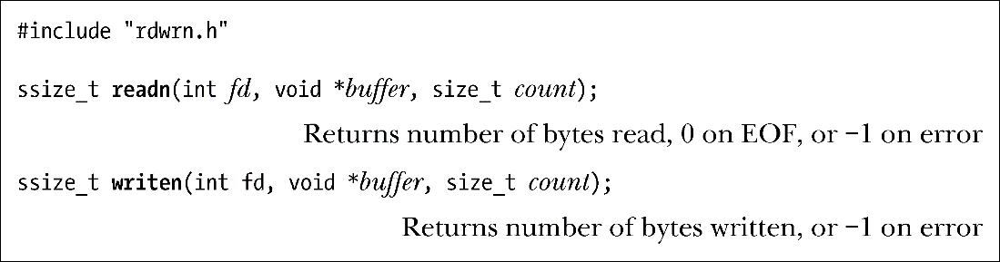
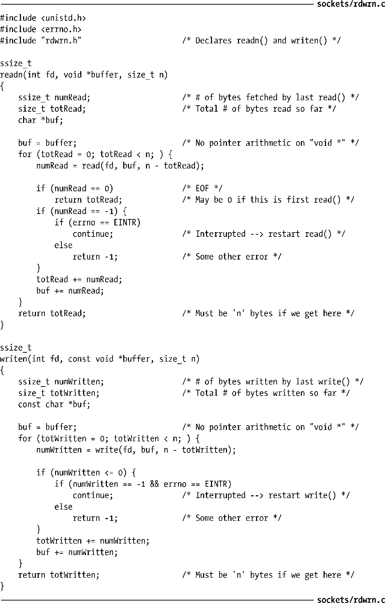

### 61.1　流式套接字上的部分读和部分写

当首次在第4章中介绍read()和write()系统调用时，我们注意到在某些情况下，它们传输的数据可能会比请求的要少。当在流式套接字上执行I/O操作时，也会出现这种部分传输的现象。现在我们来思考为什么会出现这种情况，并向大家展示一对能以透明的方式处理部分传输问题的函数。

如果套接字上可用的数据比在read()调用中请求的数据要少，那就可能会出现部分读的现象。在这种情况下，read()简单地返回可用的字节数。（这同我们在44.10节中看到的管道和FIFO所表现出的行为一样。）

如果没有足够的缓冲区空间来传输所有请求的字节，并且满足了如下几条的其中一条时，可能会出现部分写的现象。

+ 在write()调用传输了部分请求的字节后被信号处理例程中断（见21.5节）。
+ 套接字工作在非阻塞模式下（O_NONBLOCK），可能当前只能传输一部分请求的字节。
+ 在部分请求的字节已经完成传输后出现了一个异步错误。对于这里的异步错误，我们指的是应用程序使用的套接字API调用中出现了一个异步错误。异步错误是可能会发生的，比如，由于TCP连接出现问题，可能就会使对端的应用程序崩溃。

在所有上述情况中，假设缓冲区空间至少能传输1字节数据，write()调用成功，并返回传输到输出缓冲区中的字节数。

如果出现了部分I/O现象——例如，如果read()返回的字节数少于请求的数量，又或者是阻塞式的write()调用在完成了部分数据传输后被信号处理例程中断——那么有时候需要重新调用系统调用来完成全部数据的传输。在程序清单61-1中，我们提供了两个函数能做到这一点：readn()和writen()。（实现这两个函数的想法源自[Stevens et al., 2004]中的同名函数。）

函数readn()和writen()的参数与read()和write()相同。但是，这两个函数使用循环来重新启用这些系统调用，因此确保了请求的字节数总是能够全部得到传输（除非出现错误或者在read()中检测到了文件结尾符）。

程序清单61-1：实现readn()和writen()

