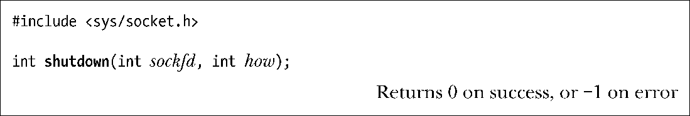
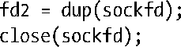
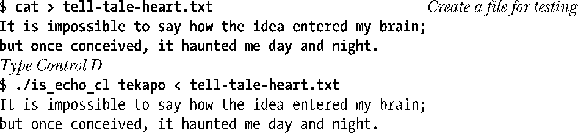
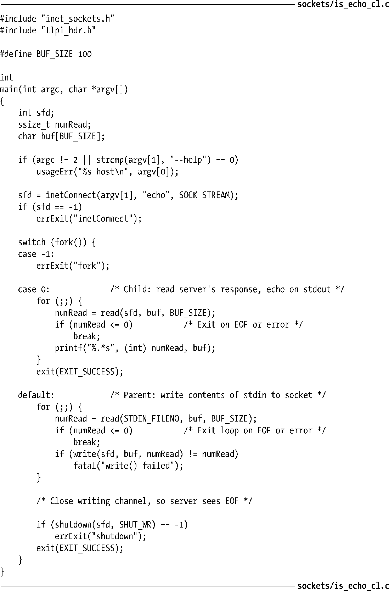

### 61.2　shutdown()系统调用

在套接字上调用close()会将双向通信通道的两端都关闭。有时候，只关闭连接的一端也是有用处的，这样数据只能在一个方向上通过套接字传输。系统调用shutdown()提供了这种功能。

系统调用shutdown()可以根据参数how的值选择关闭套接字通道的一端还是两端。参数how的值可以指定为如下几种。

##### SHUT_RD

关闭连接的读端。之后的读操作将返回文件结尾（0）。数据仍然可以写入到套接字上。在UNIX域流式套接字上执行了SHUT_RD操作后，对端应用程序将接收到一个SIGPIPE信号，如果继续尝试在对端套接字上做写操作的话将产生EPIPE错误。如61.6.6节中讨论的，SHUT_RD对于TCP套接字来说没有什么意义。

##### SHUT_WR

关闭连接的写端。一旦对端的应用程序已经将所有剩余的数据读取完毕，它就会检测到文件结尾。后续对本地套接字的写操作将产生SIGPIPE信号以及EPIPE错误。而由对端写入的数据仍然可以在套接字上读取。换句话说，这个操作允许我们在仍然能读取对端发回给我们的数据时，通过文件结尾来通知对端应用程序本地的写端已经关闭了。SHUT_WR操作在ssh和rsh中都有用到（参见[Stevens，1994]中的18.5节）。在shutdown()中最常用到的操作就是SHUT_WR，有时候也被称为半关闭套接字。

##### SHUT_RDWR

将连接的读端和写端都关闭。这等同于先执行SHUT_RD，跟着再执行一次SHUT_WR操作。

除了参数how的语义之外，shutdown()同close()之间的另一个重要区别是：无论该套接字上是否还关联有其他的文件描述符，shutdown()都会关闭套接字通道。（换句话说，shutdown()是根据打开的文件描述（open file description）来执行操作，而同文件描述符无关。见图5-1。）例如，假设sockfd指向一个已连接的流式套接字，如果执行下列调用，那么连接依然会保持打开状态，我们仍然可以通过文件描述符fd2在该连接上做I/O操作。

但是，如果我们执行如下的调用，那么该连接的双向通道都会关闭，通过fd2也无法再执行I/O操作了。

如果套接字文件描述符在 fork()时被复制，那么此时也会出现相似的场景。如果在 fork()调用之后，一个进程在描述符的副本上执行一次SHUT_RDWR操作，那么其他的进程就无法再在这个文件描述符上执行I/O操作了。

需要注意的是，shutdown()并不会关闭文件描述符，就算参数how指定为SHUT_RDWR时也是如此。要关闭文件描述符，我们必须另外调用close()。

#### 示例程序

程序清单61-2中的程序说明了应该如何使用shutdown()的SHUT_WR操作。这个程序是echo服务的TCP客户端。（我们在60.3节中给出了一个TCP echo服务器程序）。为了简化实现，我们利用了59.12节中的Internet域套接字函数库。

> 有些Linux发行版中，默认情况下是没有启用echo服务的。因此我们必须在运行程序清单61-2中的程序之前先启动echo服务。一般来说，这个服务是通过inetd(8)守护进程在内部实现的（见60.5节），要启动echo服务，我们必须编辑/etc/inetd.conf文件，将对应于UDP和TCP echo服务的那两行去掉注释（见60-5节），然后发送一个SIGHUP信号给inetd守护进程。
> 许多发行版中都有提供更先进的xinetd(8)，以此取代inetd(8)。请参考xinetd的文档以获取信息，了解如何通过xinetd完成同样的任务。

该程序将运行echo服务的主机名称以命令行参数的方式传递。客户端执行一次fork()调用，产生父子进程。

客户端父进程将标准输入的内容写到套接字上，这样就可以被echo服务器读取了。当父进程在标准输入上检测到文件结尾时，调用shutdown()来关闭该套接字上的写端。这将导致echo服务器检测到文件结尾，此时echo服务就会关闭它这端的套接字（进而导致客户端子进程检测到文件结尾）。之后，父进程终止。

客户端子进程从套接字中读取echo服务器的响应，并回显到标准输出上。当在套接字上检测到文件结尾时，子进程终止。

当我们运行该程序时会看到类似下面的输出。

程序清单61-2：echo服务的客户端程序

